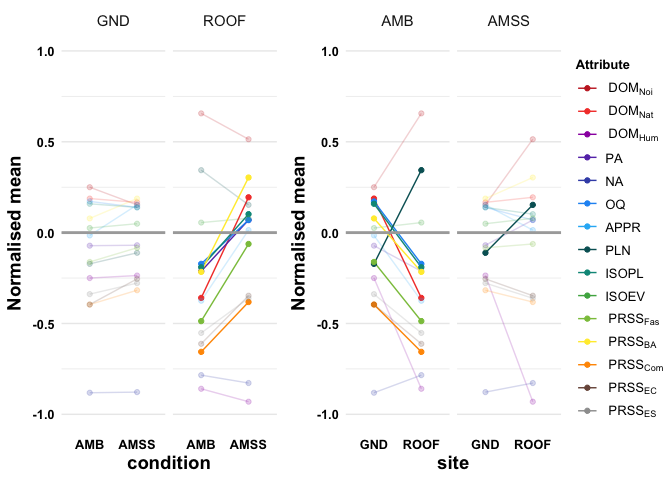

# Replication Code for “AI-augmented urban soundscapes: In-situ assessment of soundscape quality and restorativeness”

The GitHub repository contains the code to replicate the analysis,
figures and tables for the paper titled: ““.

The data that support the findings of this study are openly available in
NTU research  
data repository DR-NTU (Data) at .

The subheadings in this repository follows the headings in the paper
(after the [Data Loading](#data-loading) section) for consistency.

The following figures are produced by this replication code:

- Figure 2 in [Site evaluation
  questionnaire](#site-evaluation-questionnaire)

- Figure 3 in

The following tables are produced by this replication code:

- Table 1 in [Site evaluation
  questionnaire](#site-evaluation-questionnaire)

- Table 2

- Extended Data Table 2

- Extended Data Table 3

- Extended Data Table 4

- Extended Data Table 5

- Extended Data Table 8 in [Effect of order and group
  size](#effect-of-order-and-group-size)

- Extended Data Table 9

- Extended Data Table 10 in [Participants](#participants)

## Initialisation

## Data Loading

First, download the RData file containing all the data tables required
to replicate all the figures, tables and analyses in this paper from the
Dataverse repository.

Load the RData file `fullData.Rdata`.

## Results

### Site evaluation questionnaire

Table 1: Mean responses $\mu$ (standard deviation $\sigma$) of
perceptual attributes in the site evaluation questionnaire investigated
for the validation study, organized by *site* and *condition*. The
scales for all attributes are normalised to the range $[-1,1]$.
Percentage changes are computed between the AMB and AMSS for *site*, and
between ROOF and GND for *condition* as scale changes on the $[-1,1]$
range with respect to the former. For instance, a change from $-0.25$ in
the AMB condition to $0.75$ in the AMSS condition would be reported as a
$50$% change. Significant changes as determined by posthoc tests are
indicated in bold.

``` r
#compute statistical tests for all variables
stat.results<-twoWLMERMANOVA(metadata,amss_insitu_participant_data)
```

    Category is: categorical; Variable is: dom_noise
    Two-Way Mixed Effects Repeated Measures Formula: 
    rank(dom_noise) ~ (1 | pID) + site * condition
    <environment: 0x13363c188>
    Category is: categorical; Variable is: dom_natural
    Two-Way Mixed Effects Repeated Measures Formula: 
    rank(dom_natural) ~ (1 | pID) + site * condition
    <environment: 0x13363c188>
    Interaction Effect is significant: p=0 (p<0.05) 
    Category is: categorical; Variable is: dom_human
    Two-Way Mixed Effects Repeated Measures Formula: 
    rank(dom_human) ~ (1 | pID) + site * condition
    <environment: 0x13363c188>
    Category is: interval; Variable is: PosAff
    Two-Way Mixed Effects Repeated Measures Formula: 
    PosAff ~ (1 | pID) + site * condition
    <environment: 0x13363c188>
    Interaction Effect is significant: p=0.021 (p<0.05) 
    Category is: interval; Variable is: NegAff
    Two-Way Mixed Effects Repeated Measures Formula: 
    NegAff ~ (1 | pID) + site * condition
    <environment: 0x13363c188>
    NegAff is non-normal: p<0.05 (p=3.40443554136163e-14)Two-Way Mixed Effects Repeated Measures Formula: 
    rank(NegAff) ~ (1 | pID) + site * condition
    <environment: 0x13363c188>
    Category is: categorical; Variable is: overall
    Two-Way Mixed Effects Repeated Measures Formula: 
    rank(overall) ~ (1 | pID) + site * condition
    <environment: 0x13363c188>
    Interaction Effect is significant: p=0.027 (p<0.05) 
    Category is: categorical; Variable is: appropriate
    Two-Way Mixed Effects Repeated Measures Formula: 
    rank(appropriate) ~ (1 | pID) + site * condition
    <environment: 0x13363c188>
    Category is: categorical; Variable is: loudness
    Two-Way Mixed Effects Repeated Measures Formula: 
    rank(loudness) ~ (1 | pID) + site * condition
    <environment: 0x13363c188>
    Interaction Effect is significant: p=0.022 (p<0.05) 
    Category is: interval; Variable is: ISOPL
    Two-Way Mixed Effects Repeated Measures Formula: 
    ISOPL ~ (1 | pID) + site * condition
    <environment: 0x13363c188>
    Interaction Effect is significant: p=0.008 (p<0.05) 
    Category is: interval; Variable is: ISOEV
    Two-Way Mixed Effects Repeated Measures Formula: 
    ISOEV ~ (1 | pID) + site * condition
    <environment: 0x13363c188>
    Category is: interval; Variable is: PRSSFas
    Two-Way Mixed Effects Repeated Measures Formula: 
    PRSSFas ~ (1 | pID) + site * condition
    <environment: 0x13363c188>
    Interaction Effect is significant: p=0.008 (p<0.05) 
    Category is: interval; Variable is: PRSSBA
    Two-Way Mixed Effects Repeated Measures Formula: 
    PRSSBA ~ (1 | pID) + site * condition
    <environment: 0x13363c188>
    Interaction Effect is significant: p=0.019 (p<0.05) 
    Category is: interval; Variable is: PRSSCom
    Two-Way Mixed Effects Repeated Measures Formula: 
    PRSSCom ~ (1 | pID) + site * condition
    <environment: 0x13363c188>
    Interaction Effect is significant: p=0.046 (p<0.05) 
    Category is: interval; Variable is: PRSSEC
    Two-Way Mixed Effects Repeated Measures Formula: 
    PRSSEC ~ (1 | pID) + site * condition
    <environment: 0x13363c188>
    Category is: interval; Variable is: PRSSES
    Two-Way Mixed Effects Repeated Measures Formula: 
    PRSSES ~ (1 | pID) + site * condition
    <environment: 0x13363c188>

``` r
#plot statistical test reults in a table
stat.results |>
        dplyr::mutate(
                p.value=paste0(
                        gtools::stars.pval(p.value),
                        formatC(p.value, format = "f", digits = 4)
                        ),
                eff.size=case_when(
                        eff.size > 0.14 ~ paste0(
                                "(L)",
                                formatC(eff.size,format = "f",digits = 4)
                                ),
                        eff.size > 0.06 ~ paste0(
                                "(M)",
                                formatC(eff.size,format = "f",digits = 4)
                                ),
                        eff.size > 0.01 ~ paste0(
                                "(S)",formatC(eff.size,format = "f",digits = 4)
                                ),
                        .default = formatC(eff.size,format = "f",digits = 4))) |>
        dplyr::group_by(variable) |>
        gt::gt() |>
        cols_label(
                term ~ html("<b>Term</b>"),
                test ~ html("<b>Test</b>"),
                p.value ~ html("<i>p</i>-<b>value</b>"),
                eff.size ~ html("<b>Effect Size</b>")
        )
```

<div>

<div id="icoyethtnh" style="padding-left:0px;padding-right:0px;padding-top:10px;padding-bottom:10px;overflow-x:auto;overflow-y:auto;width:auto;height:auto;">
<style>#icoyethtnh table {
  font-family: system-ui, 'Segoe UI', Roboto, Helvetica, Arial, sans-serif, 'Apple Color Emoji', 'Segoe UI Emoji', 'Segoe UI Symbol', 'Noto Color Emoji';
  -webkit-font-smoothing: antialiased;
  -moz-osx-font-smoothing: grayscale;
}
&#10;#icoyethtnh thead, #icoyethtnh tbody, #icoyethtnh tfoot, #icoyethtnh tr, #icoyethtnh td, #icoyethtnh th {
  border-style: none;
}
&#10;#icoyethtnh p {
  margin: 0;
  padding: 0;
}
&#10;#icoyethtnh .gt_table {
  display: table;
  border-collapse: collapse;
  line-height: normal;
  margin-left: auto;
  margin-right: auto;
  color: #333333;
  font-size: 16px;
  font-weight: normal;
  font-style: normal;
  background-color: #FFFFFF;
  width: auto;
  border-top-style: solid;
  border-top-width: 2px;
  border-top-color: #A8A8A8;
  border-right-style: none;
  border-right-width: 2px;
  border-right-color: #D3D3D3;
  border-bottom-style: solid;
  border-bottom-width: 2px;
  border-bottom-color: #A8A8A8;
  border-left-style: none;
  border-left-width: 2px;
  border-left-color: #D3D3D3;
}
&#10;#icoyethtnh .gt_caption {
  padding-top: 4px;
  padding-bottom: 4px;
}
&#10;#icoyethtnh .gt_title {
  color: #333333;
  font-size: 125%;
  font-weight: initial;
  padding-top: 4px;
  padding-bottom: 4px;
  padding-left: 5px;
  padding-right: 5px;
  border-bottom-color: #FFFFFF;
  border-bottom-width: 0;
}
&#10;#icoyethtnh .gt_subtitle {
  color: #333333;
  font-size: 85%;
  font-weight: initial;
  padding-top: 3px;
  padding-bottom: 5px;
  padding-left: 5px;
  padding-right: 5px;
  border-top-color: #FFFFFF;
  border-top-width: 0;
}
&#10;#icoyethtnh .gt_heading {
  background-color: #FFFFFF;
  text-align: center;
  border-bottom-color: #FFFFFF;
  border-left-style: none;
  border-left-width: 1px;
  border-left-color: #D3D3D3;
  border-right-style: none;
  border-right-width: 1px;
  border-right-color: #D3D3D3;
}
&#10;#icoyethtnh .gt_bottom_border {
  border-bottom-style: solid;
  border-bottom-width: 2px;
  border-bottom-color: #D3D3D3;
}
&#10;#icoyethtnh .gt_col_headings {
  border-top-style: solid;
  border-top-width: 2px;
  border-top-color: #D3D3D3;
  border-bottom-style: solid;
  border-bottom-width: 2px;
  border-bottom-color: #D3D3D3;
  border-left-style: none;
  border-left-width: 1px;
  border-left-color: #D3D3D3;
  border-right-style: none;
  border-right-width: 1px;
  border-right-color: #D3D3D3;
}
&#10;#icoyethtnh .gt_col_heading {
  color: #333333;
  background-color: #FFFFFF;
  font-size: 100%;
  font-weight: normal;
  text-transform: inherit;
  border-left-style: none;
  border-left-width: 1px;
  border-left-color: #D3D3D3;
  border-right-style: none;
  border-right-width: 1px;
  border-right-color: #D3D3D3;
  vertical-align: bottom;
  padding-top: 5px;
  padding-bottom: 6px;
  padding-left: 5px;
  padding-right: 5px;
  overflow-x: hidden;
}
&#10;#icoyethtnh .gt_column_spanner_outer {
  color: #333333;
  background-color: #FFFFFF;
  font-size: 100%;
  font-weight: normal;
  text-transform: inherit;
  padding-top: 0;
  padding-bottom: 0;
  padding-left: 4px;
  padding-right: 4px;
}
&#10;#icoyethtnh .gt_column_spanner_outer:first-child {
  padding-left: 0;
}
&#10;#icoyethtnh .gt_column_spanner_outer:last-child {
  padding-right: 0;
}
&#10;#icoyethtnh .gt_column_spanner {
  border-bottom-style: solid;
  border-bottom-width: 2px;
  border-bottom-color: #D3D3D3;
  vertical-align: bottom;
  padding-top: 5px;
  padding-bottom: 5px;
  overflow-x: hidden;
  display: inline-block;
  width: 100%;
}
&#10;#icoyethtnh .gt_spanner_row {
  border-bottom-style: hidden;
}
&#10;#icoyethtnh .gt_group_heading {
  padding-top: 8px;
  padding-bottom: 8px;
  padding-left: 5px;
  padding-right: 5px;
  color: #333333;
  background-color: #FFFFFF;
  font-size: 100%;
  font-weight: initial;
  text-transform: inherit;
  border-top-style: solid;
  border-top-width: 2px;
  border-top-color: #D3D3D3;
  border-bottom-style: solid;
  border-bottom-width: 2px;
  border-bottom-color: #D3D3D3;
  border-left-style: none;
  border-left-width: 1px;
  border-left-color: #D3D3D3;
  border-right-style: none;
  border-right-width: 1px;
  border-right-color: #D3D3D3;
  vertical-align: middle;
  text-align: left;
}
&#10;#icoyethtnh .gt_empty_group_heading {
  padding: 0.5px;
  color: #333333;
  background-color: #FFFFFF;
  font-size: 100%;
  font-weight: initial;
  border-top-style: solid;
  border-top-width: 2px;
  border-top-color: #D3D3D3;
  border-bottom-style: solid;
  border-bottom-width: 2px;
  border-bottom-color: #D3D3D3;
  vertical-align: middle;
}
&#10;#icoyethtnh .gt_from_md > :first-child {
  margin-top: 0;
}
&#10;#icoyethtnh .gt_from_md > :last-child {
  margin-bottom: 0;
}
&#10;#icoyethtnh .gt_row {
  padding-top: 8px;
  padding-bottom: 8px;
  padding-left: 5px;
  padding-right: 5px;
  margin: 10px;
  border-top-style: solid;
  border-top-width: 1px;
  border-top-color: #D3D3D3;
  border-left-style: none;
  border-left-width: 1px;
  border-left-color: #D3D3D3;
  border-right-style: none;
  border-right-width: 1px;
  border-right-color: #D3D3D3;
  vertical-align: middle;
  overflow-x: hidden;
}
&#10;#icoyethtnh .gt_stub {
  color: #333333;
  background-color: #FFFFFF;
  font-size: 100%;
  font-weight: initial;
  text-transform: inherit;
  border-right-style: solid;
  border-right-width: 2px;
  border-right-color: #D3D3D3;
  padding-left: 5px;
  padding-right: 5px;
}
&#10;#icoyethtnh .gt_stub_row_group {
  color: #333333;
  background-color: #FFFFFF;
  font-size: 100%;
  font-weight: initial;
  text-transform: inherit;
  border-right-style: solid;
  border-right-width: 2px;
  border-right-color: #D3D3D3;
  padding-left: 5px;
  padding-right: 5px;
  vertical-align: top;
}
&#10;#icoyethtnh .gt_row_group_first td {
  border-top-width: 2px;
}
&#10;#icoyethtnh .gt_row_group_first th {
  border-top-width: 2px;
}
&#10;#icoyethtnh .gt_summary_row {
  color: #333333;
  background-color: #FFFFFF;
  text-transform: inherit;
  padding-top: 8px;
  padding-bottom: 8px;
  padding-left: 5px;
  padding-right: 5px;
}
&#10;#icoyethtnh .gt_first_summary_row {
  border-top-style: solid;
  border-top-color: #D3D3D3;
}
&#10;#icoyethtnh .gt_first_summary_row.thick {
  border-top-width: 2px;
}
&#10;#icoyethtnh .gt_last_summary_row {
  padding-top: 8px;
  padding-bottom: 8px;
  padding-left: 5px;
  padding-right: 5px;
  border-bottom-style: solid;
  border-bottom-width: 2px;
  border-bottom-color: #D3D3D3;
}
&#10;#icoyethtnh .gt_grand_summary_row {
  color: #333333;
  background-color: #FFFFFF;
  text-transform: inherit;
  padding-top: 8px;
  padding-bottom: 8px;
  padding-left: 5px;
  padding-right: 5px;
}
&#10;#icoyethtnh .gt_first_grand_summary_row {
  padding-top: 8px;
  padding-bottom: 8px;
  padding-left: 5px;
  padding-right: 5px;
  border-top-style: double;
  border-top-width: 6px;
  border-top-color: #D3D3D3;
}
&#10;#icoyethtnh .gt_last_grand_summary_row_top {
  padding-top: 8px;
  padding-bottom: 8px;
  padding-left: 5px;
  padding-right: 5px;
  border-bottom-style: double;
  border-bottom-width: 6px;
  border-bottom-color: #D3D3D3;
}
&#10;#icoyethtnh .gt_striped {
  background-color: rgba(128, 128, 128, 0.05);
}
&#10;#icoyethtnh .gt_table_body {
  border-top-style: solid;
  border-top-width: 2px;
  border-top-color: #D3D3D3;
  border-bottom-style: solid;
  border-bottom-width: 2px;
  border-bottom-color: #D3D3D3;
}
&#10;#icoyethtnh .gt_footnotes {
  color: #333333;
  background-color: #FFFFFF;
  border-bottom-style: none;
  border-bottom-width: 2px;
  border-bottom-color: #D3D3D3;
  border-left-style: none;
  border-left-width: 2px;
  border-left-color: #D3D3D3;
  border-right-style: none;
  border-right-width: 2px;
  border-right-color: #D3D3D3;
}
&#10;#icoyethtnh .gt_footnote {
  margin: 0px;
  font-size: 90%;
  padding-top: 4px;
  padding-bottom: 4px;
  padding-left: 5px;
  padding-right: 5px;
}
&#10;#icoyethtnh .gt_sourcenotes {
  color: #333333;
  background-color: #FFFFFF;
  border-bottom-style: none;
  border-bottom-width: 2px;
  border-bottom-color: #D3D3D3;
  border-left-style: none;
  border-left-width: 2px;
  border-left-color: #D3D3D3;
  border-right-style: none;
  border-right-width: 2px;
  border-right-color: #D3D3D3;
}
&#10;#icoyethtnh .gt_sourcenote {
  font-size: 90%;
  padding-top: 4px;
  padding-bottom: 4px;
  padding-left: 5px;
  padding-right: 5px;
}
&#10;#icoyethtnh .gt_left {
  text-align: left;
}
&#10;#icoyethtnh .gt_center {
  text-align: center;
}
&#10;#icoyethtnh .gt_right {
  text-align: right;
  font-variant-numeric: tabular-nums;
}
&#10;#icoyethtnh .gt_font_normal {
  font-weight: normal;
}
&#10;#icoyethtnh .gt_font_bold {
  font-weight: bold;
}
&#10;#icoyethtnh .gt_font_italic {
  font-style: italic;
}
&#10;#icoyethtnh .gt_super {
  font-size: 65%;
}
&#10;#icoyethtnh .gt_footnote_marks {
  font-size: 75%;
  vertical-align: 0.4em;
  position: initial;
}
&#10;#icoyethtnh .gt_asterisk {
  font-size: 100%;
  vertical-align: 0;
}
&#10;#icoyethtnh .gt_indent_1 {
  text-indent: 5px;
}
&#10;#icoyethtnh .gt_indent_2 {
  text-indent: 10px;
}
&#10;#icoyethtnh .gt_indent_3 {
  text-indent: 15px;
}
&#10;#icoyethtnh .gt_indent_4 {
  text-indent: 20px;
}
&#10;#icoyethtnh .gt_indent_5 {
  text-indent: 25px;
}
</style>

| **Term**           | **Test**                       | *p*-**value** | **Effect Size** |
|--------------------|--------------------------------|---------------|-----------------|
| dom_noise          |                                |               |                 |
| site               | 2W-LME-RM-T3-RT-ANOVA          | \*\*\*0.0000  | (L)0.3182       |
| condition          | 2W-LME-RM-T3-RT-ANOVA          | 0.1571        | (S)0.0145       |
| site:condition     | 2W-LME-RM-T3-RT-ANOVA          | 0.5667        | 0.0000          |
| dom_natural        |                                |               |                 |
| site               | 2W-LME-RM-T3-RT-ANOVA          | \*\*\*0.0004  | (L)0.1464       |
| condition          | 2W-LME-RM-T3-RT-ANOVA          | \*\*0.0015    | (M)0.1175       |
| site:condition     | 2W-LME-RM-T3-RT-ANOVA          | \*\*\*0.0003  | (L)0.1492       |
| AMB - AMSS \| GND  | Simple Contrasts for Condition | 0.9513        | (S)0.0149       |
| AMB - AMSS \| ROOF | Simple Contrasts for Condition | \*\*\*0.0000  | -1.1574         |
| GND - ROOF \| AMB  | Simple Contrasts for Site      | \*\*\*0.0000  | (L)1.1661       |
| GND - ROOF \| AMSS | Simple Contrasts for Site      | \*\*\*0.0000  | -0.0061         |
| dom_human          |                                |               |                 |
| site               | 2W-LME-RM-T3-RT-ANOVA          | \*\*\*0.0000  | (L)0.5180       |
| condition          | 2W-LME-RM-T3-RT-ANOVA          | 0.1039        | (S)0.0121       |
| site:condition     | 2W-LME-RM-T3-RT-ANOVA          | 0.8785        | 0.0000          |
| PosAff             |                                |               |                 |
| Residuals          | Shapiro-Wilk normality test    | 0.1731        | NA              |
| site               | 2W-LME-RM-T3-ANOVA             | 0.6753        | 0.0000          |
| condition          | 2W-LME-RM-T3-ANOVA             | 0.1620        | (S)0.0139       |
| site:condition     | 2W-LME-RM-T3-ANOVA             | \*0.0211      | (S)0.0403       |
| AMB - AMSS \| GND  | Simple Contrasts for Condition | 0.9835        | -0.0050         |
| AMB - AMSS \| MP   | Simple Contrasts for Condition | 0.2242        | -0.2963         |
| AMB - AMSS \| ROOF | Simple Contrasts for Condition | \*0.0179      | -0.5839         |
| GND - MP \| AMB    | Simple Contrasts for Site      | 0.8971        | (M)0.0669       |
| GND - ROOF \| AMB  | Simple Contrasts for Site      | 0.8971        | (L)0.2912       |
| MP - ROOF \| AMB   | Simple Contrasts for Site      | 0.8971        | (L)0.2243       |
| GND - MP \| AMSS   | Simple Contrasts for Site      | 0.8971        | -0.2243         |
| GND - ROOF \| AMSS | Simple Contrasts for Site      | 0.8971        | -0.2876         |
| MP - ROOF \| AMSS  | Simple Contrasts for Site      | 0.8971        | -0.0633         |
| NegAff             |                                |               |                 |
| Residuals          | Shapiro-Wilk normality test    | \*\*\*0.0000  | NA              |
| site               | 2W-LME-RM-T3-RT-ANOVA          | 0.3525        | 0.0006          |
| condition          | 2W-LME-RM-T3-RT-ANOVA          | \*0.0253      | (S)0.0550       |
| site:condition     | 2W-LME-RM-T3-RT-ANOVA          | 0.1665        | (S)0.0114       |
| overall            |                                |               |                 |
| site               | 2W-LME-RM-T3-RT-ANOVA          | \*\*0.0041    | (M)0.0965       |
| condition          | 2W-LME-RM-T3-RT-ANOVA          | 0.2204        | 0.0073          |
| site:condition     | 2W-LME-RM-T3-RT-ANOVA          | \*0.0271      | (S)0.0540       |
| AMB - AMSS \| GND  | Simple Contrasts for Condition | 0.7087        | (M)0.0910       |
| AMB - AMSS \| ROOF | Simple Contrasts for Condition | \*0.0221      | -0.5631         |
| GND - ROOF \| AMB  | Simple Contrasts for Site      | \*\*\*0.0009  | (L)0.7525       |
| GND - ROOF \| AMSS | Simple Contrasts for Site      | \*\*\*0.0009  | (M)0.0984       |
| appropriate        |                                |               |                 |
| site               | 2W-LME-RM-T3-RT-ANOVA          | \*\*0.0024    | (M)0.1074       |
| condition          | 2W-LME-RM-T3-RT-ANOVA          | \*\*\*0.0007  | (M)0.1327       |
| site:condition     | 2W-LME-RM-T3-RT-ANOVA          | 0.1591        | (S)0.0142       |
| loudness           |                                |               |                 |
| site               | 2W-LME-RM-T3-RT-ANOVA          | \*\*\*0.0000  | (L)0.3561       |
| condition          | 2W-LME-RM-T3-RT-ANOVA          | 0.5667        | 0.0000          |
| site:condition     | 2W-LME-RM-T3-RT-ANOVA          | \*0.0221      | (S)0.0587       |
| AMB - AMSS \| GND  | Simple Contrasts for Condition | 0.4189        | -0.1971         |
| AMB - AMSS \| ROOF | Simple Contrasts for Condition | .0.0812       | (L)0.4274       |
| GND - ROOF \| AMB  | Simple Contrasts for Site      | \*\*\*0.0000  | -1.1600         |
| GND - ROOF \| AMSS | Simple Contrasts for Site      | \*\*\*0.0000  | -0.5355         |
| ISOPL              |                                |               |                 |
| Residuals          | Shapiro-Wilk normality test    | 0.1229        | NA              |
| site               | 2W-LME-RM-T3-ANOVA             | \*\*0.0011    | (M)0.1248       |
| condition          | 2W-LME-RM-T3-ANOVA             | \*0.0432      | (S)0.0434       |
| site:condition     | 2W-LME-RM-T3-ANOVA             | \*\*0.0082    | (M)0.0808       |
| AMB - AMSS \| GND  | Simple Contrasts for Condition | 0.8241        | (S)0.0541       |
| AMB - AMSS \| ROOF | Simple Contrasts for Condition | \*\*0.0014    | -0.7926         |
| GND - ROOF \| AMB  | Simple Contrasts for Site      | \*\*\*0.0001  | (L)0.9473       |
| GND - ROOF \| AMSS | Simple Contrasts for Site      | \*\*\*0.0001  | (M)0.1006       |
| ISOEV              |                                |               |                 |
| Residuals          | Shapiro-Wilk normality test    | 0.7790        | NA              |
| site               | 2W-LME-RM-T3-ANOVA             | 0.4576        | 0.0000          |
| condition          | 2W-LME-RM-T3-ANOVA             | 0.5795        | 0.0000          |
| site:condition     | 2W-LME-RM-T3-ANOVA             | 0.9990        | 0.0000          |
| PRSSFas            |                                |               |                 |
| Residuals          | Shapiro-Wilk normality test    | 0.8728        | NA              |
| site               | 2W-LME-RM-T3-ANOVA             | \*0.0203      | (M)0.0606       |
| condition          | 2W-LME-RM-T3-ANOVA             | \*\*0.0034    | (M)0.1000       |
| site:condition     | 2W-LME-RM-T3-ANOVA             | \*\*0.0083    | (M)0.0806       |
| AMB - AMSS \| GND  | Simple Contrasts for Condition | 0.4713        | -0.1755         |
| AMB - AMSS \| ROOF | Simple Contrasts for Condition | \*\*\*0.0001  | -0.9538         |
| GND - ROOF \| AMB  | Simple Contrasts for Site      | \*\*0.0011    | (L)0.7314       |
| GND - ROOF \| AMSS | Simple Contrasts for Site      | \*\*0.0011    | -0.0468         |
| PRSSBA             |                                |               |                 |
| Residuals          | Shapiro-Wilk normality test    | 0.7777        | NA              |
| site               | 2W-LME-RM-T3-ANOVA             | 0.3081        | 0.0006          |
| condition          | 2W-LME-RM-T3-ANOVA             | \*\*0.0034    | (M)0.1005       |
| site:condition     | 2W-LME-RM-T3-ANOVA             | \*0.0193      | (M)0.0618       |
| AMB - AMSS \| GND  | Simple Contrasts for Condition | 0.4309        | -0.1920         |
| AMB - AMSS \| ROOF | Simple Contrasts for Condition | \*\*\*0.0003  | -0.9116         |
| GND - ROOF \| AMB  | Simple Contrasts for Site      | \*0.0241      | (L)0.5165       |
| GND - ROOF \| AMSS | Simple Contrasts for Site      | \*0.0241      | -0.2031         |
| PRSSCom            |                                |               |                 |
| Residuals          | Shapiro-Wilk normality test    | 0.3328        | NA              |
| site               | 2W-LME-RM-T3-ANOVA             | \*\*\*0.0009  | (M)0.1287       |
| condition          | 2W-LME-RM-T3-ANOVA             | \*0.0135      | (M)0.0698       |
| site:condition     | 2W-LME-RM-T3-ANOVA             | \*0.0456      | (S)0.0422       |
| AMB - AMSS \| GND  | Simple Contrasts for Condition | 0.3652        | -0.2209         |
| AMB - AMSS \| ROOF | Simple Contrasts for Condition | \*\*0.0020    | -0.7697         |
| GND - ROOF \| AMB  | Simple Contrasts for Site      | \*\*\*0.0005  | (L)0.7308       |
| GND - ROOF \| AMSS | Simple Contrasts for Site      | \*\*\*0.0005  | (L)0.1819       |
| PRSSEC             |                                |               |                 |
| Residuals          | Shapiro-Wilk normality test    | 0.9051        | NA              |
| site               | 2W-LME-RM-T3-ANOVA             | \*\*0.0015    | (M)0.1182       |
| condition          | 2W-LME-RM-T3-ANOVA             | \*\*0.0023    | (M)0.1089       |
| site:condition     | 2W-LME-RM-T3-ANOVA             | 0.2031        | 0.0090          |
| PRSSES             |                                |               |                 |
| Residuals          | Shapiro-Wilk normality test    | .0.0581       | NA              |
| site               | 2W-LME-RM-T3-ANOVA             | \*\*0.0010    | (M)0.1254       |
| condition          | 2W-LME-RM-T3-ANOVA             | \*0.0410      | (S)0.0446       |
| site:condition     | 2W-LME-RM-T3-ANOVA             | 0.1504        | (S)0.0155       |

</div>

</div>

Figure 2: Simple contrast of means across all perceptual attributes
organized by *condition* and *site* Contrasts by *condition* are between
groups at each *site*, whereas contrasts by *site* are within group for
each *condition*. The scales for all attributes are normalised to the
range \[-1,1\]. Significant differences as determined by posthoc
contrast tests are accentuated

``` r
#prepare dataframe for plotting
plot_df<- amss_insitu_participant_data |>
        dplyr::filter(!site=="MP") |> #remove the meeting point
        pivot_longer(
                cols = metadata$variable,
                values_to = "score",
                names_to = "Attribute"
                ) |>
        dplyr::select(!c(p:who5)) |>
        dplyr::mutate(
                Attribute=factor(Attribute,levels=metadata$variable)
        )

#Contrasts by condition under GND and ROOF site conditions
plot_site_df<-plot_df |>
        group_by(site,condition,Attribute) |>
        summarise(
                mean=mean(score,na.rm=TRUE),
                sd=sd(score,na.rm=TRUE)
                ) |>
        ungroup() |>
        dplyr::mutate(
                significant=ifelse(
                        site=="ROOF" & 
                                Attribute %in% c("dom_natural","PosAff",
                                                 "ISOPL","overall",
                                                 "PRSSFas","PRSSBA",
                                                 "PRSSCom"),
                                   TRUE,FALSE)
                )

#Contrasts by site under AMSS and AMB conditions
plot_cond_df<-plot_df |>
        group_by(condition,site,Attribute) |>
        summarise(mean=mean(score,na.rm=TRUE),
                  sd=sd(score,na.rm=TRUE)) |>
        ungroup() |>
        dplyr::mutate(
                significant=ifelse((
                        condition=="AMB" & 
                                Attribute %in% c("dom_natural","ISOPL",
                                              "overall","loudness",
                                              "PRSSFas","PRSSBA","PRSSCom")) |
                                (condition=="AMSS" & 
                                         Attribute %in% c("loudness")),
                                   TRUE,FALSE)
                )

#prepare legend labels
plot_legends <- c(
                bquote(~DOM[Noi]),
                bquote(~DOM[Nat]),
                bquote(~DOM[Hum]),
                "PA","NA","OQ","APPR",
                "PLN","ISOPL","ISOEV",
                bquote(~PRSS[Fas]),
                bquote(~PRSS[BA]),
                bquote(~PRSS[Com]),
                bquote(~PRSS[EC]),
                bquote(~PRSS[ES])
                )

site_plot<-ggplot(data = plot_site_df,
       aes(x=condition,y=mean,group=Attribute,
           alpha=significant,color=Attribute)) +
        geom_line() + 
        geom_point() +
        scale_alpha_discrete(
                range=c(0.2, 1),
                guide = 'none' #turn off legend
                ) +
        scale_color_paletteer_d(
                palette = "awtools::bpalette",
                labels=plot_legends
                ) +
        facet_wrap(vars(site)) +
        theme_minimal() +
        theme(
                panel.grid.major.x = element_blank(),
                panel.grid.minor.x = element_blank()
        ) +
        geom_hline(
                yintercept = 0,
                color="darkgrey",
                size=1
                ) +
        ylim(c(-1,1)) +
        ylab("Normalised mean") +
        ggpubr::labs_pubr()
```

    Warning: Using alpha for a discrete variable is not advised.

    Warning: Using `size` aesthetic for lines was deprecated in ggplot2 3.4.0.
    ℹ Please use `linewidth` instead.

``` r
cond_plot<-ggplot(data = plot_cond_df,
       aes(x=site,y=mean,group=Attribute,
           alpha=significant,color=Attribute)) +
        geom_line() + 
        geom_point() +
        scale_alpha_discrete(
                range=c(0.2, 1),
                guide = 'none' #turn off legend
                ) +
        scale_color_paletteer_d(
                palette = "awtools::bpalette",
                labels=plot_legends) +
        facet_wrap(vars(condition)) +
        theme_minimal() +
        theme(
                panel.grid.major.x = element_blank(),
                panel.grid.minor.x = element_blank()
        ) +
        geom_hline(
                yintercept = 0,
                color="darkgrey",
                size=1
                ) +
        ylim(c(-1,1)) +
        ylab("Normalised mean") +
        ggpubr::labs_pubr()
```

    Warning: Using alpha for a discrete variable is not advised.

``` r
comb_plot<-ggarrange(
        site_plot, cond_plot, #labels = c("Site", "Condition"),
        common.legend = TRUE, legend = "right"
)
comb_plot
```



``` r
ggsave(
        path = "output/",
        filename = "comb_contrast_mean_plot.pdf",
        plot = comb_plot,
        scale = 1.5, units = "px", dpi = "retina",limitsize = TRUE,
        height = 1200, width = 2000
)
```

## Methods

### Design of in-situ evaluation experiment

#### Effect of order and group size

**Extended Data Table 8** Summary of exact two-sample Kolmogorov-Smirnov
tests to examine effect of order (GND–ROOF or ROOF–GND) and group size
(1 or $>1$) on each soundscape evaluation attribute (sound source
dominance, overall quality, appropriateness, loudness, *ISOPL*, *ISOEV*,
and PRSS dimensions) across each condition (AMSS and AMB). All the
$p$-values were adjusted for multiple comparisons within conditions with
the Benjamini-Hochberg (BH) method.

``` r
ks.df <- amss_insitu_participant_data |>
        dplyr::select(c(condition,partGrp,order,metadata$variable)) |>
        pivot_longer(names_to = "variable",
                     values_to = "score",
                     cols = metadata$variable)

ks.order.grpsize <- rbind(
        #KS Test by order
        ks.df |> 
                dplyr::group_by(condition,variable) |>
                dplyr::summarise(
                        ks_test = list(ks.test(score[order == 18],
                                               score[order == 81],
                                               exact = NULL,
                                               alternative = "two.sided")),
                        ks.pvalue = ks_test[[1]]$p.value
                ) |>
                dplyr::ungroup() |>
                dplyr::group_by(condition) |>
                dplyr::mutate(ks.padj = p.adjust(ks.pvalue, method="BH"),
                              confvar = "order"),
        #KS Test by group size
        ks.df |> 
                dplyr::group_by(condition,variable) |>
                dplyr::summarise(
                        ks_test = list(ks.test(score[partGrp == "single"],
                                               score[partGrp == "multi"],
                                               exact = NULL,
                                               alternative = "two.sided")),
                        ks.pvalue = ks_test[[1]]$p.value
                ) |>
                dplyr::ungroup() |>
                dplyr::group_by(condition) |>
                dplyr::mutate(ks.padj = p.adjust(ks.pvalue, method="BH"),
                              confvar = "group size")
        ) |>
        #add significance stars
        dplyr::mutate(
                        ks.padj=paste0(gtools::stars.pval(ks.padj),
                               formatC(ks.padj,
                                       format = "f",
                                       digits = 2))
        ) |>
        dplyr::select(!ks_test) |>
        pivot_wider(values_from = ks.padj,
                    names_from = variable,
                    id_cols = c(condition,confvar)) |>
        #reorder columns
        dplyr::select(
                dom_noise, dom_human, dom_natural, 
                PosAff, NegAff, 
                overall, appropriate, loudness, 
                ISOPL, ISOEV,
                PRSSFas, PRSSBA, PRSSCom, PRSSEC, PRSSES, confvar) |>
        dplyr::group_by(confvar) |>
        gt::gt() |>
        cols_label(
                ISOEV ~ html("<i>ISOEV</i>"),
                ISOPL ~ html("<i>ISOPL</i>"),
                NegAff ~ html("<i>NA</i>"),
                PosAff ~ html("<i>PA</i>"),
                PRSSFas ~ html("<i>PRSS</i><sub>Fas</sub>"),
                PRSSBA ~ html("<i>PRSS</i><sub>BA</sub>"),
                PRSSCom ~ html("<i>PRSS</i><sub>Com</sub>"),
                PRSSEC ~ html("<i>PRSS</i><sub>EC</sub>"),
                PRSSES ~ html("<i>PRSS</i><sub>ES</sub>"),
                appropriate ~ html("<i>APPR</i>"),
                dom_natural ~ html("<i>DOM</i><sub>Nat</sub>"),
                dom_human ~ html("<i>DOM</i><sub>Hum</sub>"),
                dom_noise ~ html("<i>DOM</i><sub>Noi</sub>"),
                loudness ~ html("<i>PLN</i>"),
                overall ~ html("<i>OSQ</i>"),
        ) 
ks.order.grpsize
```

<div>

<div id="xaykomjymj" style="padding-left:0px;padding-right:0px;padding-top:10px;padding-bottom:10px;overflow-x:auto;overflow-y:auto;width:auto;height:auto;">
<style>#xaykomjymj table {
  font-family: system-ui, 'Segoe UI', Roboto, Helvetica, Arial, sans-serif, 'Apple Color Emoji', 'Segoe UI Emoji', 'Segoe UI Symbol', 'Noto Color Emoji';
  -webkit-font-smoothing: antialiased;
  -moz-osx-font-smoothing: grayscale;
}
&#10;#xaykomjymj thead, #xaykomjymj tbody, #xaykomjymj tfoot, #xaykomjymj tr, #xaykomjymj td, #xaykomjymj th {
  border-style: none;
}
&#10;#xaykomjymj p {
  margin: 0;
  padding: 0;
}
&#10;#xaykomjymj .gt_table {
  display: table;
  border-collapse: collapse;
  line-height: normal;
  margin-left: auto;
  margin-right: auto;
  color: #333333;
  font-size: 16px;
  font-weight: normal;
  font-style: normal;
  background-color: #FFFFFF;
  width: auto;
  border-top-style: solid;
  border-top-width: 2px;
  border-top-color: #A8A8A8;
  border-right-style: none;
  border-right-width: 2px;
  border-right-color: #D3D3D3;
  border-bottom-style: solid;
  border-bottom-width: 2px;
  border-bottom-color: #A8A8A8;
  border-left-style: none;
  border-left-width: 2px;
  border-left-color: #D3D3D3;
}
&#10;#xaykomjymj .gt_caption {
  padding-top: 4px;
  padding-bottom: 4px;
}
&#10;#xaykomjymj .gt_title {
  color: #333333;
  font-size: 125%;
  font-weight: initial;
  padding-top: 4px;
  padding-bottom: 4px;
  padding-left: 5px;
  padding-right: 5px;
  border-bottom-color: #FFFFFF;
  border-bottom-width: 0;
}
&#10;#xaykomjymj .gt_subtitle {
  color: #333333;
  font-size: 85%;
  font-weight: initial;
  padding-top: 3px;
  padding-bottom: 5px;
  padding-left: 5px;
  padding-right: 5px;
  border-top-color: #FFFFFF;
  border-top-width: 0;
}
&#10;#xaykomjymj .gt_heading {
  background-color: #FFFFFF;
  text-align: center;
  border-bottom-color: #FFFFFF;
  border-left-style: none;
  border-left-width: 1px;
  border-left-color: #D3D3D3;
  border-right-style: none;
  border-right-width: 1px;
  border-right-color: #D3D3D3;
}
&#10;#xaykomjymj .gt_bottom_border {
  border-bottom-style: solid;
  border-bottom-width: 2px;
  border-bottom-color: #D3D3D3;
}
&#10;#xaykomjymj .gt_col_headings {
  border-top-style: solid;
  border-top-width: 2px;
  border-top-color: #D3D3D3;
  border-bottom-style: solid;
  border-bottom-width: 2px;
  border-bottom-color: #D3D3D3;
  border-left-style: none;
  border-left-width: 1px;
  border-left-color: #D3D3D3;
  border-right-style: none;
  border-right-width: 1px;
  border-right-color: #D3D3D3;
}
&#10;#xaykomjymj .gt_col_heading {
  color: #333333;
  background-color: #FFFFFF;
  font-size: 100%;
  font-weight: normal;
  text-transform: inherit;
  border-left-style: none;
  border-left-width: 1px;
  border-left-color: #D3D3D3;
  border-right-style: none;
  border-right-width: 1px;
  border-right-color: #D3D3D3;
  vertical-align: bottom;
  padding-top: 5px;
  padding-bottom: 6px;
  padding-left: 5px;
  padding-right: 5px;
  overflow-x: hidden;
}
&#10;#xaykomjymj .gt_column_spanner_outer {
  color: #333333;
  background-color: #FFFFFF;
  font-size: 100%;
  font-weight: normal;
  text-transform: inherit;
  padding-top: 0;
  padding-bottom: 0;
  padding-left: 4px;
  padding-right: 4px;
}
&#10;#xaykomjymj .gt_column_spanner_outer:first-child {
  padding-left: 0;
}
&#10;#xaykomjymj .gt_column_spanner_outer:last-child {
  padding-right: 0;
}
&#10;#xaykomjymj .gt_column_spanner {
  border-bottom-style: solid;
  border-bottom-width: 2px;
  border-bottom-color: #D3D3D3;
  vertical-align: bottom;
  padding-top: 5px;
  padding-bottom: 5px;
  overflow-x: hidden;
  display: inline-block;
  width: 100%;
}
&#10;#xaykomjymj .gt_spanner_row {
  border-bottom-style: hidden;
}
&#10;#xaykomjymj .gt_group_heading {
  padding-top: 8px;
  padding-bottom: 8px;
  padding-left: 5px;
  padding-right: 5px;
  color: #333333;
  background-color: #FFFFFF;
  font-size: 100%;
  font-weight: initial;
  text-transform: inherit;
  border-top-style: solid;
  border-top-width: 2px;
  border-top-color: #D3D3D3;
  border-bottom-style: solid;
  border-bottom-width: 2px;
  border-bottom-color: #D3D3D3;
  border-left-style: none;
  border-left-width: 1px;
  border-left-color: #D3D3D3;
  border-right-style: none;
  border-right-width: 1px;
  border-right-color: #D3D3D3;
  vertical-align: middle;
  text-align: left;
}
&#10;#xaykomjymj .gt_empty_group_heading {
  padding: 0.5px;
  color: #333333;
  background-color: #FFFFFF;
  font-size: 100%;
  font-weight: initial;
  border-top-style: solid;
  border-top-width: 2px;
  border-top-color: #D3D3D3;
  border-bottom-style: solid;
  border-bottom-width: 2px;
  border-bottom-color: #D3D3D3;
  vertical-align: middle;
}
&#10;#xaykomjymj .gt_from_md > :first-child {
  margin-top: 0;
}
&#10;#xaykomjymj .gt_from_md > :last-child {
  margin-bottom: 0;
}
&#10;#xaykomjymj .gt_row {
  padding-top: 8px;
  padding-bottom: 8px;
  padding-left: 5px;
  padding-right: 5px;
  margin: 10px;
  border-top-style: solid;
  border-top-width: 1px;
  border-top-color: #D3D3D3;
  border-left-style: none;
  border-left-width: 1px;
  border-left-color: #D3D3D3;
  border-right-style: none;
  border-right-width: 1px;
  border-right-color: #D3D3D3;
  vertical-align: middle;
  overflow-x: hidden;
}
&#10;#xaykomjymj .gt_stub {
  color: #333333;
  background-color: #FFFFFF;
  font-size: 100%;
  font-weight: initial;
  text-transform: inherit;
  border-right-style: solid;
  border-right-width: 2px;
  border-right-color: #D3D3D3;
  padding-left: 5px;
  padding-right: 5px;
}
&#10;#xaykomjymj .gt_stub_row_group {
  color: #333333;
  background-color: #FFFFFF;
  font-size: 100%;
  font-weight: initial;
  text-transform: inherit;
  border-right-style: solid;
  border-right-width: 2px;
  border-right-color: #D3D3D3;
  padding-left: 5px;
  padding-right: 5px;
  vertical-align: top;
}
&#10;#xaykomjymj .gt_row_group_first td {
  border-top-width: 2px;
}
&#10;#xaykomjymj .gt_row_group_first th {
  border-top-width: 2px;
}
&#10;#xaykomjymj .gt_summary_row {
  color: #333333;
  background-color: #FFFFFF;
  text-transform: inherit;
  padding-top: 8px;
  padding-bottom: 8px;
  padding-left: 5px;
  padding-right: 5px;
}
&#10;#xaykomjymj .gt_first_summary_row {
  border-top-style: solid;
  border-top-color: #D3D3D3;
}
&#10;#xaykomjymj .gt_first_summary_row.thick {
  border-top-width: 2px;
}
&#10;#xaykomjymj .gt_last_summary_row {
  padding-top: 8px;
  padding-bottom: 8px;
  padding-left: 5px;
  padding-right: 5px;
  border-bottom-style: solid;
  border-bottom-width: 2px;
  border-bottom-color: #D3D3D3;
}
&#10;#xaykomjymj .gt_grand_summary_row {
  color: #333333;
  background-color: #FFFFFF;
  text-transform: inherit;
  padding-top: 8px;
  padding-bottom: 8px;
  padding-left: 5px;
  padding-right: 5px;
}
&#10;#xaykomjymj .gt_first_grand_summary_row {
  padding-top: 8px;
  padding-bottom: 8px;
  padding-left: 5px;
  padding-right: 5px;
  border-top-style: double;
  border-top-width: 6px;
  border-top-color: #D3D3D3;
}
&#10;#xaykomjymj .gt_last_grand_summary_row_top {
  padding-top: 8px;
  padding-bottom: 8px;
  padding-left: 5px;
  padding-right: 5px;
  border-bottom-style: double;
  border-bottom-width: 6px;
  border-bottom-color: #D3D3D3;
}
&#10;#xaykomjymj .gt_striped {
  background-color: rgba(128, 128, 128, 0.05);
}
&#10;#xaykomjymj .gt_table_body {
  border-top-style: solid;
  border-top-width: 2px;
  border-top-color: #D3D3D3;
  border-bottom-style: solid;
  border-bottom-width: 2px;
  border-bottom-color: #D3D3D3;
}
&#10;#xaykomjymj .gt_footnotes {
  color: #333333;
  background-color: #FFFFFF;
  border-bottom-style: none;
  border-bottom-width: 2px;
  border-bottom-color: #D3D3D3;
  border-left-style: none;
  border-left-width: 2px;
  border-left-color: #D3D3D3;
  border-right-style: none;
  border-right-width: 2px;
  border-right-color: #D3D3D3;
}
&#10;#xaykomjymj .gt_footnote {
  margin: 0px;
  font-size: 90%;
  padding-top: 4px;
  padding-bottom: 4px;
  padding-left: 5px;
  padding-right: 5px;
}
&#10;#xaykomjymj .gt_sourcenotes {
  color: #333333;
  background-color: #FFFFFF;
  border-bottom-style: none;
  border-bottom-width: 2px;
  border-bottom-color: #D3D3D3;
  border-left-style: none;
  border-left-width: 2px;
  border-left-color: #D3D3D3;
  border-right-style: none;
  border-right-width: 2px;
  border-right-color: #D3D3D3;
}
&#10;#xaykomjymj .gt_sourcenote {
  font-size: 90%;
  padding-top: 4px;
  padding-bottom: 4px;
  padding-left: 5px;
  padding-right: 5px;
}
&#10;#xaykomjymj .gt_left {
  text-align: left;
}
&#10;#xaykomjymj .gt_center {
  text-align: center;
}
&#10;#xaykomjymj .gt_right {
  text-align: right;
  font-variant-numeric: tabular-nums;
}
&#10;#xaykomjymj .gt_font_normal {
  font-weight: normal;
}
&#10;#xaykomjymj .gt_font_bold {
  font-weight: bold;
}
&#10;#xaykomjymj .gt_font_italic {
  font-style: italic;
}
&#10;#xaykomjymj .gt_super {
  font-size: 65%;
}
&#10;#xaykomjymj .gt_footnote_marks {
  font-size: 75%;
  vertical-align: 0.4em;
  position: initial;
}
&#10;#xaykomjymj .gt_asterisk {
  font-size: 100%;
  vertical-align: 0;
}
&#10;#xaykomjymj .gt_indent_1 {
  text-indent: 5px;
}
&#10;#xaykomjymj .gt_indent_2 {
  text-indent: 10px;
}
&#10;#xaykomjymj .gt_indent_3 {
  text-indent: 15px;
}
&#10;#xaykomjymj .gt_indent_4 {
  text-indent: 20px;
}
&#10;#xaykomjymj .gt_indent_5 {
  text-indent: 25px;
}
</style>

| condition  | *DOM*<sub>Noi</sub> | *DOM*<sub>Hum</sub> | *DOM*<sub>Nat</sub> | *PA* | *NA* | *OSQ* | *APPR* | *PLN* | *ISOPL* | *ISOEV* | *PRSS*<sub>Fas</sub> | *PRSS*<sub>BA</sub> | *PRSS*<sub>Com</sub> | *PRSS*<sub>EC</sub> | *PRSS*<sub>ES</sub> |
|------------|---------------------|---------------------|---------------------|------|------|-------|--------|-------|---------|---------|----------------------|---------------------|----------------------|---------------------|---------------------|
| order      |                     |                     |                     |      |      |       |        |       |         |         |                      |                     |                      |                     |                     |
| AMB        | 1.00                | 1.00                | 1.00                | 1.00 | 1.00 | 1.00  | 1.00   | 1.00  | 1.00    | 1.00    | 1.00                 | 1.00                | 1.00                 | 1.00                | 1.00                |
| AMSS       | 0.95                | 0.83                | 0.83                | 0.83 | 0.83 | 0.83  | 0.83   | 0.83  | 0.83    | 0.83    | 0.83                 | 0.83                | 0.83                 | 0.83                | 0.83                |
| group size |                     |                     |                     |      |      |       |        |       |         |         |                      |                     |                      |                     |                     |
| AMB        | 0.98                | 0.98                | 0.98                | 0.98 | 0.96 | 0.96  | 0.98   | 0.96  | 0.98    | 0.96    | 0.98                 | 0.96                | 0.96                 | 0.98                | 0.96                |
| AMSS       | 0.75                | 0.75                | 0.94                | 0.75 | 0.75 | 0.94  | 0.75   | 0.94  | 0.75    | 0.94    | 0.80                 | 0.80                | 0.75                 | 0.75                | 0.80                |

</div>

</div>

### Participants

**Extended Data Table 10** Summary of participant demographics and
non-acoustic factors (PSS-10, WNSS, WHO-5, baseline annoyance) across
each condition (AMSS and AMB).

``` r
#custom function for ks-test between ambient and amss groups across {}
ks_test <- function(data, variable, by, ...) {
  data <- data[c(variable, by)] %>% dplyr::filter(complete.cases(.))
  ks.test(data[[variable]] ~ factor(data[[by]])) %>%
  broom::tidy()
}

amss_insitu_participant_data |>
        dplyr::select(c(condition,gender,age,pss,wnss,wbi), 
                              starts_with("annoy-")) |>
        drop_na() |>
        tbl_summary(
                by = condition,
                type = list(!c(gender) ~ 'continuous'),
                statistic = list(all_continuous() ~ "{mean} ({sd})"),
                digits = list(all_continuous() ~ c(2, 2)),
                label = list(
                        pss ~ "PSS-10",
                        wnss ~ "INS",
                        wbi ~ "WHO-5",
                        `annoy-aircraft` ~ "BA@aircraft~",
                        `annoy-mrt` ~ "BA@mrt~",
                        `annoy-consite` ~ "BA@consite~",
                        `annoy-reno` ~ "BA@reno~",
                        `annoy-traffic` ~ "BA@traffic~",
                        `annoy-animals` ~ "BA@animals~",
                        `annoy-children` ~ "BA@children~",
                        `annoy-people` ~ "BA@people~",
                        `annoy-others` ~ "BA@others~"
                        )
        ) |>
        add_p(
                test = list(
                        gender ~ "prop.test",
                        c(age,pss,wnss,wbi,
                          starts_with("annoy-")) ~ c("ks_test")
                        ),
                pvalue_fun = function(x) style_pvalue(x, digits = 2)
                ) |>
        add_overall() |>
        as_gt() |>
        text_transform(
                locations = cells_body(),
                fn = function(x) {
                        str_replace_all(x,pattern = "@",
                                        replacement = "<sub>") |>
                                str_replace_all("~","</sub>") 
                        }
                )
```

<div>

<div id="ldhdrhwzxv" style="padding-left:0px;padding-right:0px;padding-top:10px;padding-bottom:10px;overflow-x:auto;overflow-y:auto;width:auto;height:auto;">
<style>#ldhdrhwzxv table {
  font-family: system-ui, 'Segoe UI', Roboto, Helvetica, Arial, sans-serif, 'Apple Color Emoji', 'Segoe UI Emoji', 'Segoe UI Symbol', 'Noto Color Emoji';
  -webkit-font-smoothing: antialiased;
  -moz-osx-font-smoothing: grayscale;
}
&#10;#ldhdrhwzxv thead, #ldhdrhwzxv tbody, #ldhdrhwzxv tfoot, #ldhdrhwzxv tr, #ldhdrhwzxv td, #ldhdrhwzxv th {
  border-style: none;
}
&#10;#ldhdrhwzxv p {
  margin: 0;
  padding: 0;
}
&#10;#ldhdrhwzxv .gt_table {
  display: table;
  border-collapse: collapse;
  line-height: normal;
  margin-left: auto;
  margin-right: auto;
  color: #333333;
  font-size: 16px;
  font-weight: normal;
  font-style: normal;
  background-color: #FFFFFF;
  width: auto;
  border-top-style: solid;
  border-top-width: 2px;
  border-top-color: #A8A8A8;
  border-right-style: none;
  border-right-width: 2px;
  border-right-color: #D3D3D3;
  border-bottom-style: solid;
  border-bottom-width: 2px;
  border-bottom-color: #A8A8A8;
  border-left-style: none;
  border-left-width: 2px;
  border-left-color: #D3D3D3;
}
&#10;#ldhdrhwzxv .gt_caption {
  padding-top: 4px;
  padding-bottom: 4px;
}
&#10;#ldhdrhwzxv .gt_title {
  color: #333333;
  font-size: 125%;
  font-weight: initial;
  padding-top: 4px;
  padding-bottom: 4px;
  padding-left: 5px;
  padding-right: 5px;
  border-bottom-color: #FFFFFF;
  border-bottom-width: 0;
}
&#10;#ldhdrhwzxv .gt_subtitle {
  color: #333333;
  font-size: 85%;
  font-weight: initial;
  padding-top: 3px;
  padding-bottom: 5px;
  padding-left: 5px;
  padding-right: 5px;
  border-top-color: #FFFFFF;
  border-top-width: 0;
}
&#10;#ldhdrhwzxv .gt_heading {
  background-color: #FFFFFF;
  text-align: center;
  border-bottom-color: #FFFFFF;
  border-left-style: none;
  border-left-width: 1px;
  border-left-color: #D3D3D3;
  border-right-style: none;
  border-right-width: 1px;
  border-right-color: #D3D3D3;
}
&#10;#ldhdrhwzxv .gt_bottom_border {
  border-bottom-style: solid;
  border-bottom-width: 2px;
  border-bottom-color: #D3D3D3;
}
&#10;#ldhdrhwzxv .gt_col_headings {
  border-top-style: solid;
  border-top-width: 2px;
  border-top-color: #D3D3D3;
  border-bottom-style: solid;
  border-bottom-width: 2px;
  border-bottom-color: #D3D3D3;
  border-left-style: none;
  border-left-width: 1px;
  border-left-color: #D3D3D3;
  border-right-style: none;
  border-right-width: 1px;
  border-right-color: #D3D3D3;
}
&#10;#ldhdrhwzxv .gt_col_heading {
  color: #333333;
  background-color: #FFFFFF;
  font-size: 100%;
  font-weight: normal;
  text-transform: inherit;
  border-left-style: none;
  border-left-width: 1px;
  border-left-color: #D3D3D3;
  border-right-style: none;
  border-right-width: 1px;
  border-right-color: #D3D3D3;
  vertical-align: bottom;
  padding-top: 5px;
  padding-bottom: 6px;
  padding-left: 5px;
  padding-right: 5px;
  overflow-x: hidden;
}
&#10;#ldhdrhwzxv .gt_column_spanner_outer {
  color: #333333;
  background-color: #FFFFFF;
  font-size: 100%;
  font-weight: normal;
  text-transform: inherit;
  padding-top: 0;
  padding-bottom: 0;
  padding-left: 4px;
  padding-right: 4px;
}
&#10;#ldhdrhwzxv .gt_column_spanner_outer:first-child {
  padding-left: 0;
}
&#10;#ldhdrhwzxv .gt_column_spanner_outer:last-child {
  padding-right: 0;
}
&#10;#ldhdrhwzxv .gt_column_spanner {
  border-bottom-style: solid;
  border-bottom-width: 2px;
  border-bottom-color: #D3D3D3;
  vertical-align: bottom;
  padding-top: 5px;
  padding-bottom: 5px;
  overflow-x: hidden;
  display: inline-block;
  width: 100%;
}
&#10;#ldhdrhwzxv .gt_spanner_row {
  border-bottom-style: hidden;
}
&#10;#ldhdrhwzxv .gt_group_heading {
  padding-top: 8px;
  padding-bottom: 8px;
  padding-left: 5px;
  padding-right: 5px;
  color: #333333;
  background-color: #FFFFFF;
  font-size: 100%;
  font-weight: initial;
  text-transform: inherit;
  border-top-style: solid;
  border-top-width: 2px;
  border-top-color: #D3D3D3;
  border-bottom-style: solid;
  border-bottom-width: 2px;
  border-bottom-color: #D3D3D3;
  border-left-style: none;
  border-left-width: 1px;
  border-left-color: #D3D3D3;
  border-right-style: none;
  border-right-width: 1px;
  border-right-color: #D3D3D3;
  vertical-align: middle;
  text-align: left;
}
&#10;#ldhdrhwzxv .gt_empty_group_heading {
  padding: 0.5px;
  color: #333333;
  background-color: #FFFFFF;
  font-size: 100%;
  font-weight: initial;
  border-top-style: solid;
  border-top-width: 2px;
  border-top-color: #D3D3D3;
  border-bottom-style: solid;
  border-bottom-width: 2px;
  border-bottom-color: #D3D3D3;
  vertical-align: middle;
}
&#10;#ldhdrhwzxv .gt_from_md > :first-child {
  margin-top: 0;
}
&#10;#ldhdrhwzxv .gt_from_md > :last-child {
  margin-bottom: 0;
}
&#10;#ldhdrhwzxv .gt_row {
  padding-top: 8px;
  padding-bottom: 8px;
  padding-left: 5px;
  padding-right: 5px;
  margin: 10px;
  border-top-style: solid;
  border-top-width: 1px;
  border-top-color: #D3D3D3;
  border-left-style: none;
  border-left-width: 1px;
  border-left-color: #D3D3D3;
  border-right-style: none;
  border-right-width: 1px;
  border-right-color: #D3D3D3;
  vertical-align: middle;
  overflow-x: hidden;
}
&#10;#ldhdrhwzxv .gt_stub {
  color: #333333;
  background-color: #FFFFFF;
  font-size: 100%;
  font-weight: initial;
  text-transform: inherit;
  border-right-style: solid;
  border-right-width: 2px;
  border-right-color: #D3D3D3;
  padding-left: 5px;
  padding-right: 5px;
}
&#10;#ldhdrhwzxv .gt_stub_row_group {
  color: #333333;
  background-color: #FFFFFF;
  font-size: 100%;
  font-weight: initial;
  text-transform: inherit;
  border-right-style: solid;
  border-right-width: 2px;
  border-right-color: #D3D3D3;
  padding-left: 5px;
  padding-right: 5px;
  vertical-align: top;
}
&#10;#ldhdrhwzxv .gt_row_group_first td {
  border-top-width: 2px;
}
&#10;#ldhdrhwzxv .gt_row_group_first th {
  border-top-width: 2px;
}
&#10;#ldhdrhwzxv .gt_summary_row {
  color: #333333;
  background-color: #FFFFFF;
  text-transform: inherit;
  padding-top: 8px;
  padding-bottom: 8px;
  padding-left: 5px;
  padding-right: 5px;
}
&#10;#ldhdrhwzxv .gt_first_summary_row {
  border-top-style: solid;
  border-top-color: #D3D3D3;
}
&#10;#ldhdrhwzxv .gt_first_summary_row.thick {
  border-top-width: 2px;
}
&#10;#ldhdrhwzxv .gt_last_summary_row {
  padding-top: 8px;
  padding-bottom: 8px;
  padding-left: 5px;
  padding-right: 5px;
  border-bottom-style: solid;
  border-bottom-width: 2px;
  border-bottom-color: #D3D3D3;
}
&#10;#ldhdrhwzxv .gt_grand_summary_row {
  color: #333333;
  background-color: #FFFFFF;
  text-transform: inherit;
  padding-top: 8px;
  padding-bottom: 8px;
  padding-left: 5px;
  padding-right: 5px;
}
&#10;#ldhdrhwzxv .gt_first_grand_summary_row {
  padding-top: 8px;
  padding-bottom: 8px;
  padding-left: 5px;
  padding-right: 5px;
  border-top-style: double;
  border-top-width: 6px;
  border-top-color: #D3D3D3;
}
&#10;#ldhdrhwzxv .gt_last_grand_summary_row_top {
  padding-top: 8px;
  padding-bottom: 8px;
  padding-left: 5px;
  padding-right: 5px;
  border-bottom-style: double;
  border-bottom-width: 6px;
  border-bottom-color: #D3D3D3;
}
&#10;#ldhdrhwzxv .gt_striped {
  background-color: rgba(128, 128, 128, 0.05);
}
&#10;#ldhdrhwzxv .gt_table_body {
  border-top-style: solid;
  border-top-width: 2px;
  border-top-color: #D3D3D3;
  border-bottom-style: solid;
  border-bottom-width: 2px;
  border-bottom-color: #D3D3D3;
}
&#10;#ldhdrhwzxv .gt_footnotes {
  color: #333333;
  background-color: #FFFFFF;
  border-bottom-style: none;
  border-bottom-width: 2px;
  border-bottom-color: #D3D3D3;
  border-left-style: none;
  border-left-width: 2px;
  border-left-color: #D3D3D3;
  border-right-style: none;
  border-right-width: 2px;
  border-right-color: #D3D3D3;
}
&#10;#ldhdrhwzxv .gt_footnote {
  margin: 0px;
  font-size: 90%;
  padding-top: 4px;
  padding-bottom: 4px;
  padding-left: 5px;
  padding-right: 5px;
}
&#10;#ldhdrhwzxv .gt_sourcenotes {
  color: #333333;
  background-color: #FFFFFF;
  border-bottom-style: none;
  border-bottom-width: 2px;
  border-bottom-color: #D3D3D3;
  border-left-style: none;
  border-left-width: 2px;
  border-left-color: #D3D3D3;
  border-right-style: none;
  border-right-width: 2px;
  border-right-color: #D3D3D3;
}
&#10;#ldhdrhwzxv .gt_sourcenote {
  font-size: 90%;
  padding-top: 4px;
  padding-bottom: 4px;
  padding-left: 5px;
  padding-right: 5px;
}
&#10;#ldhdrhwzxv .gt_left {
  text-align: left;
}
&#10;#ldhdrhwzxv .gt_center {
  text-align: center;
}
&#10;#ldhdrhwzxv .gt_right {
  text-align: right;
  font-variant-numeric: tabular-nums;
}
&#10;#ldhdrhwzxv .gt_font_normal {
  font-weight: normal;
}
&#10;#ldhdrhwzxv .gt_font_bold {
  font-weight: bold;
}
&#10;#ldhdrhwzxv .gt_font_italic {
  font-style: italic;
}
&#10;#ldhdrhwzxv .gt_super {
  font-size: 65%;
}
&#10;#ldhdrhwzxv .gt_footnote_marks {
  font-size: 75%;
  vertical-align: 0.4em;
  position: initial;
}
&#10;#ldhdrhwzxv .gt_asterisk {
  font-size: 100%;
  vertical-align: 0;
}
&#10;#ldhdrhwzxv .gt_indent_1 {
  text-indent: 5px;
}
&#10;#ldhdrhwzxv .gt_indent_2 {
  text-indent: 10px;
}
&#10;#ldhdrhwzxv .gt_indent_3 {
  text-indent: 15px;
}
&#10;#ldhdrhwzxv .gt_indent_4 {
  text-indent: 20px;
}
&#10;#ldhdrhwzxv .gt_indent_5 {
  text-indent: 25px;
}
</style>

<table class="gt_table" data-quarto-postprocess="true"
data-quarto-disable-processing="false" data-quarto-bootstrap="false">
<colgroup>
<col style="width: 20%" />
<col style="width: 20%" />
<col style="width: 20%" />
<col style="width: 20%" />
<col style="width: 20%" />
</colgroup>
<thead>
<tr class="header gt_col_headings">
<th id="&lt;strong&gt;Characteristic&lt;/strong&gt;"
class="gt_col_heading gt_columns_bottom_border gt_left"
data-quarto-table-cell-role="th"
scope="col"><strong>Characteristic</strong></th>
<th
id="&lt;strong&gt;Overall&lt;/strong&gt;, N = 68&lt;span class=&quot;gt_footnote_marks&quot; style=&quot;white-space:nowrap;font-style:italic;font-weight:normal;&quot;&gt;&lt;sup&gt;1&lt;/sup&gt;&lt;/span&gt;"
class="gt_col_heading gt_columns_bottom_border gt_center"
data-quarto-table-cell-role="th" scope="col"><strong>Overall</strong>, N
= 68<span class="gt_footnote_marks"
style="white-space:nowrap;font-style:italic;font-weight:normal;"><sup>1</sup></span></th>
<th
id="&lt;strong&gt;AMB&lt;/strong&gt;, N = 32&lt;span class=&quot;gt_footnote_marks&quot; style=&quot;white-space:nowrap;font-style:italic;font-weight:normal;&quot;&gt;&lt;sup&gt;1&lt;/sup&gt;&lt;/span&gt;"
class="gt_col_heading gt_columns_bottom_border gt_center"
data-quarto-table-cell-role="th" scope="col"><strong>AMB</strong>, N =
32<span class="gt_footnote_marks"
style="white-space:nowrap;font-style:italic;font-weight:normal;"><sup>1</sup></span></th>
<th
id="&lt;strong&gt;AMSS&lt;/strong&gt;, N = 36&lt;span class=&quot;gt_footnote_marks&quot; style=&quot;white-space:nowrap;font-style:italic;font-weight:normal;&quot;&gt;&lt;sup&gt;1&lt;/sup&gt;&lt;/span&gt;"
class="gt_col_heading gt_columns_bottom_border gt_center"
data-quarto-table-cell-role="th" scope="col"><strong>AMSS</strong>, N =
36<span class="gt_footnote_marks"
style="white-space:nowrap;font-style:italic;font-weight:normal;"><sup>1</sup></span></th>
<th
id="&lt;strong&gt;p-value&lt;/strong&gt;&lt;span class=&quot;gt_footnote_marks&quot; style=&quot;white-space:nowrap;font-style:italic;font-weight:normal;&quot;&gt;&lt;sup&gt;2&lt;/sup&gt;&lt;/span&gt;"
class="gt_col_heading gt_columns_bottom_border gt_center"
data-quarto-table-cell-role="th"
scope="col"><strong>p-value</strong><span class="gt_footnote_marks"
style="white-space:nowrap;font-style:italic;font-weight:normal;"><sup>2</sup></span></th>
</tr>
</thead>
<tbody class="gt_table_body">
<tr class="odd">
<td class="gt_row gt_left" headers="label">gender</td>
<td class="gt_row gt_center" headers="stat_0"><br />
</td>
<td class="gt_row gt_center" headers="stat_1"><br />
</td>
<td class="gt_row gt_center" headers="stat_2"><br />
</td>
<td class="gt_row gt_center" headers="p.value">0.091</td>
</tr>
<tr class="even">
<td class="gt_row gt_left" headers="label">    Female</td>
<td class="gt_row gt_center" headers="stat_0">40 (59%)</td>
<td class="gt_row gt_center" headers="stat_1">21 (66%)</td>
<td class="gt_row gt_center" headers="stat_2">19 (53%)</td>
<td class="gt_row gt_center" headers="p.value"><br />
</td>
</tr>
<tr class="odd">
<td class="gt_row gt_left" headers="label">    Male</td>
<td class="gt_row gt_center" headers="stat_0">28 (41%)</td>
<td class="gt_row gt_center" headers="stat_1">11 (34%)</td>
<td class="gt_row gt_center" headers="stat_2">17 (47%)</td>
<td class="gt_row gt_center" headers="p.value"><br />
</td>
</tr>
<tr class="even">
<td class="gt_row gt_left" headers="label">age</td>
<td class="gt_row gt_center" headers="stat_0">41.75 (12.83)</td>
<td class="gt_row gt_center" headers="stat_1">42.00 (13.22)</td>
<td class="gt_row gt_center" headers="stat_2">41.53 (12.65)</td>
<td class="gt_row gt_center" headers="p.value">0.91</td>
</tr>
<tr class="odd">
<td class="gt_row gt_left" headers="label">PSS-10</td>
<td class="gt_row gt_center" headers="stat_0">0.51 (0.13)</td>
<td class="gt_row gt_center" headers="stat_1">0.51 (0.13)</td>
<td class="gt_row gt_center" headers="stat_2">0.51 (0.14)</td>
<td class="gt_row gt_center" headers="p.value">0.94</td>
</tr>
<tr class="even">
<td class="gt_row gt_left" headers="label">INS</td>
<td class="gt_row gt_center" headers="stat_0">0.67 (0.06)</td>
<td class="gt_row gt_center" headers="stat_1">0.67 (0.05)</td>
<td class="gt_row gt_center" headers="stat_2">0.67 (0.06)</td>
<td class="gt_row gt_center" headers="p.value">0.72</td>
</tr>
<tr class="odd">
<td class="gt_row gt_left" headers="label">WHO-5</td>
<td class="gt_row gt_center" headers="stat_0">0.62 (0.17)</td>
<td class="gt_row gt_center" headers="stat_1">0.59 (0.17)</td>
<td class="gt_row gt_center" headers="stat_2">0.65 (0.16)</td>
<td class="gt_row gt_center" headers="p.value">0.54</td>
</tr>
<tr class="even">
<td class="gt_row gt_left" headers="label">BA<sub>aircraft</sub></td>
<td class="gt_row gt_center" headers="stat_0">3.93 (1.39)</td>
<td class="gt_row gt_center" headers="stat_1">3.88 (1.41)</td>
<td class="gt_row gt_center" headers="stat_2">3.97 (1.38)</td>
<td class="gt_row gt_center" headers="p.value">0.82</td>
</tr>
<tr class="odd">
<td class="gt_row gt_left" headers="label">BA<sub>mrt</sub></td>
<td class="gt_row gt_center" headers="stat_0">2.35 (1.22)</td>
<td class="gt_row gt_center" headers="stat_1">2.59 (1.29)</td>
<td class="gt_row gt_center" headers="stat_2">2.14 (1.13)</td>
<td class="gt_row gt_center" headers="p.value">0.46</td>
</tr>
<tr class="even">
<td class="gt_row gt_left" headers="label">BA<sub>consite</sub></td>
<td class="gt_row gt_center" headers="stat_0">3.53 (1.30)</td>
<td class="gt_row gt_center" headers="stat_1">3.59 (1.29)</td>
<td class="gt_row gt_center" headers="stat_2">3.47 (1.32)</td>
<td class="gt_row gt_center" headers="p.value">0.80</td>
</tr>
<tr class="odd">
<td class="gt_row gt_left" headers="label">BA<sub>reno</sub></td>
<td class="gt_row gt_center" headers="stat_0">3.46 (1.34)</td>
<td class="gt_row gt_center" headers="stat_1">3.59 (1.39)</td>
<td class="gt_row gt_center" headers="stat_2">3.33 (1.31)</td>
<td class="gt_row gt_center" headers="p.value">0.59</td>
</tr>
<tr class="even">
<td class="gt_row gt_left" headers="label">BA<sub>traffic</sub></td>
<td class="gt_row gt_center" headers="stat_0">3.46 (1.20)</td>
<td class="gt_row gt_center" headers="stat_1">3.53 (1.14)</td>
<td class="gt_row gt_center" headers="stat_2">3.39 (1.27)</td>
<td class="gt_row gt_center" headers="p.value">0.90</td>
</tr>
<tr class="odd">
<td class="gt_row gt_left" headers="label">BA<sub>animals</sub></td>
<td class="gt_row gt_center" headers="stat_0">2.12 (1.10)</td>
<td class="gt_row gt_center" headers="stat_1">1.94 (1.05)</td>
<td class="gt_row gt_center" headers="stat_2">2.28 (1.14)</td>
<td class="gt_row gt_center" headers="p.value">0.28</td>
</tr>
<tr class="even">
<td class="gt_row gt_left" headers="label">BA<sub>children</sub></td>
<td class="gt_row gt_center" headers="stat_0">2.51 (1.17)</td>
<td class="gt_row gt_center" headers="stat_1">2.66 (1.21)</td>
<td class="gt_row gt_center" headers="stat_2">2.39 (1.13)</td>
<td class="gt_row gt_center" headers="p.value">0.51</td>
</tr>
<tr class="odd">
<td class="gt_row gt_left" headers="label">BA<sub>people</sub></td>
<td class="gt_row gt_center" headers="stat_0">2.34 (1.02)</td>
<td class="gt_row gt_center" headers="stat_1">2.47 (1.05)</td>
<td class="gt_row gt_center" headers="stat_2">2.22 (0.99)</td>
<td class="gt_row gt_center" headers="p.value">0.28</td>
</tr>
<tr class="even">
<td class="gt_row gt_left" headers="label">BA<sub>others</sub></td>
<td class="gt_row gt_center" headers="stat_0">2.35 (1.18)</td>
<td class="gt_row gt_center" headers="stat_1">2.38 (1.10)</td>
<td class="gt_row gt_center" headers="stat_2">2.33 (1.26)</td>
<td class="gt_row gt_center" headers="p.value">0.83</td>
</tr>
</tbody><tfoot class="gt_footnotes">
<tr class="odd">
<td colspan="5" class="gt_footnote"><span class="gt_footnote_marks"
style="white-space:nowrap;font-style:italic;font-weight:normal;"><sup>1</sup></span>
n (%); Mean (SD)</td>
</tr>
<tr class="even">
<td colspan="5" class="gt_footnote"><span class="gt_footnote_marks"
style="white-space:nowrap;font-style:italic;font-weight:normal;"><sup>2</sup></span>
4-sample test for equality of proportions without continuity correction;
Exact two-sample Kolmogorov-Smirnov test</td>
</tr>
</tfoot>
&#10;</table>

</div>

</div>
