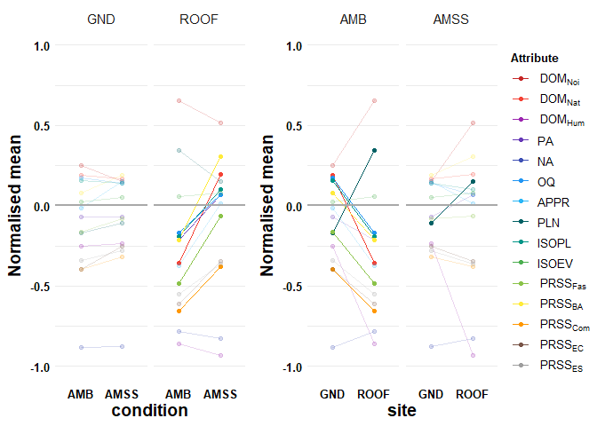

# Replication Code for “AI-augmented urban soundscapes: In-situ assessment of soundscape quality and restorativeness”

The GitHub repository contains the code to replicate the analysis,
figures and tables for the paper titled: “AI-augmented urban
soundscapes: In-situ assessment of soundscape quality and
restorativeness”. The initial stable release v1.0.0 has been archived on
Zenodo:
[](https://doi.org/10.5281/zenodo.11141691 "Link to archived stable release on Zenodo")

The data that support the findings of this study are openly available in
NTU research  
data repository DR-NTU (Data) at <https://doi.org/10.21979/N9/NEH5TR>.

The subheadings in this repository follows the headings in the paper
(after the [Data Loading](#data-loading) section) for consistency.

The following figures are produced by this replication code:

- Figure 2 in [Site evaluation
  questionnaire](#site-evaluation-questionnaire)

- Figure 3 in [Objective binaural
  measurements](#objective-binaural-measurements)

The following tables are produced by this replication code:

- Table 1 in [Site evaluation
  questionnaire](#site-evaluation-questionnaire)

- Table 2 in [Objective binaural
  measurements](#objective-binaural-measurements)

- Extended Data Table 2 in [Site evaluation
  questionnaire](#site-evaluation-questionnaire)

- Extended Data Table 3 in [Site evaluation
  questionnaire](#site-evaluation-questionnaire)

- Extended Data Table 4 in [Objective binaural
  measurements](#objective-binaural-measurements)

- Extended Data Table 5 in [Perceptual implications of ISOPL as a
  soundscape intervention design
  goal](#perceptual-implications-of-isopl-as-a-soundscape-intervention-design-goal)

- Extended Data Table 8 in [Effect of order and group
  size](#effect-of-order-and-group-size)

- Extended Data Table 9 in [Non-acoustic environmental conditions for
  in-situ validation
  study](#non-acoustic-environmental-conditions-for-in-situ-validation-study)

- Extended Data Table 10 in [Participants](#participants)

## Initialisation

## Data Loading

First, download the RData file containing all the data tables required
to replicate all the figures, tables and analyses in this paper from the
Dataverse repository.

Load the RData file `fullData.Rdata`.

## Results

### Site evaluation questionnaire

#### `Extended Data Table 2:` Summary of statistical tests for attributes in soundscape evaluation questionnaire (sound source dominance, overall quality, appropriateness, loudness, *ISOPL*, *ISOEV*, and PRSS dimensions) across site (GND and ROOF), condition (AMSS and AMB), and their interaction (*site*:*condition*). Test abbreviations and symbols for significance levels and effect sizes are defined in the footnote.

``` r
#compute statistical tests for all variables
stat.results<-twoWLMERMANOVA(metadata,amss_insitu_participant_data)
```

    Category is: categorical; Variable is: dom_noise
    Two-Way Mixed Effects Repeated Measures Formula: 
    rank(dom_noise) ~ (1 | pID) + site * condition
    <environment: 0x00000173166d9c80>
    Category is: categorical; Variable is: dom_natural
    Two-Way Mixed Effects Repeated Measures Formula: 
    rank(dom_natural) ~ (1 | pID) + site * condition
    <environment: 0x00000173166d9c80>
    Interaction Effect is significant: p=0 (p<0.05) 
    Category is: categorical; Variable is: dom_human
    Two-Way Mixed Effects Repeated Measures Formula: 
    rank(dom_human) ~ (1 | pID) + site * condition
    <environment: 0x00000173166d9c80>
    Category is: interval; Variable is: PosAff
    Two-Way Mixed Effects Repeated Measures Formula: 
    PosAff ~ (1 | pID) + site * condition
    <environment: 0x00000173166d9c80>
    Interaction Effect is significant: p=0.021 (p<0.05) 
    Category is: interval; Variable is: NegAff
    Two-Way Mixed Effects Repeated Measures Formula: 
    NegAff ~ (1 | pID) + site * condition
    <environment: 0x00000173166d9c80>
    NegAff is non-normal: p<0.05 (p=3.40444416059014e-14)Two-Way Mixed Effects Repeated Measures Formula: 
    rank(NegAff) ~ (1 | pID) + site * condition
    <environment: 0x00000173166d9c80>
    Category is: categorical; Variable is: overall
    Two-Way Mixed Effects Repeated Measures Formula: 
    rank(overall) ~ (1 | pID) + site * condition
    <environment: 0x00000173166d9c80>
    Interaction Effect is significant: p=0.027 (p<0.05) 
    Category is: categorical; Variable is: appropriate
    Two-Way Mixed Effects Repeated Measures Formula: 
    rank(appropriate) ~ (1 | pID) + site * condition
    <environment: 0x00000173166d9c80>
    Category is: categorical; Variable is: loudness
    Two-Way Mixed Effects Repeated Measures Formula: 
    rank(loudness) ~ (1 | pID) + site * condition
    <environment: 0x00000173166d9c80>
    Interaction Effect is significant: p=0.022 (p<0.05) 
    Category is: interval; Variable is: ISOPL
    Two-Way Mixed Effects Repeated Measures Formula: 
    ISOPL ~ (1 | pID) + site * condition
    <environment: 0x00000173166d9c80>
    Interaction Effect is significant: p=0.008 (p<0.05) 
    Category is: interval; Variable is: ISOEV
    Two-Way Mixed Effects Repeated Measures Formula: 
    ISOEV ~ (1 | pID) + site * condition
    <environment: 0x00000173166d9c80>
    Category is: interval; Variable is: PRSSFas
    Two-Way Mixed Effects Repeated Measures Formula: 
    PRSSFas ~ (1 | pID) + site * condition
    <environment: 0x00000173166d9c80>
    Interaction Effect is significant: p=0.008 (p<0.05) 
    Category is: interval; Variable is: PRSSBA
    Two-Way Mixed Effects Repeated Measures Formula: 
    PRSSBA ~ (1 | pID) + site * condition
    <environment: 0x00000173166d9c80>
    Interaction Effect is significant: p=0.019 (p<0.05) 
    Category is: interval; Variable is: PRSSCom
    Two-Way Mixed Effects Repeated Measures Formula: 
    PRSSCom ~ (1 | pID) + site * condition
    <environment: 0x00000173166d9c80>
    Interaction Effect is significant: p=0.046 (p<0.05) 
    Category is: interval; Variable is: PRSSEC
    Two-Way Mixed Effects Repeated Measures Formula: 
    PRSSEC ~ (1 | pID) + site * condition
    <environment: 0x00000173166d9c80>
    Category is: interval; Variable is: PRSSES
    Two-Way Mixed Effects Repeated Measures Formula: 
    PRSSES ~ (1 | pID) + site * condition
    <environment: 0x00000173166d9c80>

``` r
#plot statistical test reults in a table
stat.results |>
        dplyr::mutate(
                p.value=paste0(
                        gtools::stars.pval(p.value),
                        formatC(p.value, format = "f", digits = 4)
                        ),
                eff.size=case_when(
                        eff.size > 0.14 ~ paste0(
                                "(L)",
                                formatC(eff.size,format = "f",digits = 4)
                                ),
                        eff.size > 0.06 ~ paste0(
                                "(M)",
                                formatC(eff.size,format = "f",digits = 4)
                                ),
                        eff.size > 0.01 ~ paste0(
                                "(S)",formatC(eff.size,format = "f",digits = 4)
                                ),
                        .default = formatC(eff.size,format = "f",digits = 4))) |>
        dplyr::group_by(variable) |>
        gt::gt() |>
        cols_label(
                term ~ html("<b>Term</b>"),
                test ~ html("<b>Test</b>"),
                p.value ~ html("<i>p</i>-<b>value</b>"),
                eff.size ~ html("<b>Effect Size</b>")
        )
```

<div>

<div id="pqfkwfmchn" style="padding-left:0px;padding-right:0px;padding-top:10px;padding-bottom:10px;overflow-x:auto;overflow-y:auto;width:auto;height:auto;">
<style>#pqfkwfmchn table {
  font-family: system-ui, 'Segoe UI', Roboto, Helvetica, Arial, sans-serif, 'Apple Color Emoji', 'Segoe UI Emoji', 'Segoe UI Symbol', 'Noto Color Emoji';
  -webkit-font-smoothing: antialiased;
  -moz-osx-font-smoothing: grayscale;
}
&#10;#pqfkwfmchn thead, #pqfkwfmchn tbody, #pqfkwfmchn tfoot, #pqfkwfmchn tr, #pqfkwfmchn td, #pqfkwfmchn th {
  border-style: none;
}
&#10;#pqfkwfmchn p {
  margin: 0;
  padding: 0;
}
&#10;#pqfkwfmchn .gt_table {
  display: table;
  border-collapse: collapse;
  line-height: normal;
  margin-left: auto;
  margin-right: auto;
  color: #333333;
  font-size: 16px;
  font-weight: normal;
  font-style: normal;
  background-color: #FFFFFF;
  width: auto;
  border-top-style: solid;
  border-top-width: 2px;
  border-top-color: #A8A8A8;
  border-right-style: none;
  border-right-width: 2px;
  border-right-color: #D3D3D3;
  border-bottom-style: solid;
  border-bottom-width: 2px;
  border-bottom-color: #A8A8A8;
  border-left-style: none;
  border-left-width: 2px;
  border-left-color: #D3D3D3;
}
&#10;#pqfkwfmchn .gt_caption {
  padding-top: 4px;
  padding-bottom: 4px;
}
&#10;#pqfkwfmchn .gt_title {
  color: #333333;
  font-size: 125%;
  font-weight: initial;
  padding-top: 4px;
  padding-bottom: 4px;
  padding-left: 5px;
  padding-right: 5px;
  border-bottom-color: #FFFFFF;
  border-bottom-width: 0;
}
&#10;#pqfkwfmchn .gt_subtitle {
  color: #333333;
  font-size: 85%;
  font-weight: initial;
  padding-top: 3px;
  padding-bottom: 5px;
  padding-left: 5px;
  padding-right: 5px;
  border-top-color: #FFFFFF;
  border-top-width: 0;
}
&#10;#pqfkwfmchn .gt_heading {
  background-color: #FFFFFF;
  text-align: center;
  border-bottom-color: #FFFFFF;
  border-left-style: none;
  border-left-width: 1px;
  border-left-color: #D3D3D3;
  border-right-style: none;
  border-right-width: 1px;
  border-right-color: #D3D3D3;
}
&#10;#pqfkwfmchn .gt_bottom_border {
  border-bottom-style: solid;
  border-bottom-width: 2px;
  border-bottom-color: #D3D3D3;
}
&#10;#pqfkwfmchn .gt_col_headings {
  border-top-style: solid;
  border-top-width: 2px;
  border-top-color: #D3D3D3;
  border-bottom-style: solid;
  border-bottom-width: 2px;
  border-bottom-color: #D3D3D3;
  border-left-style: none;
  border-left-width: 1px;
  border-left-color: #D3D3D3;
  border-right-style: none;
  border-right-width: 1px;
  border-right-color: #D3D3D3;
}
&#10;#pqfkwfmchn .gt_col_heading {
  color: #333333;
  background-color: #FFFFFF;
  font-size: 100%;
  font-weight: normal;
  text-transform: inherit;
  border-left-style: none;
  border-left-width: 1px;
  border-left-color: #D3D3D3;
  border-right-style: none;
  border-right-width: 1px;
  border-right-color: #D3D3D3;
  vertical-align: bottom;
  padding-top: 5px;
  padding-bottom: 6px;
  padding-left: 5px;
  padding-right: 5px;
  overflow-x: hidden;
}
&#10;#pqfkwfmchn .gt_column_spanner_outer {
  color: #333333;
  background-color: #FFFFFF;
  font-size: 100%;
  font-weight: normal;
  text-transform: inherit;
  padding-top: 0;
  padding-bottom: 0;
  padding-left: 4px;
  padding-right: 4px;
}
&#10;#pqfkwfmchn .gt_column_spanner_outer:first-child {
  padding-left: 0;
}
&#10;#pqfkwfmchn .gt_column_spanner_outer:last-child {
  padding-right: 0;
}
&#10;#pqfkwfmchn .gt_column_spanner {
  border-bottom-style: solid;
  border-bottom-width: 2px;
  border-bottom-color: #D3D3D3;
  vertical-align: bottom;
  padding-top: 5px;
  padding-bottom: 5px;
  overflow-x: hidden;
  display: inline-block;
  width: 100%;
}
&#10;#pqfkwfmchn .gt_spanner_row {
  border-bottom-style: hidden;
}
&#10;#pqfkwfmchn .gt_group_heading {
  padding-top: 8px;
  padding-bottom: 8px;
  padding-left: 5px;
  padding-right: 5px;
  color: #333333;
  background-color: #FFFFFF;
  font-size: 100%;
  font-weight: initial;
  text-transform: inherit;
  border-top-style: solid;
  border-top-width: 2px;
  border-top-color: #D3D3D3;
  border-bottom-style: solid;
  border-bottom-width: 2px;
  border-bottom-color: #D3D3D3;
  border-left-style: none;
  border-left-width: 1px;
  border-left-color: #D3D3D3;
  border-right-style: none;
  border-right-width: 1px;
  border-right-color: #D3D3D3;
  vertical-align: middle;
  text-align: left;
}
&#10;#pqfkwfmchn .gt_empty_group_heading {
  padding: 0.5px;
  color: #333333;
  background-color: #FFFFFF;
  font-size: 100%;
  font-weight: initial;
  border-top-style: solid;
  border-top-width: 2px;
  border-top-color: #D3D3D3;
  border-bottom-style: solid;
  border-bottom-width: 2px;
  border-bottom-color: #D3D3D3;
  vertical-align: middle;
}
&#10;#pqfkwfmchn .gt_from_md > :first-child {
  margin-top: 0;
}
&#10;#pqfkwfmchn .gt_from_md > :last-child {
  margin-bottom: 0;
}
&#10;#pqfkwfmchn .gt_row {
  padding-top: 8px;
  padding-bottom: 8px;
  padding-left: 5px;
  padding-right: 5px;
  margin: 10px;
  border-top-style: solid;
  border-top-width: 1px;
  border-top-color: #D3D3D3;
  border-left-style: none;
  border-left-width: 1px;
  border-left-color: #D3D3D3;
  border-right-style: none;
  border-right-width: 1px;
  border-right-color: #D3D3D3;
  vertical-align: middle;
  overflow-x: hidden;
}
&#10;#pqfkwfmchn .gt_stub {
  color: #333333;
  background-color: #FFFFFF;
  font-size: 100%;
  font-weight: initial;
  text-transform: inherit;
  border-right-style: solid;
  border-right-width: 2px;
  border-right-color: #D3D3D3;
  padding-left: 5px;
  padding-right: 5px;
}
&#10;#pqfkwfmchn .gt_stub_row_group {
  color: #333333;
  background-color: #FFFFFF;
  font-size: 100%;
  font-weight: initial;
  text-transform: inherit;
  border-right-style: solid;
  border-right-width: 2px;
  border-right-color: #D3D3D3;
  padding-left: 5px;
  padding-right: 5px;
  vertical-align: top;
}
&#10;#pqfkwfmchn .gt_row_group_first td {
  border-top-width: 2px;
}
&#10;#pqfkwfmchn .gt_row_group_first th {
  border-top-width: 2px;
}
&#10;#pqfkwfmchn .gt_summary_row {
  color: #333333;
  background-color: #FFFFFF;
  text-transform: inherit;
  padding-top: 8px;
  padding-bottom: 8px;
  padding-left: 5px;
  padding-right: 5px;
}
&#10;#pqfkwfmchn .gt_first_summary_row {
  border-top-style: solid;
  border-top-color: #D3D3D3;
}
&#10;#pqfkwfmchn .gt_first_summary_row.thick {
  border-top-width: 2px;
}
&#10;#pqfkwfmchn .gt_last_summary_row {
  padding-top: 8px;
  padding-bottom: 8px;
  padding-left: 5px;
  padding-right: 5px;
  border-bottom-style: solid;
  border-bottom-width: 2px;
  border-bottom-color: #D3D3D3;
}
&#10;#pqfkwfmchn .gt_grand_summary_row {
  color: #333333;
  background-color: #FFFFFF;
  text-transform: inherit;
  padding-top: 8px;
  padding-bottom: 8px;
  padding-left: 5px;
  padding-right: 5px;
}
&#10;#pqfkwfmchn .gt_first_grand_summary_row {
  padding-top: 8px;
  padding-bottom: 8px;
  padding-left: 5px;
  padding-right: 5px;
  border-top-style: double;
  border-top-width: 6px;
  border-top-color: #D3D3D3;
}
&#10;#pqfkwfmchn .gt_last_grand_summary_row_top {
  padding-top: 8px;
  padding-bottom: 8px;
  padding-left: 5px;
  padding-right: 5px;
  border-bottom-style: double;
  border-bottom-width: 6px;
  border-bottom-color: #D3D3D3;
}
&#10;#pqfkwfmchn .gt_striped {
  background-color: rgba(128, 128, 128, 0.05);
}
&#10;#pqfkwfmchn .gt_table_body {
  border-top-style: solid;
  border-top-width: 2px;
  border-top-color: #D3D3D3;
  border-bottom-style: solid;
  border-bottom-width: 2px;
  border-bottom-color: #D3D3D3;
}
&#10;#pqfkwfmchn .gt_footnotes {
  color: #333333;
  background-color: #FFFFFF;
  border-bottom-style: none;
  border-bottom-width: 2px;
  border-bottom-color: #D3D3D3;
  border-left-style: none;
  border-left-width: 2px;
  border-left-color: #D3D3D3;
  border-right-style: none;
  border-right-width: 2px;
  border-right-color: #D3D3D3;
}
&#10;#pqfkwfmchn .gt_footnote {
  margin: 0px;
  font-size: 90%;
  padding-top: 4px;
  padding-bottom: 4px;
  padding-left: 5px;
  padding-right: 5px;
}
&#10;#pqfkwfmchn .gt_sourcenotes {
  color: #333333;
  background-color: #FFFFFF;
  border-bottom-style: none;
  border-bottom-width: 2px;
  border-bottom-color: #D3D3D3;
  border-left-style: none;
  border-left-width: 2px;
  border-left-color: #D3D3D3;
  border-right-style: none;
  border-right-width: 2px;
  border-right-color: #D3D3D3;
}
&#10;#pqfkwfmchn .gt_sourcenote {
  font-size: 90%;
  padding-top: 4px;
  padding-bottom: 4px;
  padding-left: 5px;
  padding-right: 5px;
}
&#10;#pqfkwfmchn .gt_left {
  text-align: left;
}
&#10;#pqfkwfmchn .gt_center {
  text-align: center;
}
&#10;#pqfkwfmchn .gt_right {
  text-align: right;
  font-variant-numeric: tabular-nums;
}
&#10;#pqfkwfmchn .gt_font_normal {
  font-weight: normal;
}
&#10;#pqfkwfmchn .gt_font_bold {
  font-weight: bold;
}
&#10;#pqfkwfmchn .gt_font_italic {
  font-style: italic;
}
&#10;#pqfkwfmchn .gt_super {
  font-size: 65%;
}
&#10;#pqfkwfmchn .gt_footnote_marks {
  font-size: 75%;
  vertical-align: 0.4em;
  position: initial;
}
&#10;#pqfkwfmchn .gt_asterisk {
  font-size: 100%;
  vertical-align: 0;
}
&#10;#pqfkwfmchn .gt_indent_1 {
  text-indent: 5px;
}
&#10;#pqfkwfmchn .gt_indent_2 {
  text-indent: 10px;
}
&#10;#pqfkwfmchn .gt_indent_3 {
  text-indent: 15px;
}
&#10;#pqfkwfmchn .gt_indent_4 {
  text-indent: 20px;
}
&#10;#pqfkwfmchn .gt_indent_5 {
  text-indent: 25px;
}
</style>

| **Term**           | **Test**                       | *p*-**value** | **Effect Size** |
|--------------------|--------------------------------|---------------|-----------------|
| dom_noise          |                                |               |                 |
| site               | 2ME-RT-RMANOVA                 | \*\*\*0.0000  | (L)0.3182       |
| condition          | 2ME-RT-RMANOVA                 | 0.1571        | (S)0.0145       |
| site:condition     | 2ME-RT-RMANOVA                 | 0.5667        | 0.0000          |
| dom_natural        |                                |               |                 |
| site               | 2ME-RT-RMANOVA                 | \*\*\*0.0004  | (L)0.1464       |
| condition          | 2ME-RT-RMANOVA                 | \*\*0.0015    | (M)0.1175       |
| site:condition     | 2ME-RT-RMANOVA                 | \*\*\*0.0003  | (L)0.1492       |
| AMB - AMSS \| GND  | Simple Contrasts for Condition | 0.9513        | (S)0.0149       |
| AMB - AMSS \| ROOF | Simple Contrasts for Condition | \*\*\*0.0000  | -1.1574         |
| GND - ROOF \| AMB  | Simple Contrasts for Site      | \*\*\*0.0000  | (L)1.1661       |
| GND - ROOF \| AMSS | Simple Contrasts for Site      | 0.9783        | -0.0061         |
| dom_human          |                                |               |                 |
| site               | 2ME-RT-RMANOVA                 | \*\*\*0.0000  | (L)0.5180       |
| condition          | 2ME-RT-RMANOVA                 | 0.1039        | (S)0.0121       |
| site:condition     | 2ME-RT-RMANOVA                 | 0.8785        | 0.0000          |
| PosAff             |                                |               |                 |
| Residuals          | Shapiro-Wilk normality test    | 0.1731        | NA              |
| site               | 2ME-RMANOVA                    | 0.6753        | 0.0000          |
| condition          | 2ME-RMANOVA                    | 0.1620        | (S)0.0139       |
| site:condition     | 2ME-RMANOVA                    | \*0.0211      | (S)0.0403       |
| AMB - AMSS \| GND  | Simple Contrasts for Condition | 0.9835        | -0.0050         |
| AMB - AMSS \| MP   | Simple Contrasts for Condition | 0.2242        | -0.2963         |
| AMB - AMSS \| ROOF | Simple Contrasts for Condition | \*0.0179      | -0.5839         |
| GND - MP \| AMB    | Simple Contrasts for Site      | 0.8971        | (M)0.0669       |
| GND - ROOF \| AMB  | Simple Contrasts for Site      | 0.1369        | (L)0.2912       |
| MP - ROOF \| AMB   | Simple Contrasts for Site      | 0.2999        | (L)0.2243       |
| GND - MP \| AMSS   | Simple Contrasts for Site      | 0.2625        | -0.2243         |
| GND - ROOF \| AMSS | Simple Contrasts for Site      | 0.1133        | -0.2876         |
| MP - ROOF \| AMSS  | Simple Contrasts for Site      | 0.8977        | -0.0633         |
| NegAff             |                                |               |                 |
| Residuals          | Shapiro-Wilk normality test    | \*\*\*0.0000  | NA              |
| site               | 2ME-RT-RMANOVA                 | 0.3525        | 0.0006          |
| condition          | 2ME-RT-RMANOVA                 | \*0.0253      | (S)0.0550       |
| site:condition     | 2ME-RT-RMANOVA                 | 0.1665        | (S)0.0114       |
| overall            |                                |               |                 |
| site               | 2ME-RT-RMANOVA                 | \*\*0.0041    | (M)0.0965       |
| condition          | 2ME-RT-RMANOVA                 | 0.2204        | 0.0073          |
| site:condition     | 2ME-RT-RMANOVA                 | \*0.0271      | (S)0.0540       |
| AMB - AMSS \| GND  | Simple Contrasts for Condition | 0.7087        | (M)0.0910       |
| AMB - AMSS \| ROOF | Simple Contrasts for Condition | \*0.0221      | -0.5631         |
| GND - ROOF \| AMB  | Simple Contrasts for Site      | \*\*\*0.0009  | (L)0.7525       |
| GND - ROOF \| AMSS | Simple Contrasts for Site      | 0.6297        | (M)0.0984       |
| appropriate        |                                |               |                 |
| site               | 2ME-RT-RMANOVA                 | \*\*0.0024    | (M)0.1074       |
| condition          | 2ME-RT-RMANOVA                 | \*\*\*0.0007  | (M)0.1327       |
| site:condition     | 2ME-RT-RMANOVA                 | 0.1591        | (S)0.0142       |
| loudness           |                                |               |                 |
| site               | 2ME-RT-RMANOVA                 | \*\*\*0.0000  | (L)0.3561       |
| condition          | 2ME-RT-RMANOVA                 | 0.5667        | 0.0000          |
| site:condition     | 2ME-RT-RMANOVA                 | \*0.0221      | (S)0.0587       |
| AMB - AMSS \| GND  | Simple Contrasts for Condition | 0.4189        | -0.1971         |
| AMB - AMSS \| ROOF | Simple Contrasts for Condition | .0.0812       | (L)0.4274       |
| GND - ROOF \| AMB  | Simple Contrasts for Site      | \*\*\*0.0000  | -1.1600         |
| GND - ROOF \| AMSS | Simple Contrasts for Site      | \*\*0.0057    | -0.5355         |
| ISOPL              |                                |               |                 |
| Residuals          | Shapiro-Wilk normality test    | 0.1229        | NA              |
| site               | 2ME-RMANOVA                    | \*\*0.0011    | (M)0.1248       |
| condition          | 2ME-RMANOVA                    | \*0.0432      | (S)0.0434       |
| site:condition     | 2ME-RMANOVA                    | \*\*0.0082    | (M)0.0808       |
| AMB - AMSS \| GND  | Simple Contrasts for Condition | 0.8241        | (S)0.0541       |
| AMB - AMSS \| ROOF | Simple Contrasts for Condition | \*\*0.0014    | -0.7926         |
| GND - ROOF \| AMB  | Simple Contrasts for Site      | \*\*\*0.0001  | (L)0.9473       |
| GND - ROOF \| AMSS | Simple Contrasts for Site      | 0.6487        | (M)0.1006       |
| ISOEV              |                                |               |                 |
| Residuals          | Shapiro-Wilk normality test    | 0.7790        | NA              |
| site               | 2ME-RMANOVA                    | 0.4576        | 0.0000          |
| condition          | 2ME-RMANOVA                    | 0.5795        | 0.0000          |
| site:condition     | 2ME-RMANOVA                    | 0.9990        | 0.0000          |
| PRSSFas            |                                |               |                 |
| Residuals          | Shapiro-Wilk normality test    | 0.8728        | NA              |
| site               | 2ME-RMANOVA                    | \*0.0203      | (M)0.0606       |
| condition          | 2ME-RMANOVA                    | \*\*0.0034    | (M)0.1000       |
| site:condition     | 2ME-RMANOVA                    | \*\*0.0083    | (M)0.0806       |
| AMB - AMSS \| GND  | Simple Contrasts for Condition | 0.4713        | -0.1755         |
| AMB - AMSS \| ROOF | Simple Contrasts for Condition | \*\*\*0.0001  | -0.9538         |
| GND - ROOF \| AMB  | Simple Contrasts for Site      | \*\*0.0011    | (L)0.7314       |
| GND - ROOF \| AMSS | Simple Contrasts for Site      | 0.8178        | -0.0468         |
| PRSSBA             |                                |               |                 |
| Residuals          | Shapiro-Wilk normality test    | 0.7777        | NA              |
| site               | 2ME-RMANOVA                    | 0.3081        | 0.0006          |
| condition          | 2ME-RMANOVA                    | \*\*0.0034    | (M)0.1005       |
| site:condition     | 2ME-RMANOVA                    | \*0.0193      | (M)0.0618       |
| AMB - AMSS \| GND  | Simple Contrasts for Condition | 0.4309        | -0.1920         |
| AMB - AMSS \| ROOF | Simple Contrasts for Condition | \*\*\*0.0003  | -0.9116         |
| GND - ROOF \| AMB  | Simple Contrasts for Site      | \*0.0241      | (L)0.5165       |
| GND - ROOF \| AMSS | Simple Contrasts for Site      | 0.3390        | -0.2031         |
| PRSSCom            |                                |               |                 |
| Residuals          | Shapiro-Wilk normality test    | 0.3328        | NA              |
| site               | 2ME-RMANOVA                    | \*\*\*0.0009  | (M)0.1287       |
| condition          | 2ME-RMANOVA                    | \*0.0135      | (M)0.0698       |
| site:condition     | 2ME-RMANOVA                    | \*0.0456      | (S)0.0422       |
| AMB - AMSS \| GND  | Simple Contrasts for Condition | 0.3652        | -0.2209         |
| AMB - AMSS \| ROOF | Simple Contrasts for Condition | \*\*0.0020    | -0.7697         |
| GND - ROOF \| AMB  | Simple Contrasts for Site      | \*\*\*0.0005  | (L)0.7308       |
| GND - ROOF \| AMSS | Simple Contrasts for Site      | 0.3378        | (L)0.1819       |
| PRSSEC             |                                |               |                 |
| Residuals          | Shapiro-Wilk normality test    | 0.9051        | NA              |
| site               | 2ME-RMANOVA                    | \*\*0.0015    | (M)0.1182       |
| condition          | 2ME-RMANOVA                    | \*\*0.0023    | (M)0.1089       |
| site:condition     | 2ME-RMANOVA                    | 0.2031        | 0.0090          |
| PRSSES             |                                |               |                 |
| Residuals          | Shapiro-Wilk normality test    | .0.0581       | NA              |
| site               | 2ME-RMANOVA                    | \*\*0.0010    | (M)0.1254       |
| condition          | 2ME-RMANOVA                    | \*0.0410      | (S)0.0446       |
| site:condition     | 2ME-RMANOVA                    | 0.1504        | (S)0.0155       |

</div>

</div>

#### `Table 1:` Mean responses $\mu$ (standard deviation $\sigma$) of perceptual attributes in the site evaluation questionnaire investigated for the validation study, organized by *site* and *condition*. The scales for all attributes are normalised to the range $[-1,1]$. Percentage changes are computed between the AMB and AMSS for *site*, and between ROOF and GND for *condition* as scale changes on the $[-1,1]$ range with respect to the former. For instance, a change from $-0.25$ in the AMB condition to $0.75$ in the AMSS condition would be reported as a $50$% change. Significant changes as determined by posthoc tests are indicated in bold.

``` r
#retrieve significant results
signif_posthoc <- stat.results |>
        dplyr::filter(
                p.value<0.05 & 
                        !grepl("MP",term) &
                        grepl("Contrasts",test)
                      ) 

signif_posthoc_bycond <- signif_posthoc |>
        filter(grepl("Condition",test)) |>
        select(variable,term)

signif_posthoc_bysite <- signif_posthoc |>
        filter(grepl("Site",test)) |>
        select(variable,term)

#summarise by condition at each site
summary_bycond_gt <- amss_insitu_participant_data |>
        dplyr::filter(!site=="MP") |>
        dplyr::select(!c(pID,order,partGrp,p:m,pss:who5)) |>
        tbl_strata(
            strata = site,
            .tbl_fun =
              ~ .x %>%
                tbl_summary(
                        by = condition, 
                        missing = "no",
                        type = everything() ~ "continuous",
                        statistic = all_continuous() ~ "{mean} ({sd})",
                        label = list(
                                dom_noise ~ "!DOM#@Noi~",
                                dom_human ~ "!DOM#@Hum~",
                                dom_natural ~ "!DOM#@Nat~",
                                overall ~ "!OSQ#",
                                appropriate ~ "!APPR#",
                                loudness ~ "!PLN#",
                                ISOPL ~ "!ISOPL#",
                                ISOEV ~ "!ISOEV#",
                                PRSSFas ~ "!PRSS#@Fas~",
                                PRSSBA ~ "!PRSS#@BA~",
                                PRSSCom ~ "!PRSS#@Com~",
                                PRSSEC ~ "!PRSS#@EC~",
                                PRSSES ~ "!PRSS#@ES~",
                                PosAff ~ "!PA#",
                                NegAff ~ "!NA#"
                                )
                        ) %>%
                add_difference(
                        estimate_fun = everything() ~ 
                                function(x) paste0(style_sigfig((-x/2) * 100), "%")
                ),
            .header = "**{strata}**"
            ) |>
        modify_column_hide(columns = c(p.value_1,ci_1,p.value_2,ci_2)) |>
        # remove difference footnote
        modify_footnote(update = everything() ~ NA) |>
        modify_header(all_stat_cols() ~ "**{level}**") 

#summarise by site for each cond
summary_bysite_gt <- amss_insitu_participant_data |>
        dplyr::filter(!site=="MP") |>
        dplyr::select(!c(pID,order,partGrp,p:m,pss:who5)) |>
        dplyr::mutate(site=factor(site, levels=c("GND","ROOF"))) |>
        tbl_strata(
            strata = condition,
            .tbl_fun =
              ~ .x %>%
                tbl_summary(
                        by = site, 
                        missing = "no",
                        type = everything() ~ "continuous",
                        statistic = all_continuous() ~ "{mean} ({sd})",
                        label = list(
                                dom_noise ~ "!DOM#@Noi~",
                                dom_human ~ "!DOM#@Hum~",
                                dom_natural ~ "!DOM#@Nat~",
                                overall ~ "!OSQ#",
                                appropriate ~ "!APPR#",
                                loudness ~ "!PLN#",
                                ISOPL ~ "!ISOPL#",
                                ISOEV ~ "!ISOEV#",
                                PRSSFas ~ "!PRSS#@Fas~",
                                PRSSBA ~ "!PRSS#@BA~",
                                PRSSCom ~ "!PRSS#@Com~",
                                PRSSEC ~ "!PRSS#@EC~",
                                PRSSES ~ "!PRSS#@ES~",
                                PosAff ~ "!PA#",
                                NegAff ~ "!NA#"
                                )
                        ) %>%
                add_difference(
                        estimate_fun = everything() ~ 
                                function(x) paste0(style_sigfig((-x/2) * 100), "%")
                        ),
            .header = "**{strata}**"
            ) |>
        modify_column_hide(columns = c(p.value_1,ci_1,p.value_2,ci_2)) |>
        # remove difference footnote
        modify_footnote(update = everything() ~ NA) |>
        modify_header(all_stat_cols() ~ "**{level}**") 

#merge tables columnwise        
tbl_merge_cond_site <-
        tbl_merge(
                tbls = list(summary_bycond_gt, summary_bysite_gt),
                tab_spanner = c(
                        "**Contrasts by condition at ...**",
                        "**Contrasts by site under ...**"
                        )
                ) |>
        as_gt() |>
        text_transform(
                locations = cells_body(),
                fn = function(x) {
                        str_replace_all(
                                x,pattern = "@",
                                replacement = "<sub>"
                                ) |>
                                str_replace_all("~","</sub>") |>
                                str_replace_all("!","<i>") |>
                                str_replace_all("#","</i>")
                        }
                ) |>
        #highlight significant results at GND site
        tab_style(
                style = list(
                        cell_fill(color = "#FDE992"),
                        cell_text(weight = "bold")
                        ),
                locations = cells_body(
                        columns = c(estimate_1_1),
                        rows = variable %in% 
                                signif_posthoc_bycond[
                                        str_detect(signif_posthoc_bycond$term,
                                                   "GND"),
                                        ]$variable
                        )
        ) |>
        #highlight significant results at ROOF site
        tab_style(
                style = list(
                        cell_fill(color = "#FDE992"),
                        cell_text(weight = "bold")
                        ),
                locations = cells_body(
                        columns = c(estimate_2_1),
                        rows = variable %in% 
                                signif_posthoc_bycond[
                                        str_detect(signif_posthoc_bycond$term,
                                                   "ROOF"),
                                        ]$variable
                        )
        ) |>
        #highlight significant results under AMB condition
        tab_style(
                style = list(
                        cell_fill(color = "#FDE992"),
                        cell_text(weight = "bold")
                        ),
                locations = cells_body(
                        columns = c(estimate_1_2),
                        rows = variable %in% 
                                signif_posthoc_bysite[
                                        str_detect(signif_posthoc_bysite$term,
                                                   "AMB"),
                                        ]$variable
                        )
        ) |>
        #highlight significant results under AMSS condition
        tab_style(
                style = list(
                        cell_fill(color = "#FDE992"),
                        cell_text(weight = "bold")
                        ),
                locations = cells_body(
                        columns = c(estimate_2_2),
                        rows = variable %in% 
                                signif_posthoc_bysite[
                                        str_detect(signif_posthoc_bysite$term,
                                                   "AMSS"),
                                        ]$variable
                        )
        )
        
tbl_merge_cond_site
```

<div>

<div id="xedafsuuie" style="padding-left:0px;padding-right:0px;padding-top:10px;padding-bottom:10px;overflow-x:auto;overflow-y:auto;width:auto;height:auto;">
<style>#xedafsuuie table {
  font-family: system-ui, 'Segoe UI', Roboto, Helvetica, Arial, sans-serif, 'Apple Color Emoji', 'Segoe UI Emoji', 'Segoe UI Symbol', 'Noto Color Emoji';
  -webkit-font-smoothing: antialiased;
  -moz-osx-font-smoothing: grayscale;
}
&#10;#xedafsuuie thead, #xedafsuuie tbody, #xedafsuuie tfoot, #xedafsuuie tr, #xedafsuuie td, #xedafsuuie th {
  border-style: none;
}
&#10;#xedafsuuie p {
  margin: 0;
  padding: 0;
}
&#10;#xedafsuuie .gt_table {
  display: table;
  border-collapse: collapse;
  line-height: normal;
  margin-left: auto;
  margin-right: auto;
  color: #333333;
  font-size: 16px;
  font-weight: normal;
  font-style: normal;
  background-color: #FFFFFF;
  width: auto;
  border-top-style: solid;
  border-top-width: 2px;
  border-top-color: #A8A8A8;
  border-right-style: none;
  border-right-width: 2px;
  border-right-color: #D3D3D3;
  border-bottom-style: solid;
  border-bottom-width: 2px;
  border-bottom-color: #A8A8A8;
  border-left-style: none;
  border-left-width: 2px;
  border-left-color: #D3D3D3;
}
&#10;#xedafsuuie .gt_caption {
  padding-top: 4px;
  padding-bottom: 4px;
}
&#10;#xedafsuuie .gt_title {
  color: #333333;
  font-size: 125%;
  font-weight: initial;
  padding-top: 4px;
  padding-bottom: 4px;
  padding-left: 5px;
  padding-right: 5px;
  border-bottom-color: #FFFFFF;
  border-bottom-width: 0;
}
&#10;#xedafsuuie .gt_subtitle {
  color: #333333;
  font-size: 85%;
  font-weight: initial;
  padding-top: 3px;
  padding-bottom: 5px;
  padding-left: 5px;
  padding-right: 5px;
  border-top-color: #FFFFFF;
  border-top-width: 0;
}
&#10;#xedafsuuie .gt_heading {
  background-color: #FFFFFF;
  text-align: center;
  border-bottom-color: #FFFFFF;
  border-left-style: none;
  border-left-width: 1px;
  border-left-color: #D3D3D3;
  border-right-style: none;
  border-right-width: 1px;
  border-right-color: #D3D3D3;
}
&#10;#xedafsuuie .gt_bottom_border {
  border-bottom-style: solid;
  border-bottom-width: 2px;
  border-bottom-color: #D3D3D3;
}
&#10;#xedafsuuie .gt_col_headings {
  border-top-style: solid;
  border-top-width: 2px;
  border-top-color: #D3D3D3;
  border-bottom-style: solid;
  border-bottom-width: 2px;
  border-bottom-color: #D3D3D3;
  border-left-style: none;
  border-left-width: 1px;
  border-left-color: #D3D3D3;
  border-right-style: none;
  border-right-width: 1px;
  border-right-color: #D3D3D3;
}
&#10;#xedafsuuie .gt_col_heading {
  color: #333333;
  background-color: #FFFFFF;
  font-size: 100%;
  font-weight: normal;
  text-transform: inherit;
  border-left-style: none;
  border-left-width: 1px;
  border-left-color: #D3D3D3;
  border-right-style: none;
  border-right-width: 1px;
  border-right-color: #D3D3D3;
  vertical-align: bottom;
  padding-top: 5px;
  padding-bottom: 6px;
  padding-left: 5px;
  padding-right: 5px;
  overflow-x: hidden;
}
&#10;#xedafsuuie .gt_column_spanner_outer {
  color: #333333;
  background-color: #FFFFFF;
  font-size: 100%;
  font-weight: normal;
  text-transform: inherit;
  padding-top: 0;
  padding-bottom: 0;
  padding-left: 4px;
  padding-right: 4px;
}
&#10;#xedafsuuie .gt_column_spanner_outer:first-child {
  padding-left: 0;
}
&#10;#xedafsuuie .gt_column_spanner_outer:last-child {
  padding-right: 0;
}
&#10;#xedafsuuie .gt_column_spanner {
  border-bottom-style: solid;
  border-bottom-width: 2px;
  border-bottom-color: #D3D3D3;
  vertical-align: bottom;
  padding-top: 5px;
  padding-bottom: 5px;
  overflow-x: hidden;
  display: inline-block;
  width: 100%;
}
&#10;#xedafsuuie .gt_spanner_row {
  border-bottom-style: hidden;
}
&#10;#xedafsuuie .gt_group_heading {
  padding-top: 8px;
  padding-bottom: 8px;
  padding-left: 5px;
  padding-right: 5px;
  color: #333333;
  background-color: #FFFFFF;
  font-size: 100%;
  font-weight: initial;
  text-transform: inherit;
  border-top-style: solid;
  border-top-width: 2px;
  border-top-color: #D3D3D3;
  border-bottom-style: solid;
  border-bottom-width: 2px;
  border-bottom-color: #D3D3D3;
  border-left-style: none;
  border-left-width: 1px;
  border-left-color: #D3D3D3;
  border-right-style: none;
  border-right-width: 1px;
  border-right-color: #D3D3D3;
  vertical-align: middle;
  text-align: left;
}
&#10;#xedafsuuie .gt_empty_group_heading {
  padding: 0.5px;
  color: #333333;
  background-color: #FFFFFF;
  font-size: 100%;
  font-weight: initial;
  border-top-style: solid;
  border-top-width: 2px;
  border-top-color: #D3D3D3;
  border-bottom-style: solid;
  border-bottom-width: 2px;
  border-bottom-color: #D3D3D3;
  vertical-align: middle;
}
&#10;#xedafsuuie .gt_from_md > :first-child {
  margin-top: 0;
}
&#10;#xedafsuuie .gt_from_md > :last-child {
  margin-bottom: 0;
}
&#10;#xedafsuuie .gt_row {
  padding-top: 8px;
  padding-bottom: 8px;
  padding-left: 5px;
  padding-right: 5px;
  margin: 10px;
  border-top-style: solid;
  border-top-width: 1px;
  border-top-color: #D3D3D3;
  border-left-style: none;
  border-left-width: 1px;
  border-left-color: #D3D3D3;
  border-right-style: none;
  border-right-width: 1px;
  border-right-color: #D3D3D3;
  vertical-align: middle;
  overflow-x: hidden;
}
&#10;#xedafsuuie .gt_stub {
  color: #333333;
  background-color: #FFFFFF;
  font-size: 100%;
  font-weight: initial;
  text-transform: inherit;
  border-right-style: solid;
  border-right-width: 2px;
  border-right-color: #D3D3D3;
  padding-left: 5px;
  padding-right: 5px;
}
&#10;#xedafsuuie .gt_stub_row_group {
  color: #333333;
  background-color: #FFFFFF;
  font-size: 100%;
  font-weight: initial;
  text-transform: inherit;
  border-right-style: solid;
  border-right-width: 2px;
  border-right-color: #D3D3D3;
  padding-left: 5px;
  padding-right: 5px;
  vertical-align: top;
}
&#10;#xedafsuuie .gt_row_group_first td {
  border-top-width: 2px;
}
&#10;#xedafsuuie .gt_row_group_first th {
  border-top-width: 2px;
}
&#10;#xedafsuuie .gt_summary_row {
  color: #333333;
  background-color: #FFFFFF;
  text-transform: inherit;
  padding-top: 8px;
  padding-bottom: 8px;
  padding-left: 5px;
  padding-right: 5px;
}
&#10;#xedafsuuie .gt_first_summary_row {
  border-top-style: solid;
  border-top-color: #D3D3D3;
}
&#10;#xedafsuuie .gt_first_summary_row.thick {
  border-top-width: 2px;
}
&#10;#xedafsuuie .gt_last_summary_row {
  padding-top: 8px;
  padding-bottom: 8px;
  padding-left: 5px;
  padding-right: 5px;
  border-bottom-style: solid;
  border-bottom-width: 2px;
  border-bottom-color: #D3D3D3;
}
&#10;#xedafsuuie .gt_grand_summary_row {
  color: #333333;
  background-color: #FFFFFF;
  text-transform: inherit;
  padding-top: 8px;
  padding-bottom: 8px;
  padding-left: 5px;
  padding-right: 5px;
}
&#10;#xedafsuuie .gt_first_grand_summary_row {
  padding-top: 8px;
  padding-bottom: 8px;
  padding-left: 5px;
  padding-right: 5px;
  border-top-style: double;
  border-top-width: 6px;
  border-top-color: #D3D3D3;
}
&#10;#xedafsuuie .gt_last_grand_summary_row_top {
  padding-top: 8px;
  padding-bottom: 8px;
  padding-left: 5px;
  padding-right: 5px;
  border-bottom-style: double;
  border-bottom-width: 6px;
  border-bottom-color: #D3D3D3;
}
&#10;#xedafsuuie .gt_striped {
  background-color: rgba(128, 128, 128, 0.05);
}
&#10;#xedafsuuie .gt_table_body {
  border-top-style: solid;
  border-top-width: 2px;
  border-top-color: #D3D3D3;
  border-bottom-style: solid;
  border-bottom-width: 2px;
  border-bottom-color: #D3D3D3;
}
&#10;#xedafsuuie .gt_footnotes {
  color: #333333;
  background-color: #FFFFFF;
  border-bottom-style: none;
  border-bottom-width: 2px;
  border-bottom-color: #D3D3D3;
  border-left-style: none;
  border-left-width: 2px;
  border-left-color: #D3D3D3;
  border-right-style: none;
  border-right-width: 2px;
  border-right-color: #D3D3D3;
}
&#10;#xedafsuuie .gt_footnote {
  margin: 0px;
  font-size: 90%;
  padding-top: 4px;
  padding-bottom: 4px;
  padding-left: 5px;
  padding-right: 5px;
}
&#10;#xedafsuuie .gt_sourcenotes {
  color: #333333;
  background-color: #FFFFFF;
  border-bottom-style: none;
  border-bottom-width: 2px;
  border-bottom-color: #D3D3D3;
  border-left-style: none;
  border-left-width: 2px;
  border-left-color: #D3D3D3;
  border-right-style: none;
  border-right-width: 2px;
  border-right-color: #D3D3D3;
}
&#10;#xedafsuuie .gt_sourcenote {
  font-size: 90%;
  padding-top: 4px;
  padding-bottom: 4px;
  padding-left: 5px;
  padding-right: 5px;
}
&#10;#xedafsuuie .gt_left {
  text-align: left;
}
&#10;#xedafsuuie .gt_center {
  text-align: center;
}
&#10;#xedafsuuie .gt_right {
  text-align: right;
  font-variant-numeric: tabular-nums;
}
&#10;#xedafsuuie .gt_font_normal {
  font-weight: normal;
}
&#10;#xedafsuuie .gt_font_bold {
  font-weight: bold;
}
&#10;#xedafsuuie .gt_font_italic {
  font-style: italic;
}
&#10;#xedafsuuie .gt_super {
  font-size: 65%;
}
&#10;#xedafsuuie .gt_footnote_marks {
  font-size: 75%;
  vertical-align: 0.4em;
  position: initial;
}
&#10;#xedafsuuie .gt_asterisk {
  font-size: 100%;
  vertical-align: 0;
}
&#10;#xedafsuuie .gt_indent_1 {
  text-indent: 5px;
}
&#10;#xedafsuuie .gt_indent_2 {
  text-indent: 10px;
}
&#10;#xedafsuuie .gt_indent_3 {
  text-indent: 15px;
}
&#10;#xedafsuuie .gt_indent_4 {
  text-indent: 20px;
}
&#10;#xedafsuuie .gt_indent_5 {
  text-indent: 25px;
}
</style>

| **Characteristic**   | <span class="gt_column_spanner">**Contrasts by condition at …**</span> |              |                |              |              |                | <span class="gt_column_spanner">**Contrasts by site under …**</span> |              |                |              |              |                |
|----------------------|------------------------------------------------------------------------|--------------|----------------|--------------|--------------|----------------|----------------------------------------------------------------------|--------------|----------------|--------------|--------------|----------------|
|                      | **AMB**                                                                | **AMSS**     | **Difference** | **AMB**      | **AMSS**     | **Difference** | **GND**                                                              | **ROOF**     | **Difference** | **GND**      | **ROOF**     | **Difference** |
| *DOM*<sub>Noi</sub>  | 0.25 (0.44)                                                            | 0.15 (0.50)  | -4.9%          | 0.66 (0.39)  | 0.51 (0.42)  | -7.1%          | 0.25 (0.44)                                                          | 0.66 (0.39)  | 20%            | 0.15 (0.50)  | 0.51 (0.42)  | 18%            |
| *DOM*<sub>Hum</sub>  | -0.25 (0.38)                                                           | -0.24 (0.60) | 0.69%          | -0.86 (0.34) | -0.93 (0.34) | -3.6%          | -0.25 (0.38)                                                         | -0.86 (0.34) | -30%           | -0.24 (0.60) | -0.93 (0.34) | -35%           |
| *DOM*<sub>Nat</sub>  | 0.19 (0.40)                                                            | 0.17 (0.49)  | -1.0%          | -0.36 (0.50) | 0.19 (0.44)  | 28%            | 0.19 (0.40)                                                          | -0.36 (0.50) | -27%           | 0.17 (0.49)  | 0.19 (0.44)  | 1.4%           |
| *OSQ*                | 0.17 (0.47)                                                            | 0.14 (0.39)  | -1.6%          | -0.17 (0.50) | 0.07 (0.55)  | 12%            | 0.17 (0.47)                                                          | -0.17 (0.50) | -17%           | 0.14 (0.39)  | 0.07 (0.55)  | -3.5%          |
| *APPR*               | -0.02 (0.39)                                                           | 0.15 (0.44)  | 8.4%           | -0.38 (0.49) | 0.01 (0.57)  | 19%            | -0.02 (0.39)                                                         | -0.38 (0.49) | -18%           | 0.15 (0.44)  | 0.01 (0.57)  | -6.9%          |
| *PLN*                | -0.17 (0.35)                                                           | -0.11 (0.49) | 3.0%           | 0.34 (0.43)  | 0.15 (0.55)  | -9.5%          | -0.17 (0.35)                                                         | 0.34 (0.43)  | 26%            | -0.11 (0.49) | 0.15 (0.55)  | 13%            |
| *ISOPL*              | 0.16 (0.32)                                                            | 0.14 (0.30)  | -1.0%          | -0.19 (0.38) | 0.10 (0.45)  | 15%            | 0.16 (0.32)                                                          | -0.19 (0.38) | -17%           | 0.14 (0.30)  | 0.10 (0.45)  | -1.9%          |
| *ISOEV*              | 0.03 (0.23)                                                            | 0.05 (0.23)  | 1.2%           | 0.06 (0.24)  | 0.08 (0.26)  | 1.2%           | 0.03 (0.23)                                                          | 0.06 (0.24)  | 1.5%           | 0.05 (0.23)  | 0.08 (0.26)  | 1.5%           |
| *PRSS*<sub>Fas</sub> | -0.16 (0.44)                                                           | -0.08 (0.39) | 3.9%           | -0.49 (0.43) | -0.06 (0.50) | 21%            | -0.16 (0.44)                                                         | -0.49 (0.43) | -16%           | -0.08 (0.39) | -0.06 (0.50) | 1.0%           |
| *PRSS*<sub>BA</sub>  | 0.08 (0.59)                                                            | 0.19 (0.48)  | 5.5%           | -0.22 (0.50) | 0.30 (0.68)  | 26%            | 0.08 (0.59)                                                          | -0.22 (0.50) | -15%           | 0.19 (0.48)  | 0.30 (0.68)  | 5.8%           |
| *PRSS*<sub>Com</sub> | -0.40 (0.35)                                                           | -0.32 (0.30) | 3.9%           | -0.66 (0.35) | -0.38 (0.41) | 14%            | -0.40 (0.35)                                                         | -0.66 (0.35) | -13%           | -0.32 (0.30) | -0.38 (0.41) | -3.2%          |
| *PRSS*<sub>EC</sub>  | -0.40 (0.33)                                                           | -0.25 (0.29) | 7.1%           | -0.61 (0.34) | -0.35 (0.39) | 13%            | -0.40 (0.33)                                                         | -0.61 (0.34) | -11%           | -0.25 (0.29) | -0.35 (0.39) | -4.6%          |
| *PRSS*<sub>ES</sub>  | -0.34 (0.33)                                                           | -0.28 (0.32) | 3.0%           | -0.55 (0.29) | -0.36 (0.31) | 9.5%           | -0.34 (0.33)                                                         | -0.55 (0.29) | -11%           | -0.28 (0.32) | -0.36 (0.31) | -4.2%          |
| *PA*                 | -0.07 (0.43)                                                           | -0.07 (0.50) | 0.12%          | -0.21 (0.38) | 0.07 (0.59)  | 14%            | -0.07 (0.43)                                                         | -0.21 (0.38) | -7.0%          | -0.07 (0.50) | 0.07 (0.59)  | 6.9%           |
| *NA*                 | -0.88 (0.18)                                                           | -0.88 (0.23) | 0.17%          | -0.78 (0.30) | -0.83 (0.43) | -2.2%          | -0.88 (0.18)                                                         | -0.78 (0.30) | 4.8%           | -0.88 (0.23) | -0.83 (0.43) | 2.5%           |

</div>

</div>

#### `Figure 2:` Simple contrast of means across all perceptual attributes organized by *condition* and *site* Contrasts by *condition* are between groups at each *site*, whereas contrasts by *site* are within group for each *condition*. The scales for all attributes are normalised to the range \[-1,1\]. Significant differences as determined by posthoc contrast tests are accentuated

``` r
#prepare dataframe for plotting
plot_df<- amss_insitu_participant_data |>
        dplyr::filter(!site=="MP") |> #remove the meeting point
        pivot_longer(
                cols = metadata$variable,
                values_to = "score",
                names_to = "Attribute"
                ) |>
        dplyr::select(!c(p:who5)) |>
        dplyr::mutate(
                Attribute=factor(Attribute,levels=metadata$variable)
        )

#Contrasts by condition under GND and ROOF site conditions
plot_site_df<-plot_df |>
        group_by(site,condition,Attribute) |>
        summarise(
                mean=mean(score,na.rm=TRUE),
                sd=sd(score,na.rm=TRUE)
                ) |>
        ungroup() |>
        dplyr::mutate(
                significant=ifelse(
                        site=="ROOF" & 
                                Attribute %in% c("dom_natural","PosAff",
                                                 "ISOPL","overall",
                                                 "PRSSFas","PRSSBA",
                                                 "PRSSCom"),
                                   TRUE,FALSE)
                )

#Contrasts by site under AMSS and AMB conditions
plot_cond_df<-plot_df |>
        group_by(condition,site,Attribute) |>
        summarise(mean=mean(score,na.rm=TRUE),
                  sd=sd(score,na.rm=TRUE)) |>
        ungroup() |>
        dplyr::mutate(
                significant=ifelse((
                        condition=="AMB" & 
                                Attribute %in% c("dom_natural","ISOPL",
                                              "overall","loudness",
                                              "PRSSFas","PRSSBA","PRSSCom")) |
                                (condition=="AMSS" & 
                                         Attribute %in% c("loudness")),
                                   TRUE,FALSE)
                )

#prepare legend labels
plot_legends <- c(
                bquote(~DOM[Noi]),
                bquote(~DOM[Nat]),
                bquote(~DOM[Hum]),
                "PA","NA","OQ","APPR",
                "PLN","ISOPL","ISOEV",
                bquote(~PRSS[Fas]),
                bquote(~PRSS[BA]),
                bquote(~PRSS[Com]),
                bquote(~PRSS[EC]),
                bquote(~PRSS[ES])
                )

site_plot<-ggplot(data = plot_site_df,
       aes(x=condition,y=mean,group=Attribute,
           alpha=significant,color=Attribute)) +
        geom_line() + 
        geom_point() +
        scale_alpha_discrete(
                range=c(0.2, 1),
                guide = 'none' #turn off legend
                ) +
        scale_color_paletteer_d(
                palette = "awtools::bpalette",
                labels=plot_legends
                ) +
        facet_wrap(vars(site)) +
        theme_minimal() +
        theme(
                panel.grid.major.x = element_blank(),
                panel.grid.minor.x = element_blank()
        ) +
        geom_hline(
                yintercept = 0,
                color="darkgrey",
                size=1
                ) +
        ylim(c(-1,1)) +
        ylab("Normalised mean") +
        ggpubr::labs_pubr()
        

cond_plot<-ggplot(data = plot_cond_df,
       aes(x=site,y=mean,group=Attribute,
           alpha=significant,color=Attribute)) +
        geom_line() + 
        geom_point() +
        scale_alpha_discrete(
                range=c(0.2, 1),
                guide = 'none' #turn off legend
                ) +
        scale_color_paletteer_d(
                palette = "awtools::bpalette",
                labels=plot_legends) +
        facet_wrap(vars(condition)) +
        theme_minimal() +
        theme(
                panel.grid.major.x = element_blank(),
                panel.grid.minor.x = element_blank()
        ) +
        geom_hline(
                yintercept = 0,
                color="darkgrey",
                size=1
                ) +
        ylim(c(-1,1)) +
        ylab("Normalised mean") +
        ggpubr::labs_pubr()


comb_plot<-ggarrange(
        site_plot, cond_plot, #labels = c("Site", "Condition"),
        common.legend = TRUE, legend = "right"
)
comb_plot
```



#### `Extended Data Table 3:` Kendall correlation matrix between all attributes in the site evaluation questionnaire where the significance of each entry in the upper triangle is denoted with a Holm-adjusted $p$-value and each entry in the lower triangle is denoted with an unadjusted $p$-value. Asterisks indicate \*$p<0.05$; \*\*$p<0.01$; \*\*\*$p<0.001$; \*\*\*\*$p<0.0001$. The unit diagonal has been removed for clarity.

<div>

<div id="kpqwjuszqo" style="padding-left:0px;padding-right:0px;padding-top:10px;padding-bottom:10px;overflow-x:auto;overflow-y:auto;width:auto;height:auto;">
<style>#kpqwjuszqo table {
  font-family: system-ui, 'Segoe UI', Roboto, Helvetica, Arial, sans-serif, 'Apple Color Emoji', 'Segoe UI Emoji', 'Segoe UI Symbol', 'Noto Color Emoji';
  -webkit-font-smoothing: antialiased;
  -moz-osx-font-smoothing: grayscale;
}
&#10;#kpqwjuszqo thead, #kpqwjuszqo tbody, #kpqwjuszqo tfoot, #kpqwjuszqo tr, #kpqwjuszqo td, #kpqwjuszqo th {
  border-style: none;
}
&#10;#kpqwjuszqo p {
  margin: 0;
  padding: 0;
}
&#10;#kpqwjuszqo .gt_table {
  display: table;
  border-collapse: collapse;
  line-height: normal;
  margin-left: auto;
  margin-right: auto;
  color: #333333;
  font-size: 16px;
  font-weight: normal;
  font-style: normal;
  background-color: #FFFFFF;
  width: auto;
  border-top-style: solid;
  border-top-width: 2px;
  border-top-color: #A8A8A8;
  border-right-style: none;
  border-right-width: 2px;
  border-right-color: #D3D3D3;
  border-bottom-style: solid;
  border-bottom-width: 2px;
  border-bottom-color: #A8A8A8;
  border-left-style: none;
  border-left-width: 2px;
  border-left-color: #D3D3D3;
}
&#10;#kpqwjuszqo .gt_caption {
  padding-top: 4px;
  padding-bottom: 4px;
}
&#10;#kpqwjuszqo .gt_title {
  color: #333333;
  font-size: 125%;
  font-weight: initial;
  padding-top: 4px;
  padding-bottom: 4px;
  padding-left: 5px;
  padding-right: 5px;
  border-bottom-color: #FFFFFF;
  border-bottom-width: 0;
}
&#10;#kpqwjuszqo .gt_subtitle {
  color: #333333;
  font-size: 85%;
  font-weight: initial;
  padding-top: 3px;
  padding-bottom: 5px;
  padding-left: 5px;
  padding-right: 5px;
  border-top-color: #FFFFFF;
  border-top-width: 0;
}
&#10;#kpqwjuszqo .gt_heading {
  background-color: #FFFFFF;
  text-align: center;
  border-bottom-color: #FFFFFF;
  border-left-style: none;
  border-left-width: 1px;
  border-left-color: #D3D3D3;
  border-right-style: none;
  border-right-width: 1px;
  border-right-color: #D3D3D3;
}
&#10;#kpqwjuszqo .gt_bottom_border {
  border-bottom-style: solid;
  border-bottom-width: 2px;
  border-bottom-color: #D3D3D3;
}
&#10;#kpqwjuszqo .gt_col_headings {
  border-top-style: solid;
  border-top-width: 2px;
  border-top-color: #D3D3D3;
  border-bottom-style: solid;
  border-bottom-width: 2px;
  border-bottom-color: #D3D3D3;
  border-left-style: none;
  border-left-width: 1px;
  border-left-color: #D3D3D3;
  border-right-style: none;
  border-right-width: 1px;
  border-right-color: #D3D3D3;
}
&#10;#kpqwjuszqo .gt_col_heading {
  color: #333333;
  background-color: #FFFFFF;
  font-size: 100%;
  font-weight: normal;
  text-transform: inherit;
  border-left-style: none;
  border-left-width: 1px;
  border-left-color: #D3D3D3;
  border-right-style: none;
  border-right-width: 1px;
  border-right-color: #D3D3D3;
  vertical-align: bottom;
  padding-top: 5px;
  padding-bottom: 6px;
  padding-left: 5px;
  padding-right: 5px;
  overflow-x: hidden;
}
&#10;#kpqwjuszqo .gt_column_spanner_outer {
  color: #333333;
  background-color: #FFFFFF;
  font-size: 100%;
  font-weight: normal;
  text-transform: inherit;
  padding-top: 0;
  padding-bottom: 0;
  padding-left: 4px;
  padding-right: 4px;
}
&#10;#kpqwjuszqo .gt_column_spanner_outer:first-child {
  padding-left: 0;
}
&#10;#kpqwjuszqo .gt_column_spanner_outer:last-child {
  padding-right: 0;
}
&#10;#kpqwjuszqo .gt_column_spanner {
  border-bottom-style: solid;
  border-bottom-width: 2px;
  border-bottom-color: #D3D3D3;
  vertical-align: bottom;
  padding-top: 5px;
  padding-bottom: 5px;
  overflow-x: hidden;
  display: inline-block;
  width: 100%;
}
&#10;#kpqwjuszqo .gt_spanner_row {
  border-bottom-style: hidden;
}
&#10;#kpqwjuszqo .gt_group_heading {
  padding-top: 8px;
  padding-bottom: 8px;
  padding-left: 5px;
  padding-right: 5px;
  color: #333333;
  background-color: #FFFFFF;
  font-size: 100%;
  font-weight: initial;
  text-transform: inherit;
  border-top-style: solid;
  border-top-width: 2px;
  border-top-color: #D3D3D3;
  border-bottom-style: solid;
  border-bottom-width: 2px;
  border-bottom-color: #D3D3D3;
  border-left-style: none;
  border-left-width: 1px;
  border-left-color: #D3D3D3;
  border-right-style: none;
  border-right-width: 1px;
  border-right-color: #D3D3D3;
  vertical-align: middle;
  text-align: left;
}
&#10;#kpqwjuszqo .gt_empty_group_heading {
  padding: 0.5px;
  color: #333333;
  background-color: #FFFFFF;
  font-size: 100%;
  font-weight: initial;
  border-top-style: solid;
  border-top-width: 2px;
  border-top-color: #D3D3D3;
  border-bottom-style: solid;
  border-bottom-width: 2px;
  border-bottom-color: #D3D3D3;
  vertical-align: middle;
}
&#10;#kpqwjuszqo .gt_from_md > :first-child {
  margin-top: 0;
}
&#10;#kpqwjuszqo .gt_from_md > :last-child {
  margin-bottom: 0;
}
&#10;#kpqwjuszqo .gt_row {
  padding-top: 8px;
  padding-bottom: 8px;
  padding-left: 5px;
  padding-right: 5px;
  margin: 10px;
  border-top-style: solid;
  border-top-width: 1px;
  border-top-color: #D3D3D3;
  border-left-style: none;
  border-left-width: 1px;
  border-left-color: #D3D3D3;
  border-right-style: none;
  border-right-width: 1px;
  border-right-color: #D3D3D3;
  vertical-align: middle;
  overflow-x: hidden;
}
&#10;#kpqwjuszqo .gt_stub {
  color: #333333;
  background-color: #FFFFFF;
  font-size: 100%;
  font-weight: initial;
  text-transform: inherit;
  border-right-style: solid;
  border-right-width: 2px;
  border-right-color: #D3D3D3;
  padding-left: 5px;
  padding-right: 5px;
}
&#10;#kpqwjuszqo .gt_stub_row_group {
  color: #333333;
  background-color: #FFFFFF;
  font-size: 100%;
  font-weight: initial;
  text-transform: inherit;
  border-right-style: solid;
  border-right-width: 2px;
  border-right-color: #D3D3D3;
  padding-left: 5px;
  padding-right: 5px;
  vertical-align: top;
}
&#10;#kpqwjuszqo .gt_row_group_first td {
  border-top-width: 2px;
}
&#10;#kpqwjuszqo .gt_row_group_first th {
  border-top-width: 2px;
}
&#10;#kpqwjuszqo .gt_summary_row {
  color: #333333;
  background-color: #FFFFFF;
  text-transform: inherit;
  padding-top: 8px;
  padding-bottom: 8px;
  padding-left: 5px;
  padding-right: 5px;
}
&#10;#kpqwjuszqo .gt_first_summary_row {
  border-top-style: solid;
  border-top-color: #D3D3D3;
}
&#10;#kpqwjuszqo .gt_first_summary_row.thick {
  border-top-width: 2px;
}
&#10;#kpqwjuszqo .gt_last_summary_row {
  padding-top: 8px;
  padding-bottom: 8px;
  padding-left: 5px;
  padding-right: 5px;
  border-bottom-style: solid;
  border-bottom-width: 2px;
  border-bottom-color: #D3D3D3;
}
&#10;#kpqwjuszqo .gt_grand_summary_row {
  color: #333333;
  background-color: #FFFFFF;
  text-transform: inherit;
  padding-top: 8px;
  padding-bottom: 8px;
  padding-left: 5px;
  padding-right: 5px;
}
&#10;#kpqwjuszqo .gt_first_grand_summary_row {
  padding-top: 8px;
  padding-bottom: 8px;
  padding-left: 5px;
  padding-right: 5px;
  border-top-style: double;
  border-top-width: 6px;
  border-top-color: #D3D3D3;
}
&#10;#kpqwjuszqo .gt_last_grand_summary_row_top {
  padding-top: 8px;
  padding-bottom: 8px;
  padding-left: 5px;
  padding-right: 5px;
  border-bottom-style: double;
  border-bottom-width: 6px;
  border-bottom-color: #D3D3D3;
}
&#10;#kpqwjuszqo .gt_striped {
  background-color: rgba(128, 128, 128, 0.05);
}
&#10;#kpqwjuszqo .gt_table_body {
  border-top-style: solid;
  border-top-width: 2px;
  border-top-color: #D3D3D3;
  border-bottom-style: solid;
  border-bottom-width: 2px;
  border-bottom-color: #D3D3D3;
}
&#10;#kpqwjuszqo .gt_footnotes {
  color: #333333;
  background-color: #FFFFFF;
  border-bottom-style: none;
  border-bottom-width: 2px;
  border-bottom-color: #D3D3D3;
  border-left-style: none;
  border-left-width: 2px;
  border-left-color: #D3D3D3;
  border-right-style: none;
  border-right-width: 2px;
  border-right-color: #D3D3D3;
}
&#10;#kpqwjuszqo .gt_footnote {
  margin: 0px;
  font-size: 90%;
  padding-top: 4px;
  padding-bottom: 4px;
  padding-left: 5px;
  padding-right: 5px;
}
&#10;#kpqwjuszqo .gt_sourcenotes {
  color: #333333;
  background-color: #FFFFFF;
  border-bottom-style: none;
  border-bottom-width: 2px;
  border-bottom-color: #D3D3D3;
  border-left-style: none;
  border-left-width: 2px;
  border-left-color: #D3D3D3;
  border-right-style: none;
  border-right-width: 2px;
  border-right-color: #D3D3D3;
}
&#10;#kpqwjuszqo .gt_sourcenote {
  font-size: 90%;
  padding-top: 4px;
  padding-bottom: 4px;
  padding-left: 5px;
  padding-right: 5px;
}
&#10;#kpqwjuszqo .gt_left {
  text-align: left;
}
&#10;#kpqwjuszqo .gt_center {
  text-align: center;
}
&#10;#kpqwjuszqo .gt_right {
  text-align: right;
  font-variant-numeric: tabular-nums;
}
&#10;#kpqwjuszqo .gt_font_normal {
  font-weight: normal;
}
&#10;#kpqwjuszqo .gt_font_bold {
  font-weight: bold;
}
&#10;#kpqwjuszqo .gt_font_italic {
  font-style: italic;
}
&#10;#kpqwjuszqo .gt_super {
  font-size: 65%;
}
&#10;#kpqwjuszqo .gt_footnote_marks {
  font-size: 75%;
  vertical-align: 0.4em;
  position: initial;
}
&#10;#kpqwjuszqo .gt_asterisk {
  font-size: 100%;
  vertical-align: 0;
}
&#10;#kpqwjuszqo .gt_indent_1 {
  text-indent: 5px;
}
&#10;#kpqwjuszqo .gt_indent_2 {
  text-indent: 10px;
}
&#10;#kpqwjuszqo .gt_indent_3 {
  text-indent: 15px;
}
&#10;#kpqwjuszqo .gt_indent_4 {
  text-indent: 20px;
}
&#10;#kpqwjuszqo .gt_indent_5 {
  text-indent: 25px;
}
</style>

<table class="gt_table" data-quarto-postprocess="true"
data-quarto-disable-processing="false" data-quarto-bootstrap="false">
<colgroup>
<col style="width: 6%" />
<col style="width: 6%" />
<col style="width: 6%" />
<col style="width: 6%" />
<col style="width: 6%" />
<col style="width: 6%" />
<col style="width: 6%" />
<col style="width: 6%" />
<col style="width: 6%" />
<col style="width: 6%" />
<col style="width: 6%" />
<col style="width: 6%" />
<col style="width: 6%" />
<col style="width: 6%" />
<col style="width: 6%" />
<col style="width: 6%" />
</colgroup>
<thead>
<tr class="header gt_col_headings">
<th class="gt_col_heading gt_columns_bottom_border gt_left"
data-quarto-table-cell-role="th" scope="col"></th>
<th id="dom_noise"
class="gt_col_heading gt_columns_bottom_border gt_right"
data-quarto-table-cell-role="th" scope="col">dom_noise</th>
<th id="dom_human"
class="gt_col_heading gt_columns_bottom_border gt_right"
data-quarto-table-cell-role="th" scope="col">dom_human</th>
<th id="dom_natural"
class="gt_col_heading gt_columns_bottom_border gt_right"
data-quarto-table-cell-role="th" scope="col">dom_natural</th>
<th id="PosAff" class="gt_col_heading gt_columns_bottom_border gt_right"
data-quarto-table-cell-role="th" scope="col">PosAff</th>
<th id="NegAff" class="gt_col_heading gt_columns_bottom_border gt_right"
data-quarto-table-cell-role="th" scope="col">NegAff</th>
<th id="overall"
class="gt_col_heading gt_columns_bottom_border gt_right"
data-quarto-table-cell-role="th" scope="col">overall</th>
<th id="appropriate"
class="gt_col_heading gt_columns_bottom_border gt_right"
data-quarto-table-cell-role="th" scope="col">appropriate</th>
<th id="loudness"
class="gt_col_heading gt_columns_bottom_border gt_right"
data-quarto-table-cell-role="th" scope="col">loudness</th>
<th id="ISOPL" class="gt_col_heading gt_columns_bottom_border gt_right"
data-quarto-table-cell-role="th" scope="col">ISOPL</th>
<th id="ISOEV" class="gt_col_heading gt_columns_bottom_border gt_right"
data-quarto-table-cell-role="th" scope="col">ISOEV</th>
<th id="PRSSFas"
class="gt_col_heading gt_columns_bottom_border gt_right"
data-quarto-table-cell-role="th" scope="col">PRSSFas</th>
<th id="PRSSBA" class="gt_col_heading gt_columns_bottom_border gt_right"
data-quarto-table-cell-role="th" scope="col">PRSSBA</th>
<th id="PRSSCom"
class="gt_col_heading gt_columns_bottom_border gt_right"
data-quarto-table-cell-role="th" scope="col">PRSSCom</th>
<th id="PRSSEC" class="gt_col_heading gt_columns_bottom_border gt_right"
data-quarto-table-cell-role="th" scope="col">PRSSEC</th>
<th id="PRSSES" class="gt_col_heading gt_columns_bottom_border gt_right"
data-quarto-table-cell-role="th" scope="col">PRSSES</th>
</tr>
</thead>
<tbody class="gt_table_body">
<tr class="odd">
<td id="stub_1_1" class="gt_row gt_left gt_stub"
data-quarto-table-cell-role="th" scope="row">dom_noise</td>
<td class="gt_row gt_right" headers="stub_1_1 dom_noise"><br />
</td>
<td class="gt_row gt_right" headers="stub_1_1 dom_human">-0.22</td>
<td class="gt_row gt_right" headers="stub_1_1 dom_natural">-0.03</td>
<td class="gt_row gt_right" headers="stub_1_1 PosAff">-0.06</td>
<td class="gt_row gt_right" headers="stub_1_1 NegAff">0.06</td>
<td class="gt_row gt_right" headers="stub_1_1 overall">**-0.35</td>
<td class="gt_row gt_right" headers="stub_1_1 appropriate">*-0.30</td>
<td class="gt_row gt_right" headers="stub_1_1 loudness">***0.44</td>
<td class="gt_row gt_right" headers="stub_1_1 ISOPL">*-0.30</td>
<td class="gt_row gt_right" headers="stub_1_1 ISOEV">0.08</td>
<td class="gt_row gt_right" headers="stub_1_1 PRSSFas">-0.12</td>
<td class="gt_row gt_right" headers="stub_1_1 PRSSBA">-0.23</td>
<td class="gt_row gt_right" headers="stub_1_1 PRSSCom">-0.24</td>
<td class="gt_row gt_right" headers="stub_1_1 PRSSEC">-0.22</td>
<td class="gt_row gt_right" headers="stub_1_1 PRSSES">-0.07</td>
</tr>
<tr class="even">
<td id="stub_1_2" class="gt_row gt_left gt_stub"
data-quarto-table-cell-role="th" scope="row">dom_human</td>
<td class="gt_row gt_right" headers="stub_1_2 dom_noise">*-0.22</td>
<td class="gt_row gt_right" headers="stub_1_2 dom_human"><br />
</td>
<td class="gt_row gt_right" headers="stub_1_2 dom_natural">0.27</td>
<td class="gt_row gt_right" headers="stub_1_2 PosAff">0.04</td>
<td class="gt_row gt_right" headers="stub_1_2 NegAff">-0.03</td>
<td class="gt_row gt_right" headers="stub_1_2 overall">0.08</td>
<td class="gt_row gt_right" headers="stub_1_2 appropriate">0.12</td>
<td class="gt_row gt_right" headers="stub_1_2 loudness">-0.14</td>
<td class="gt_row gt_right" headers="stub_1_2 ISOPL">0.09</td>
<td class="gt_row gt_right" headers="stub_1_2 ISOEV">0.01</td>
<td class="gt_row gt_right" headers="stub_1_2 PRSSFas">0.12</td>
<td class="gt_row gt_right" headers="stub_1_2 PRSSBA">0.07</td>
<td class="gt_row gt_right" headers="stub_1_2 PRSSCom">0.07</td>
<td class="gt_row gt_right" headers="stub_1_2 PRSSEC">0.10</td>
<td class="gt_row gt_right" headers="stub_1_2 PRSSES">0.17</td>
</tr>
<tr class="odd">
<td id="stub_1_3" class="gt_row gt_left gt_stub"
data-quarto-table-cell-role="th" scope="row">dom_natural</td>
<td class="gt_row gt_right" headers="stub_1_3 dom_noise">-0.03</td>
<td class="gt_row gt_right" headers="stub_1_3 dom_human">**0.27</td>
<td class="gt_row gt_right" headers="stub_1_3 dom_natural"><br />
</td>
<td class="gt_row gt_right" headers="stub_1_3 PosAff">0.18</td>
<td class="gt_row gt_right" headers="stub_1_3 NegAff">-0.11</td>
<td class="gt_row gt_right" headers="stub_1_3 overall">*0.29</td>
<td class="gt_row gt_right" headers="stub_1_3 appropriate">0.23</td>
<td class="gt_row gt_right" headers="stub_1_3 loudness">-0.13</td>
<td class="gt_row gt_right" headers="stub_1_3 ISOPL">*0.29</td>
<td class="gt_row gt_right" headers="stub_1_3 ISOEV">0.02</td>
<td class="gt_row gt_right" headers="stub_1_3 PRSSFas">.0.28</td>
<td class="gt_row gt_right" headers="stub_1_3 PRSSBA">0.24</td>
<td class="gt_row gt_right" headers="stub_1_3 PRSSCom">0.25</td>
<td class="gt_row gt_right" headers="stub_1_3 PRSSEC">*0.30</td>
<td class="gt_row gt_right" headers="stub_1_3 PRSSES">*0.29</td>
</tr>
<tr class="even">
<td id="stub_1_4" class="gt_row gt_left gt_stub"
data-quarto-table-cell-role="th" scope="row">PosAff</td>
<td class="gt_row gt_right" headers="stub_1_4 dom_noise">-0.06</td>
<td class="gt_row gt_right" headers="stub_1_4 dom_human">0.04</td>
<td class="gt_row gt_right" headers="stub_1_4 dom_natural">*0.18</td>
<td class="gt_row gt_right" headers="stub_1_4 PosAff"><br />
</td>
<td class="gt_row gt_right" headers="stub_1_4 NegAff">-0.04</td>
<td class="gt_row gt_right" headers="stub_1_4 overall">*0.29</td>
<td class="gt_row gt_right" headers="stub_1_4 appropriate">0.23</td>
<td class="gt_row gt_right" headers="stub_1_4 loudness">-0.02</td>
<td class="gt_row gt_right" headers="stub_1_4 ISOPL">0.23</td>
<td class="gt_row gt_right" headers="stub_1_4 ISOEV">0.01</td>
<td class="gt_row gt_right" headers="stub_1_4 PRSSFas">**0.35</td>
<td class="gt_row gt_right" headers="stub_1_4 PRSSBA">***0.39</td>
<td class="gt_row gt_right" headers="stub_1_4 PRSSCom">**0.34</td>
<td class="gt_row gt_right" headers="stub_1_4 PRSSEC">***0.37</td>
<td class="gt_row gt_right" headers="stub_1_4 PRSSES">**0.35</td>
</tr>
<tr class="odd">
<td id="stub_1_5" class="gt_row gt_left gt_stub"
data-quarto-table-cell-role="th" scope="row">NegAff</td>
<td class="gt_row gt_right" headers="stub_1_5 dom_noise">0.06</td>
<td class="gt_row gt_right" headers="stub_1_5 dom_human">-0.03</td>
<td class="gt_row gt_right" headers="stub_1_5 dom_natural">-0.11</td>
<td class="gt_row gt_right" headers="stub_1_5 PosAff">-0.04</td>
<td class="gt_row gt_right" headers="stub_1_5 NegAff"><br />
</td>
<td class="gt_row gt_right" headers="stub_1_5 overall">-0.22</td>
<td class="gt_row gt_right" headers="stub_1_5 appropriate">-0.20</td>
<td class="gt_row gt_right" headers="stub_1_5 loudness">0.16</td>
<td class="gt_row gt_right" headers="stub_1_5 ISOPL">*-0.29</td>
<td class="gt_row gt_right" headers="stub_1_5 ISOEV">0.04</td>
<td class="gt_row gt_right" headers="stub_1_5 PRSSFas">-0.07</td>
<td class="gt_row gt_right" headers="stub_1_5 PRSSBA">-0.10</td>
<td class="gt_row gt_right" headers="stub_1_5 PRSSCom">-0.21</td>
<td class="gt_row gt_right" headers="stub_1_5 PRSSEC">-0.14</td>
<td class="gt_row gt_right" headers="stub_1_5 PRSSES">-0.00</td>
</tr>
<tr class="even">
<td id="stub_1_6" class="gt_row gt_left gt_stub"
data-quarto-table-cell-role="th" scope="row">overall</td>
<td class="gt_row gt_right" headers="stub_1_6 dom_noise">***-0.35</td>
<td class="gt_row gt_right" headers="stub_1_6 dom_human">0.08</td>
<td class="gt_row gt_right" headers="stub_1_6 dom_natural">***0.29</td>
<td class="gt_row gt_right" headers="stub_1_6 PosAff">***0.29</td>
<td class="gt_row gt_right" headers="stub_1_6 NegAff">**-0.22</td>
<td class="gt_row gt_right" headers="stub_1_6 overall"><br />
</td>
<td class="gt_row gt_right" headers="stub_1_6 appropriate">***0.56</td>
<td class="gt_row gt_right" headers="stub_1_6 loudness">***-0.47</td>
<td class="gt_row gt_right" headers="stub_1_6 ISOPL">***0.62</td>
<td class="gt_row gt_right" headers="stub_1_6 ISOEV">-0.13</td>
<td class="gt_row gt_right" headers="stub_1_6 PRSSFas">**0.34</td>
<td class="gt_row gt_right" headers="stub_1_6 PRSSBA">***0.49</td>
<td class="gt_row gt_right" headers="stub_1_6 PRSSCom">***0.54</td>
<td class="gt_row gt_right" headers="stub_1_6 PRSSEC">***0.52</td>
<td class="gt_row gt_right" headers="stub_1_6 PRSSES">.0.27</td>
</tr>
<tr class="odd">
<td id="stub_1_7" class="gt_row gt_left gt_stub"
data-quarto-table-cell-role="th" scope="row">appropriate</td>
<td class="gt_row gt_right" headers="stub_1_7 dom_noise">***-0.30</td>
<td class="gt_row gt_right" headers="stub_1_7 dom_human">0.12</td>
<td class="gt_row gt_right" headers="stub_1_7 dom_natural">**0.23</td>
<td class="gt_row gt_right" headers="stub_1_7 PosAff">**0.23</td>
<td class="gt_row gt_right" headers="stub_1_7 NegAff">*-0.20</td>
<td class="gt_row gt_right" headers="stub_1_7 overall">***0.56</td>
<td class="gt_row gt_right" headers="stub_1_7 appropriate"><br />
</td>
<td class="gt_row gt_right" headers="stub_1_7 loudness">***-0.41</td>
<td class="gt_row gt_right" headers="stub_1_7 ISOPL">***0.50</td>
<td class="gt_row gt_right" headers="stub_1_7 ISOEV">-0.03</td>
<td class="gt_row gt_right" headers="stub_1_7 PRSSFas">**0.35</td>
<td class="gt_row gt_right" headers="stub_1_7 PRSSBA">***0.43</td>
<td class="gt_row gt_right" headers="stub_1_7 PRSSCom">***0.48</td>
<td class="gt_row gt_right" headers="stub_1_7 PRSSEC">***0.47</td>
<td class="gt_row gt_right" headers="stub_1_7 PRSSES">.0.28</td>
</tr>
<tr class="even">
<td id="stub_1_8" class="gt_row gt_left gt_stub"
data-quarto-table-cell-role="th" scope="row">loudness</td>
<td class="gt_row gt_right" headers="stub_1_8 dom_noise">***0.44</td>
<td class="gt_row gt_right" headers="stub_1_8 dom_human">.-0.14</td>
<td class="gt_row gt_right" headers="stub_1_8 dom_natural">-0.13</td>
<td class="gt_row gt_right" headers="stub_1_8 PosAff">-0.02</td>
<td class="gt_row gt_right" headers="stub_1_8 NegAff">.0.16</td>
<td class="gt_row gt_right" headers="stub_1_8 overall">***-0.47</td>
<td class="gt_row gt_right" headers="stub_1_8 appropriate">***-0.41</td>
<td class="gt_row gt_right" headers="stub_1_8 loudness"><br />
</td>
<td class="gt_row gt_right" headers="stub_1_8 ISOPL">***-0.39</td>
<td class="gt_row gt_right" headers="stub_1_8 ISOEV">0.10</td>
<td class="gt_row gt_right" headers="stub_1_8 PRSSFas">-0.16</td>
<td class="gt_row gt_right" headers="stub_1_8 PRSSBA">-0.25</td>
<td class="gt_row gt_right" headers="stub_1_8 PRSSCom">**-0.35</td>
<td class="gt_row gt_right" headers="stub_1_8 PRSSEC">*-0.31</td>
<td class="gt_row gt_right" headers="stub_1_8 PRSSES">-0.17</td>
</tr>
<tr class="odd">
<td id="stub_1_9" class="gt_row gt_left gt_stub"
data-quarto-table-cell-role="th" scope="row">ISOPL</td>
<td class="gt_row gt_right" headers="stub_1_9 dom_noise">***-0.30</td>
<td class="gt_row gt_right" headers="stub_1_9 dom_human">0.09</td>
<td class="gt_row gt_right" headers="stub_1_9 dom_natural">***0.29</td>
<td class="gt_row gt_right" headers="stub_1_9 PosAff">**0.23</td>
<td class="gt_row gt_right" headers="stub_1_9 NegAff">***-0.29</td>
<td class="gt_row gt_right" headers="stub_1_9 overall">***0.62</td>
<td class="gt_row gt_right" headers="stub_1_9 appropriate">***0.50</td>
<td class="gt_row gt_right" headers="stub_1_9 loudness">***-0.39</td>
<td class="gt_row gt_right" headers="stub_1_9 ISOPL"><br />
</td>
<td class="gt_row gt_right" headers="stub_1_9 ISOEV">-0.03</td>
<td class="gt_row gt_right" headers="stub_1_9 PRSSFas">**0.34</td>
<td class="gt_row gt_right" headers="stub_1_9 PRSSBA">***0.50</td>
<td class="gt_row gt_right" headers="stub_1_9 PRSSCom">***0.52</td>
<td class="gt_row gt_right" headers="stub_1_9 PRSSEC">***0.46</td>
<td class="gt_row gt_right" headers="stub_1_9 PRSSES">0.25</td>
</tr>
<tr class="even">
<td id="stub_1_10" class="gt_row gt_left gt_stub"
data-quarto-table-cell-role="th" scope="row">ISOEV</td>
<td class="gt_row gt_right" headers="stub_1_10 dom_noise">0.08</td>
<td class="gt_row gt_right" headers="stub_1_10 dom_human">0.01</td>
<td class="gt_row gt_right" headers="stub_1_10 dom_natural">0.02</td>
<td class="gt_row gt_right" headers="stub_1_10 PosAff">0.01</td>
<td class="gt_row gt_right" headers="stub_1_10 NegAff">0.04</td>
<td class="gt_row gt_right" headers="stub_1_10 overall">-0.13</td>
<td class="gt_row gt_right" headers="stub_1_10 appropriate">-0.03</td>
<td class="gt_row gt_right" headers="stub_1_10 loudness">0.10</td>
<td class="gt_row gt_right" headers="stub_1_10 ISOPL">-0.03</td>
<td class="gt_row gt_right" headers="stub_1_10 ISOEV"><br />
</td>
<td class="gt_row gt_right" headers="stub_1_10 PRSSFas">-0.02</td>
<td class="gt_row gt_right" headers="stub_1_10 PRSSBA">-0.08</td>
<td class="gt_row gt_right" headers="stub_1_10 PRSSCom">-0.08</td>
<td class="gt_row gt_right" headers="stub_1_10 PRSSEC">-0.06</td>
<td class="gt_row gt_right" headers="stub_1_10 PRSSES">0.03</td>
</tr>
<tr class="odd">
<td id="stub_1_11" class="gt_row gt_left gt_stub"
data-quarto-table-cell-role="th" scope="row">PRSSFas</td>
<td class="gt_row gt_right" headers="stub_1_11 dom_noise">-0.12</td>
<td class="gt_row gt_right" headers="stub_1_11 dom_human">0.12</td>
<td class="gt_row gt_right" headers="stub_1_11 dom_natural">***0.28</td>
<td class="gt_row gt_right" headers="stub_1_11 PosAff">***0.35</td>
<td class="gt_row gt_right" headers="stub_1_11 NegAff">-0.07</td>
<td class="gt_row gt_right" headers="stub_1_11 overall">***0.34</td>
<td class="gt_row gt_right" headers="stub_1_11 appropriate">***0.35</td>
<td class="gt_row gt_right" headers="stub_1_11 loudness">.-0.16</td>
<td class="gt_row gt_right" headers="stub_1_11 ISOPL">***0.34</td>
<td class="gt_row gt_right" headers="stub_1_11 ISOEV">-0.02</td>
<td class="gt_row gt_right" headers="stub_1_11 PRSSFas"><br />
</td>
<td class="gt_row gt_right" headers="stub_1_11 PRSSBA">***0.61</td>
<td class="gt_row gt_right" headers="stub_1_11 PRSSCom">***0.57</td>
<td class="gt_row gt_right" headers="stub_1_11 PRSSEC">***0.55</td>
<td class="gt_row gt_right" headers="stub_1_11 PRSSES">***0.65</td>
</tr>
<tr class="even">
<td id="stub_1_12" class="gt_row gt_left gt_stub"
data-quarto-table-cell-role="th" scope="row">PRSSBA</td>
<td class="gt_row gt_right" headers="stub_1_12 dom_noise">**-0.23</td>
<td class="gt_row gt_right" headers="stub_1_12 dom_human">0.07</td>
<td class="gt_row gt_right" headers="stub_1_12 dom_natural">**0.24</td>
<td class="gt_row gt_right" headers="stub_1_12 PosAff">***0.39</td>
<td class="gt_row gt_right" headers="stub_1_12 NegAff">-0.10</td>
<td class="gt_row gt_right" headers="stub_1_12 overall">***0.49</td>
<td class="gt_row gt_right" headers="stub_1_12 appropriate">***0.43</td>
<td class="gt_row gt_right" headers="stub_1_12 loudness">**-0.25</td>
<td class="gt_row gt_right" headers="stub_1_12 ISOPL">***0.50</td>
<td class="gt_row gt_right" headers="stub_1_12 ISOEV">-0.08</td>
<td class="gt_row gt_right" headers="stub_1_12 PRSSFas">***0.61</td>
<td class="gt_row gt_right" headers="stub_1_12 PRSSBA"><br />
</td>
<td class="gt_row gt_right" headers="stub_1_12 PRSSCom">***0.69</td>
<td class="gt_row gt_right" headers="stub_1_12 PRSSEC">***0.64</td>
<td class="gt_row gt_right" headers="stub_1_12 PRSSES">***0.51</td>
</tr>
<tr class="odd">
<td id="stub_1_13" class="gt_row gt_left gt_stub"
data-quarto-table-cell-role="th" scope="row">PRSSCom</td>
<td class="gt_row gt_right" headers="stub_1_13 dom_noise">**-0.24</td>
<td class="gt_row gt_right" headers="stub_1_13 dom_human">0.07</td>
<td class="gt_row gt_right" headers="stub_1_13 dom_natural">**0.25</td>
<td class="gt_row gt_right" headers="stub_1_13 PosAff">***0.34</td>
<td class="gt_row gt_right" headers="stub_1_13 NegAff">*-0.21</td>
<td class="gt_row gt_right" headers="stub_1_13 overall">***0.54</td>
<td class="gt_row gt_right" headers="stub_1_13 appropriate">***0.48</td>
<td class="gt_row gt_right" headers="stub_1_13 loudness">***-0.35</td>
<td class="gt_row gt_right" headers="stub_1_13 ISOPL">***0.52</td>
<td class="gt_row gt_right" headers="stub_1_13 ISOEV">-0.08</td>
<td class="gt_row gt_right" headers="stub_1_13 PRSSFas">***0.57</td>
<td class="gt_row gt_right" headers="stub_1_13 PRSSBA">***0.69</td>
<td class="gt_row gt_right" headers="stub_1_13 PRSSCom"><br />
</td>
<td class="gt_row gt_right" headers="stub_1_13 PRSSEC">***0.65</td>
<td class="gt_row gt_right" headers="stub_1_13 PRSSES">***0.50</td>
</tr>
<tr class="even">
<td id="stub_1_14" class="gt_row gt_left gt_stub"
data-quarto-table-cell-role="th" scope="row">PRSSEC</td>
<td class="gt_row gt_right" headers="stub_1_14 dom_noise">**-0.22</td>
<td class="gt_row gt_right" headers="stub_1_14 dom_human">0.10</td>
<td class="gt_row gt_right" headers="stub_1_14 dom_natural">***0.30</td>
<td class="gt_row gt_right" headers="stub_1_14 PosAff">***0.37</td>
<td class="gt_row gt_right" headers="stub_1_14 NegAff">-0.14</td>
<td class="gt_row gt_right" headers="stub_1_14 overall">***0.52</td>
<td class="gt_row gt_right" headers="stub_1_14 appropriate">***0.47</td>
<td class="gt_row gt_right" headers="stub_1_14 loudness">***-0.31</td>
<td class="gt_row gt_right" headers="stub_1_14 ISOPL">***0.46</td>
<td class="gt_row gt_right" headers="stub_1_14 ISOEV">-0.06</td>
<td class="gt_row gt_right" headers="stub_1_14 PRSSFas">***0.55</td>
<td class="gt_row gt_right" headers="stub_1_14 PRSSBA">***0.64</td>
<td class="gt_row gt_right" headers="stub_1_14 PRSSCom">***0.65</td>
<td class="gt_row gt_right" headers="stub_1_14 PRSSEC"><br />
</td>
<td class="gt_row gt_right" headers="stub_1_14 PRSSES">***0.52</td>
</tr>
<tr class="odd">
<td id="stub_1_15" class="gt_row gt_left gt_stub"
data-quarto-table-cell-role="th" scope="row">PRSSES</td>
<td class="gt_row gt_right" headers="stub_1_15 dom_noise">-0.07</td>
<td class="gt_row gt_right" headers="stub_1_15 dom_human">.0.17</td>
<td class="gt_row gt_right" headers="stub_1_15 dom_natural">***0.29</td>
<td class="gt_row gt_right" headers="stub_1_15 PosAff">***0.35</td>
<td class="gt_row gt_right" headers="stub_1_15 NegAff">-0.00</td>
<td class="gt_row gt_right" headers="stub_1_15 overall">**0.27</td>
<td class="gt_row gt_right" headers="stub_1_15 appropriate">**0.28</td>
<td class="gt_row gt_right" headers="stub_1_15 loudness">*-0.17</td>
<td class="gt_row gt_right" headers="stub_1_15 ISOPL">**0.25</td>
<td class="gt_row gt_right" headers="stub_1_15 ISOEV">0.03</td>
<td class="gt_row gt_right" headers="stub_1_15 PRSSFas">***0.65</td>
<td class="gt_row gt_right" headers="stub_1_15 PRSSBA">***0.51</td>
<td class="gt_row gt_right" headers="stub_1_15 PRSSCom">***0.50</td>
<td class="gt_row gt_right" headers="stub_1_15 PRSSEC">***0.52</td>
<td class="gt_row gt_right" headers="stub_1_15 PRSSES"><br />
</td>
</tr>
</tbody>
</table>

</div>

</div>

### Objective binaural measurements

#### `Table 2:` Summary of mean *L*<sub>Aeq</sub>, *L*<sub>Ceq</sub>, *N*<sub>95</sub>, *ISOPL*, *OSQ*, *PRSS*<sub>Fas</sub>, *PRSS*<sub>BA</sub>, and *PRSS*<sub>Com</sub> values across 20 AMSS and AMB sessions in each of the GND and RTGP sites. Supplemented mean values for the AMSS sessions excluding aircraft flyby (3 in GND; 1 in ROOF) are included.

``` r
#summary including aircraft flyby
isopl_obj_tbl <- comb_obj_insitu_session_data |>
        ungroup() |>
        pivot_wider(
                names_from = "attribute",
                values_from = "score"
        ) |>
        tbl_strata2(
                strata = condition,
                .tbl_fun =
                        ~ .x %>%
                        tbl_summary(include = c(`L[Aeq]`,`L[Ceq]`,
                                                `N[95]`,`ISOPL`,
                                                `OSQ`,`PRSS[Fas]`,
                                                `PRSS[BA]`,`PRSS[Com]`),
                            by = site,
                            type = list(everything() ~ 'continuous'),
                            statistic = list(everything() ~ "{mean} ({sd})"),
                            missing = "no",
                            digits = list(all_continuous() ~ c(2, 2)))
                )

#remove aircraft noise
isopl_obj_noaircraft_tbl<-comb_obj_insitu_session_data |> 
        ungroup() |>
        pivot_wider(
                names_from = "attribute",
                values_from = "score"
        ) |>
        dplyr::filter(
                !((date=="20230914" & sessionTime=="9" & site=="GND") |
                        (date=="20230915" & sessionTime=="14" 
                         & site %in% c("GND","ROOF")) |
                                 (date=="20230915" & sessionTime=="16" 
                                  & site=="GND"))
        ) |>
        #dplyr::group_by(condition,site) |>
        tbl_strata2(
                strata = condition,
                .tbl_fun =
                        ~ .x %>%
                        tbl_summary(include = c(`L[Aeq]`,`L[Ceq]`,
                                                `N[95]`,`ISOPL`,
                                                `OSQ`,`PRSS[Fas]`,
                                                `PRSS[BA]`,`PRSS[Com]`),
                            by = site,
                            type = list(everything() ~ 'continuous'),
                            statistic = list(everything() ~ "{mean} ({sd})"),
                            missing = "no",
                            digits = list(all_continuous() ~ c(2, 2))),
                .header = "**{strata}** (without aircraft flyby)"
                ) |>
        modify_header(label="") |>
        modify_column_hide(columns = c(stat_1_1,stat_2_1))

#merge tables columnwise        
tbl_merge_cond_site <-
        tbl_merge(
                tbls = list(isopl_obj_tbl, isopl_obj_noaircraft_tbl)
        ) |>
        modify_spanning_header(
                c(stat_1_1_1,stat_2_1_1) ~ "**AMB**"
        ) |>
        modify_spanning_header(
                c(stat_1_2_1,stat_2_2_1) ~ "**AMSS**"
        ) |>
        modify_spanning_header(
                c(stat_1_2_2,stat_2_2_2) ~ "**AMSS (without aircraft flyby)**"
        ) |>
        as_gt()
tbl_merge_cond_site
```

<div>

<div id="xukfgsphnb" style="padding-left:0px;padding-right:0px;padding-top:10px;padding-bottom:10px;overflow-x:auto;overflow-y:auto;width:auto;height:auto;">
<style>#xukfgsphnb table {
  font-family: system-ui, 'Segoe UI', Roboto, Helvetica, Arial, sans-serif, 'Apple Color Emoji', 'Segoe UI Emoji', 'Segoe UI Symbol', 'Noto Color Emoji';
  -webkit-font-smoothing: antialiased;
  -moz-osx-font-smoothing: grayscale;
}
&#10;#xukfgsphnb thead, #xukfgsphnb tbody, #xukfgsphnb tfoot, #xukfgsphnb tr, #xukfgsphnb td, #xukfgsphnb th {
  border-style: none;
}
&#10;#xukfgsphnb p {
  margin: 0;
  padding: 0;
}
&#10;#xukfgsphnb .gt_table {
  display: table;
  border-collapse: collapse;
  line-height: normal;
  margin-left: auto;
  margin-right: auto;
  color: #333333;
  font-size: 16px;
  font-weight: normal;
  font-style: normal;
  background-color: #FFFFFF;
  width: auto;
  border-top-style: solid;
  border-top-width: 2px;
  border-top-color: #A8A8A8;
  border-right-style: none;
  border-right-width: 2px;
  border-right-color: #D3D3D3;
  border-bottom-style: solid;
  border-bottom-width: 2px;
  border-bottom-color: #A8A8A8;
  border-left-style: none;
  border-left-width: 2px;
  border-left-color: #D3D3D3;
}
&#10;#xukfgsphnb .gt_caption {
  padding-top: 4px;
  padding-bottom: 4px;
}
&#10;#xukfgsphnb .gt_title {
  color: #333333;
  font-size: 125%;
  font-weight: initial;
  padding-top: 4px;
  padding-bottom: 4px;
  padding-left: 5px;
  padding-right: 5px;
  border-bottom-color: #FFFFFF;
  border-bottom-width: 0;
}
&#10;#xukfgsphnb .gt_subtitle {
  color: #333333;
  font-size: 85%;
  font-weight: initial;
  padding-top: 3px;
  padding-bottom: 5px;
  padding-left: 5px;
  padding-right: 5px;
  border-top-color: #FFFFFF;
  border-top-width: 0;
}
&#10;#xukfgsphnb .gt_heading {
  background-color: #FFFFFF;
  text-align: center;
  border-bottom-color: #FFFFFF;
  border-left-style: none;
  border-left-width: 1px;
  border-left-color: #D3D3D3;
  border-right-style: none;
  border-right-width: 1px;
  border-right-color: #D3D3D3;
}
&#10;#xukfgsphnb .gt_bottom_border {
  border-bottom-style: solid;
  border-bottom-width: 2px;
  border-bottom-color: #D3D3D3;
}
&#10;#xukfgsphnb .gt_col_headings {
  border-top-style: solid;
  border-top-width: 2px;
  border-top-color: #D3D3D3;
  border-bottom-style: solid;
  border-bottom-width: 2px;
  border-bottom-color: #D3D3D3;
  border-left-style: none;
  border-left-width: 1px;
  border-left-color: #D3D3D3;
  border-right-style: none;
  border-right-width: 1px;
  border-right-color: #D3D3D3;
}
&#10;#xukfgsphnb .gt_col_heading {
  color: #333333;
  background-color: #FFFFFF;
  font-size: 100%;
  font-weight: normal;
  text-transform: inherit;
  border-left-style: none;
  border-left-width: 1px;
  border-left-color: #D3D3D3;
  border-right-style: none;
  border-right-width: 1px;
  border-right-color: #D3D3D3;
  vertical-align: bottom;
  padding-top: 5px;
  padding-bottom: 6px;
  padding-left: 5px;
  padding-right: 5px;
  overflow-x: hidden;
}
&#10;#xukfgsphnb .gt_column_spanner_outer {
  color: #333333;
  background-color: #FFFFFF;
  font-size: 100%;
  font-weight: normal;
  text-transform: inherit;
  padding-top: 0;
  padding-bottom: 0;
  padding-left: 4px;
  padding-right: 4px;
}
&#10;#xukfgsphnb .gt_column_spanner_outer:first-child {
  padding-left: 0;
}
&#10;#xukfgsphnb .gt_column_spanner_outer:last-child {
  padding-right: 0;
}
&#10;#xukfgsphnb .gt_column_spanner {
  border-bottom-style: solid;
  border-bottom-width: 2px;
  border-bottom-color: #D3D3D3;
  vertical-align: bottom;
  padding-top: 5px;
  padding-bottom: 5px;
  overflow-x: hidden;
  display: inline-block;
  width: 100%;
}
&#10;#xukfgsphnb .gt_spanner_row {
  border-bottom-style: hidden;
}
&#10;#xukfgsphnb .gt_group_heading {
  padding-top: 8px;
  padding-bottom: 8px;
  padding-left: 5px;
  padding-right: 5px;
  color: #333333;
  background-color: #FFFFFF;
  font-size: 100%;
  font-weight: initial;
  text-transform: inherit;
  border-top-style: solid;
  border-top-width: 2px;
  border-top-color: #D3D3D3;
  border-bottom-style: solid;
  border-bottom-width: 2px;
  border-bottom-color: #D3D3D3;
  border-left-style: none;
  border-left-width: 1px;
  border-left-color: #D3D3D3;
  border-right-style: none;
  border-right-width: 1px;
  border-right-color: #D3D3D3;
  vertical-align: middle;
  text-align: left;
}
&#10;#xukfgsphnb .gt_empty_group_heading {
  padding: 0.5px;
  color: #333333;
  background-color: #FFFFFF;
  font-size: 100%;
  font-weight: initial;
  border-top-style: solid;
  border-top-width: 2px;
  border-top-color: #D3D3D3;
  border-bottom-style: solid;
  border-bottom-width: 2px;
  border-bottom-color: #D3D3D3;
  vertical-align: middle;
}
&#10;#xukfgsphnb .gt_from_md > :first-child {
  margin-top: 0;
}
&#10;#xukfgsphnb .gt_from_md > :last-child {
  margin-bottom: 0;
}
&#10;#xukfgsphnb .gt_row {
  padding-top: 8px;
  padding-bottom: 8px;
  padding-left: 5px;
  padding-right: 5px;
  margin: 10px;
  border-top-style: solid;
  border-top-width: 1px;
  border-top-color: #D3D3D3;
  border-left-style: none;
  border-left-width: 1px;
  border-left-color: #D3D3D3;
  border-right-style: none;
  border-right-width: 1px;
  border-right-color: #D3D3D3;
  vertical-align: middle;
  overflow-x: hidden;
}
&#10;#xukfgsphnb .gt_stub {
  color: #333333;
  background-color: #FFFFFF;
  font-size: 100%;
  font-weight: initial;
  text-transform: inherit;
  border-right-style: solid;
  border-right-width: 2px;
  border-right-color: #D3D3D3;
  padding-left: 5px;
  padding-right: 5px;
}
&#10;#xukfgsphnb .gt_stub_row_group {
  color: #333333;
  background-color: #FFFFFF;
  font-size: 100%;
  font-weight: initial;
  text-transform: inherit;
  border-right-style: solid;
  border-right-width: 2px;
  border-right-color: #D3D3D3;
  padding-left: 5px;
  padding-right: 5px;
  vertical-align: top;
}
&#10;#xukfgsphnb .gt_row_group_first td {
  border-top-width: 2px;
}
&#10;#xukfgsphnb .gt_row_group_first th {
  border-top-width: 2px;
}
&#10;#xukfgsphnb .gt_summary_row {
  color: #333333;
  background-color: #FFFFFF;
  text-transform: inherit;
  padding-top: 8px;
  padding-bottom: 8px;
  padding-left: 5px;
  padding-right: 5px;
}
&#10;#xukfgsphnb .gt_first_summary_row {
  border-top-style: solid;
  border-top-color: #D3D3D3;
}
&#10;#xukfgsphnb .gt_first_summary_row.thick {
  border-top-width: 2px;
}
&#10;#xukfgsphnb .gt_last_summary_row {
  padding-top: 8px;
  padding-bottom: 8px;
  padding-left: 5px;
  padding-right: 5px;
  border-bottom-style: solid;
  border-bottom-width: 2px;
  border-bottom-color: #D3D3D3;
}
&#10;#xukfgsphnb .gt_grand_summary_row {
  color: #333333;
  background-color: #FFFFFF;
  text-transform: inherit;
  padding-top: 8px;
  padding-bottom: 8px;
  padding-left: 5px;
  padding-right: 5px;
}
&#10;#xukfgsphnb .gt_first_grand_summary_row {
  padding-top: 8px;
  padding-bottom: 8px;
  padding-left: 5px;
  padding-right: 5px;
  border-top-style: double;
  border-top-width: 6px;
  border-top-color: #D3D3D3;
}
&#10;#xukfgsphnb .gt_last_grand_summary_row_top {
  padding-top: 8px;
  padding-bottom: 8px;
  padding-left: 5px;
  padding-right: 5px;
  border-bottom-style: double;
  border-bottom-width: 6px;
  border-bottom-color: #D3D3D3;
}
&#10;#xukfgsphnb .gt_striped {
  background-color: rgba(128, 128, 128, 0.05);
}
&#10;#xukfgsphnb .gt_table_body {
  border-top-style: solid;
  border-top-width: 2px;
  border-top-color: #D3D3D3;
  border-bottom-style: solid;
  border-bottom-width: 2px;
  border-bottom-color: #D3D3D3;
}
&#10;#xukfgsphnb .gt_footnotes {
  color: #333333;
  background-color: #FFFFFF;
  border-bottom-style: none;
  border-bottom-width: 2px;
  border-bottom-color: #D3D3D3;
  border-left-style: none;
  border-left-width: 2px;
  border-left-color: #D3D3D3;
  border-right-style: none;
  border-right-width: 2px;
  border-right-color: #D3D3D3;
}
&#10;#xukfgsphnb .gt_footnote {
  margin: 0px;
  font-size: 90%;
  padding-top: 4px;
  padding-bottom: 4px;
  padding-left: 5px;
  padding-right: 5px;
}
&#10;#xukfgsphnb .gt_sourcenotes {
  color: #333333;
  background-color: #FFFFFF;
  border-bottom-style: none;
  border-bottom-width: 2px;
  border-bottom-color: #D3D3D3;
  border-left-style: none;
  border-left-width: 2px;
  border-left-color: #D3D3D3;
  border-right-style: none;
  border-right-width: 2px;
  border-right-color: #D3D3D3;
}
&#10;#xukfgsphnb .gt_sourcenote {
  font-size: 90%;
  padding-top: 4px;
  padding-bottom: 4px;
  padding-left: 5px;
  padding-right: 5px;
}
&#10;#xukfgsphnb .gt_left {
  text-align: left;
}
&#10;#xukfgsphnb .gt_center {
  text-align: center;
}
&#10;#xukfgsphnb .gt_right {
  text-align: right;
  font-variant-numeric: tabular-nums;
}
&#10;#xukfgsphnb .gt_font_normal {
  font-weight: normal;
}
&#10;#xukfgsphnb .gt_font_bold {
  font-weight: bold;
}
&#10;#xukfgsphnb .gt_font_italic {
  font-style: italic;
}
&#10;#xukfgsphnb .gt_super {
  font-size: 65%;
}
&#10;#xukfgsphnb .gt_footnote_marks {
  font-size: 75%;
  vertical-align: 0.4em;
  position: initial;
}
&#10;#xukfgsphnb .gt_asterisk {
  font-size: 100%;
  vertical-align: 0;
}
&#10;#xukfgsphnb .gt_indent_1 {
  text-indent: 5px;
}
&#10;#xukfgsphnb .gt_indent_2 {
  text-indent: 10px;
}
&#10;#xukfgsphnb .gt_indent_3 {
  text-indent: 15px;
}
&#10;#xukfgsphnb .gt_indent_4 {
  text-indent: 20px;
}
&#10;#xukfgsphnb .gt_indent_5 {
  text-indent: 25px;
}
</style>

| **Characteristic**                                                                                                             | <span class="gt_column_spanner">**AMB**</span>                                                                                      |                                                                                                                                      | <span class="gt_column_spanner">**AMSS**</span>                                                                                     |                                                                                                                                      | <span class="gt_column_spanner">**AMSS (without aircraft flyby)**</span>                                                            |                                                                                                                                      |
|--------------------------------------------------------------------------------------------------------------------------------|-------------------------------------------------------------------------------------------------------------------------------------|--------------------------------------------------------------------------------------------------------------------------------------|-------------------------------------------------------------------------------------------------------------------------------------|--------------------------------------------------------------------------------------------------------------------------------------|-------------------------------------------------------------------------------------------------------------------------------------|--------------------------------------------------------------------------------------------------------------------------------------|
|                                                                                                                                | **GND**, N = 24<span class="gt_footnote_marks" style="white-space:nowrap;font-style:italic;font-weight:normal;"><sup>1</sup></span> | **ROOF**, N = 24<span class="gt_footnote_marks" style="white-space:nowrap;font-style:italic;font-weight:normal;"><sup>1</sup></span> | **GND**, N = 20<span class="gt_footnote_marks" style="white-space:nowrap;font-style:italic;font-weight:normal;"><sup>1</sup></span> | **ROOF**, N = 20<span class="gt_footnote_marks" style="white-space:nowrap;font-style:italic;font-weight:normal;"><sup>1</sup></span> | **GND**, N = 17<span class="gt_footnote_marks" style="white-space:nowrap;font-style:italic;font-weight:normal;"><sup>1</sup></span> | **ROOF**, N = 19<span class="gt_footnote_marks" style="white-space:nowrap;font-style:italic;font-weight:normal;"><sup>1</sup></span> |
| L\[Aeq\]                                                                                                                       | 57.91 (1.46)                                                                                                                        | 63.96 (2.95)                                                                                                                         | 61.04 (7.17)                                                                                                                        | 64.97 (3.38)                                                                                                                         | 58.26 (1.77)                                                                                                                        | 64.25 (1.07)                                                                                                                         |
| L\[Ceq\]                                                                                                                       | 65.60 (1.55)                                                                                                                        | 70.81 (2.54)                                                                                                                         | 70.89 (6.42)                                                                                                                        | 72.30 (3.27)                                                                                                                         | 68.93 (4.39)                                                                                                                        | 71.71 (2.01)                                                                                                                         |
| N\[95\]                                                                                                                        | 9.80 (0.87)                                                                                                                         | 15.03 (1.64)                                                                                                                         | 9.67 (0.31)                                                                                                                         | 15.44 (0.87)                                                                                                                         | 9.66 (0.34)                                                                                                                         | 15.47 (0.88)                                                                                                                         |
| ISOPL                                                                                                                          | 0.17 (0.32)                                                                                                                         | -0.20 (0.37)                                                                                                                         | 0.17 (0.23)                                                                                                                         | 0.09 (0.38)                                                                                                                          | 0.20 (0.23)                                                                                                                         | 0.08 (0.38)                                                                                                                          |
| OSQ                                                                                                                            | 0.14 (0.43)                                                                                                                         | -0.22 (0.47)                                                                                                                         | 0.17 (0.29)                                                                                                                         | 0.03 (0.52)                                                                                                                          | 0.21 (0.28)                                                                                                                         | 0.00 (0.52)                                                                                                                          |
| PRSS\[Fas\]                                                                                                                    | -0.13 (0.44)                                                                                                                        | -0.47 (0.44)                                                                                                                         | -0.11 (0.38)                                                                                                                        | -0.09 (0.44)                                                                                                                         | -0.10 (0.40)                                                                                                                        | -0.10 (0.45)                                                                                                                         |
| PRSS\[BA\]                                                                                                                     | 0.10 (0.60)                                                                                                                         | -0.21 (0.52)                                                                                                                         | 0.21 (0.38)                                                                                                                         | 0.32 (0.63)                                                                                                                          | 0.25 (0.37)                                                                                                                         | 0.30 (0.64)                                                                                                                          |
| PRSS\[Com\]                                                                                                                    | -0.38 (0.32)                                                                                                                        | -0.65 (0.37)                                                                                                                         | -0.30 (0.24)                                                                                                                        | -0.36 (0.36)                                                                                                                         | -0.28 (0.24)                                                                                                                        | -0.37 (0.37)                                                                                                                         |
| <span class="gt_footnote_marks" style="white-space:nowrap;font-style:italic;font-weight:normal;"><sup>1</sup></span> Mean (SD) |                                                                                                                                     |                                                                                                                                      |                                                                                                                                     |                                                                                                                                      |                                                                                                                                     |                                                                                                                                      |

</div>

</div>

### `Figure 3:` Mean perceptual *ISOPL*, *OSQ*, *PRSS*<sub>Fas</sub>, *PRSS*<sub>BA</sub>, and *PRSS*<sub>Com</sub> scores across all participants per session (y-axis) as a function of normalized objective *L*<sub>Aeq</sub>, *L*<sub>Ceq</sub>, *N*<sub>95</sub>, scores of each session (x-axis). Fifty percent of the sessions lie within the median contours computed for AMB–GND, AMB–ROOF, AMSS–GND, AMSS–ROOF contrast subgroups. The left to right columns represent *L*<sub>Aeq</sub>, *L*<sub>Ceq</sub>, and *N*<sub>95</sub>, and each row represents each of the perceptual metrics, respectively.


### `Extended Data Table 4:` Kendall correlation matrix between all objective acoustic measures and perceptual attributes in the site evaluation questionnaire where the significance of each entry in the upper triangle is denoted with a Holm-adjusted $p$-value and each entry in the lower triangle is denoted with an unadjusted $p$-value. Asterisks indicate \*$p<0.05$; \*\*$p<0.01$; \*\*\*$p<0.001$; \*\*\*\*$p<0.0001$. The unit diagonal has been removed for clarity.

<div>

<div id="vtzrzqzviz" style="padding-left:0px;padding-right:0px;padding-top:10px;padding-bottom:10px;overflow-x:auto;overflow-y:auto;width:auto;height:auto;">
<style>#vtzrzqzviz table {
  font-family: system-ui, 'Segoe UI', Roboto, Helvetica, Arial, sans-serif, 'Apple Color Emoji', 'Segoe UI Emoji', 'Segoe UI Symbol', 'Noto Color Emoji';
  -webkit-font-smoothing: antialiased;
  -moz-osx-font-smoothing: grayscale;
}
&#10;#vtzrzqzviz thead, #vtzrzqzviz tbody, #vtzrzqzviz tfoot, #vtzrzqzviz tr, #vtzrzqzviz td, #vtzrzqzviz th {
  border-style: none;
}
&#10;#vtzrzqzviz p {
  margin: 0;
  padding: 0;
}
&#10;#vtzrzqzviz .gt_table {
  display: table;
  border-collapse: collapse;
  line-height: normal;
  margin-left: auto;
  margin-right: auto;
  color: #333333;
  font-size: 16px;
  font-weight: normal;
  font-style: normal;
  background-color: #FFFFFF;
  width: auto;
  border-top-style: solid;
  border-top-width: 2px;
  border-top-color: #A8A8A8;
  border-right-style: none;
  border-right-width: 2px;
  border-right-color: #D3D3D3;
  border-bottom-style: solid;
  border-bottom-width: 2px;
  border-bottom-color: #A8A8A8;
  border-left-style: none;
  border-left-width: 2px;
  border-left-color: #D3D3D3;
}
&#10;#vtzrzqzviz .gt_caption {
  padding-top: 4px;
  padding-bottom: 4px;
}
&#10;#vtzrzqzviz .gt_title {
  color: #333333;
  font-size: 125%;
  font-weight: initial;
  padding-top: 4px;
  padding-bottom: 4px;
  padding-left: 5px;
  padding-right: 5px;
  border-bottom-color: #FFFFFF;
  border-bottom-width: 0;
}
&#10;#vtzrzqzviz .gt_subtitle {
  color: #333333;
  font-size: 85%;
  font-weight: initial;
  padding-top: 3px;
  padding-bottom: 5px;
  padding-left: 5px;
  padding-right: 5px;
  border-top-color: #FFFFFF;
  border-top-width: 0;
}
&#10;#vtzrzqzviz .gt_heading {
  background-color: #FFFFFF;
  text-align: center;
  border-bottom-color: #FFFFFF;
  border-left-style: none;
  border-left-width: 1px;
  border-left-color: #D3D3D3;
  border-right-style: none;
  border-right-width: 1px;
  border-right-color: #D3D3D3;
}
&#10;#vtzrzqzviz .gt_bottom_border {
  border-bottom-style: solid;
  border-bottom-width: 2px;
  border-bottom-color: #D3D3D3;
}
&#10;#vtzrzqzviz .gt_col_headings {
  border-top-style: solid;
  border-top-width: 2px;
  border-top-color: #D3D3D3;
  border-bottom-style: solid;
  border-bottom-width: 2px;
  border-bottom-color: #D3D3D3;
  border-left-style: none;
  border-left-width: 1px;
  border-left-color: #D3D3D3;
  border-right-style: none;
  border-right-width: 1px;
  border-right-color: #D3D3D3;
}
&#10;#vtzrzqzviz .gt_col_heading {
  color: #333333;
  background-color: #FFFFFF;
  font-size: 100%;
  font-weight: normal;
  text-transform: inherit;
  border-left-style: none;
  border-left-width: 1px;
  border-left-color: #D3D3D3;
  border-right-style: none;
  border-right-width: 1px;
  border-right-color: #D3D3D3;
  vertical-align: bottom;
  padding-top: 5px;
  padding-bottom: 6px;
  padding-left: 5px;
  padding-right: 5px;
  overflow-x: hidden;
}
&#10;#vtzrzqzviz .gt_column_spanner_outer {
  color: #333333;
  background-color: #FFFFFF;
  font-size: 100%;
  font-weight: normal;
  text-transform: inherit;
  padding-top: 0;
  padding-bottom: 0;
  padding-left: 4px;
  padding-right: 4px;
}
&#10;#vtzrzqzviz .gt_column_spanner_outer:first-child {
  padding-left: 0;
}
&#10;#vtzrzqzviz .gt_column_spanner_outer:last-child {
  padding-right: 0;
}
&#10;#vtzrzqzviz .gt_column_spanner {
  border-bottom-style: solid;
  border-bottom-width: 2px;
  border-bottom-color: #D3D3D3;
  vertical-align: bottom;
  padding-top: 5px;
  padding-bottom: 5px;
  overflow-x: hidden;
  display: inline-block;
  width: 100%;
}
&#10;#vtzrzqzviz .gt_spanner_row {
  border-bottom-style: hidden;
}
&#10;#vtzrzqzviz .gt_group_heading {
  padding-top: 8px;
  padding-bottom: 8px;
  padding-left: 5px;
  padding-right: 5px;
  color: #333333;
  background-color: #FFFFFF;
  font-size: 100%;
  font-weight: initial;
  text-transform: inherit;
  border-top-style: solid;
  border-top-width: 2px;
  border-top-color: #D3D3D3;
  border-bottom-style: solid;
  border-bottom-width: 2px;
  border-bottom-color: #D3D3D3;
  border-left-style: none;
  border-left-width: 1px;
  border-left-color: #D3D3D3;
  border-right-style: none;
  border-right-width: 1px;
  border-right-color: #D3D3D3;
  vertical-align: middle;
  text-align: left;
}
&#10;#vtzrzqzviz .gt_empty_group_heading {
  padding: 0.5px;
  color: #333333;
  background-color: #FFFFFF;
  font-size: 100%;
  font-weight: initial;
  border-top-style: solid;
  border-top-width: 2px;
  border-top-color: #D3D3D3;
  border-bottom-style: solid;
  border-bottom-width: 2px;
  border-bottom-color: #D3D3D3;
  vertical-align: middle;
}
&#10;#vtzrzqzviz .gt_from_md > :first-child {
  margin-top: 0;
}
&#10;#vtzrzqzviz .gt_from_md > :last-child {
  margin-bottom: 0;
}
&#10;#vtzrzqzviz .gt_row {
  padding-top: 8px;
  padding-bottom: 8px;
  padding-left: 5px;
  padding-right: 5px;
  margin: 10px;
  border-top-style: solid;
  border-top-width: 1px;
  border-top-color: #D3D3D3;
  border-left-style: none;
  border-left-width: 1px;
  border-left-color: #D3D3D3;
  border-right-style: none;
  border-right-width: 1px;
  border-right-color: #D3D3D3;
  vertical-align: middle;
  overflow-x: hidden;
}
&#10;#vtzrzqzviz .gt_stub {
  color: #333333;
  background-color: #FFFFFF;
  font-size: 100%;
  font-weight: initial;
  text-transform: inherit;
  border-right-style: solid;
  border-right-width: 2px;
  border-right-color: #D3D3D3;
  padding-left: 5px;
  padding-right: 5px;
}
&#10;#vtzrzqzviz .gt_stub_row_group {
  color: #333333;
  background-color: #FFFFFF;
  font-size: 100%;
  font-weight: initial;
  text-transform: inherit;
  border-right-style: solid;
  border-right-width: 2px;
  border-right-color: #D3D3D3;
  padding-left: 5px;
  padding-right: 5px;
  vertical-align: top;
}
&#10;#vtzrzqzviz .gt_row_group_first td {
  border-top-width: 2px;
}
&#10;#vtzrzqzviz .gt_row_group_first th {
  border-top-width: 2px;
}
&#10;#vtzrzqzviz .gt_summary_row {
  color: #333333;
  background-color: #FFFFFF;
  text-transform: inherit;
  padding-top: 8px;
  padding-bottom: 8px;
  padding-left: 5px;
  padding-right: 5px;
}
&#10;#vtzrzqzviz .gt_first_summary_row {
  border-top-style: solid;
  border-top-color: #D3D3D3;
}
&#10;#vtzrzqzviz .gt_first_summary_row.thick {
  border-top-width: 2px;
}
&#10;#vtzrzqzviz .gt_last_summary_row {
  padding-top: 8px;
  padding-bottom: 8px;
  padding-left: 5px;
  padding-right: 5px;
  border-bottom-style: solid;
  border-bottom-width: 2px;
  border-bottom-color: #D3D3D3;
}
&#10;#vtzrzqzviz .gt_grand_summary_row {
  color: #333333;
  background-color: #FFFFFF;
  text-transform: inherit;
  padding-top: 8px;
  padding-bottom: 8px;
  padding-left: 5px;
  padding-right: 5px;
}
&#10;#vtzrzqzviz .gt_first_grand_summary_row {
  padding-top: 8px;
  padding-bottom: 8px;
  padding-left: 5px;
  padding-right: 5px;
  border-top-style: double;
  border-top-width: 6px;
  border-top-color: #D3D3D3;
}
&#10;#vtzrzqzviz .gt_last_grand_summary_row_top {
  padding-top: 8px;
  padding-bottom: 8px;
  padding-left: 5px;
  padding-right: 5px;
  border-bottom-style: double;
  border-bottom-width: 6px;
  border-bottom-color: #D3D3D3;
}
&#10;#vtzrzqzviz .gt_striped {
  background-color: rgba(128, 128, 128, 0.05);
}
&#10;#vtzrzqzviz .gt_table_body {
  border-top-style: solid;
  border-top-width: 2px;
  border-top-color: #D3D3D3;
  border-bottom-style: solid;
  border-bottom-width: 2px;
  border-bottom-color: #D3D3D3;
}
&#10;#vtzrzqzviz .gt_footnotes {
  color: #333333;
  background-color: #FFFFFF;
  border-bottom-style: none;
  border-bottom-width: 2px;
  border-bottom-color: #D3D3D3;
  border-left-style: none;
  border-left-width: 2px;
  border-left-color: #D3D3D3;
  border-right-style: none;
  border-right-width: 2px;
  border-right-color: #D3D3D3;
}
&#10;#vtzrzqzviz .gt_footnote {
  margin: 0px;
  font-size: 90%;
  padding-top: 4px;
  padding-bottom: 4px;
  padding-left: 5px;
  padding-right: 5px;
}
&#10;#vtzrzqzviz .gt_sourcenotes {
  color: #333333;
  background-color: #FFFFFF;
  border-bottom-style: none;
  border-bottom-width: 2px;
  border-bottom-color: #D3D3D3;
  border-left-style: none;
  border-left-width: 2px;
  border-left-color: #D3D3D3;
  border-right-style: none;
  border-right-width: 2px;
  border-right-color: #D3D3D3;
}
&#10;#vtzrzqzviz .gt_sourcenote {
  font-size: 90%;
  padding-top: 4px;
  padding-bottom: 4px;
  padding-left: 5px;
  padding-right: 5px;
}
&#10;#vtzrzqzviz .gt_left {
  text-align: left;
}
&#10;#vtzrzqzviz .gt_center {
  text-align: center;
}
&#10;#vtzrzqzviz .gt_right {
  text-align: right;
  font-variant-numeric: tabular-nums;
}
&#10;#vtzrzqzviz .gt_font_normal {
  font-weight: normal;
}
&#10;#vtzrzqzviz .gt_font_bold {
  font-weight: bold;
}
&#10;#vtzrzqzviz .gt_font_italic {
  font-style: italic;
}
&#10;#vtzrzqzviz .gt_super {
  font-size: 65%;
}
&#10;#vtzrzqzviz .gt_footnote_marks {
  font-size: 75%;
  vertical-align: 0.4em;
  position: initial;
}
&#10;#vtzrzqzviz .gt_asterisk {
  font-size: 100%;
  vertical-align: 0;
}
&#10;#vtzrzqzviz .gt_indent_1 {
  text-indent: 5px;
}
&#10;#vtzrzqzviz .gt_indent_2 {
  text-indent: 10px;
}
&#10;#vtzrzqzviz .gt_indent_3 {
  text-indent: 15px;
}
&#10;#vtzrzqzviz .gt_indent_4 {
  text-indent: 20px;
}
&#10;#vtzrzqzviz .gt_indent_5 {
  text-indent: 25px;
}
</style>

<table class="gt_table" data-quarto-postprocess="true"
data-quarto-disable-processing="false" data-quarto-bootstrap="false">
<colgroup>
<col style="width: 11%" />
<col style="width: 11%" />
<col style="width: 11%" />
<col style="width: 11%" />
<col style="width: 11%" />
<col style="width: 11%" />
<col style="width: 11%" />
<col style="width: 11%" />
<col style="width: 11%" />
</colgroup>
<thead>
<tr class="header gt_col_headings">
<th class="gt_col_heading gt_columns_bottom_border gt_left"
data-quarto-table-cell-role="th" scope="col"></th>
<th id="ISOPL" class="gt_col_heading gt_columns_bottom_border gt_right"
data-quarto-table-cell-role="th" scope="col">ISOPL</th>
<th id="OSQ" class="gt_col_heading gt_columns_bottom_border gt_right"
data-quarto-table-cell-role="th" scope="col">OSQ</th>
<th id="PRSS[Fas]"
class="gt_col_heading gt_columns_bottom_border gt_right"
data-quarto-table-cell-role="th" scope="col">PRSS[Fas]</th>
<th id="PRSS[BA]"
class="gt_col_heading gt_columns_bottom_border gt_right"
data-quarto-table-cell-role="th" scope="col">PRSS[BA]</th>
<th id="PRSS[Com]"
class="gt_col_heading gt_columns_bottom_border gt_right"
data-quarto-table-cell-role="th" scope="col">PRSS[Com]</th>
<th id="L[Aeq]" class="gt_col_heading gt_columns_bottom_border gt_right"
data-quarto-table-cell-role="th" scope="col">L[Aeq]</th>
<th id="L[Ceq]" class="gt_col_heading gt_columns_bottom_border gt_right"
data-quarto-table-cell-role="th" scope="col">L[Ceq]</th>
<th id="N[95]" class="gt_col_heading gt_columns_bottom_border gt_right"
data-quarto-table-cell-role="th" scope="col">N[95]</th>
</tr>
</thead>
<tbody class="gt_table_body">
<tr class="odd">
<td id="stub_1_1" class="gt_row gt_left gt_stub"
data-quarto-table-cell-role="th" scope="row">ISOPL</td>
<td class="gt_row gt_right" headers="stub_1_1 ISOPL"><br />
</td>
<td class="gt_row gt_right" headers="stub_1_1 OSQ">***0.64</td>
<td class="gt_row gt_right" headers="stub_1_1 PRSS[Fas]">**0.40</td>
<td class="gt_row gt_right" headers="stub_1_1 PRSS[BA]">***0.56</td>
<td class="gt_row gt_right" headers="stub_1_1 PRSS[Com]">***0.61</td>
<td class="gt_row gt_right" headers="stub_1_1 L[Aeq]">-0.22</td>
<td class="gt_row gt_right" headers="stub_1_1 L[Ceq]">-0.10</td>
<td class="gt_row gt_right" headers="stub_1_1 N[95]">-0.18</td>
</tr>
<tr class="even">
<td id="stub_1_2" class="gt_row gt_left gt_stub"
data-quarto-table-cell-role="th" scope="row">OSQ</td>
<td class="gt_row gt_right" headers="stub_1_2 ISOPL">***0.64</td>
<td class="gt_row gt_right" headers="stub_1_2 OSQ"><br />
</td>
<td class="gt_row gt_right" headers="stub_1_2 PRSS[Fas]">.0.29</td>
<td class="gt_row gt_right" headers="stub_1_2 PRSS[BA]">***0.49</td>
<td class="gt_row gt_right" headers="stub_1_2 PRSS[Com]">***0.52</td>
<td class="gt_row gt_right" headers="stub_1_2 L[Aeq]">-0.19</td>
<td class="gt_row gt_right" headers="stub_1_2 L[Ceq]">-0.09</td>
<td class="gt_row gt_right" headers="stub_1_2 N[95]">-0.16</td>
</tr>
<tr class="odd">
<td id="stub_1_3" class="gt_row gt_left gt_stub"
data-quarto-table-cell-role="th" scope="row">PRSS[Fas]</td>
<td class="gt_row gt_right" headers="stub_1_3 ISOPL">***0.40</td>
<td class="gt_row gt_right" headers="stub_1_3 OSQ">**0.29</td>
<td class="gt_row gt_right" headers="stub_1_3 PRSS[Fas]"><br />
</td>
<td class="gt_row gt_right" headers="stub_1_3 PRSS[BA]">***0.59</td>
<td class="gt_row gt_right" headers="stub_1_3 PRSS[Com]">***0.59</td>
<td class="gt_row gt_right" headers="stub_1_3 L[Aeq]">-0.09</td>
<td class="gt_row gt_right" headers="stub_1_3 L[Ceq]">-0.07</td>
<td class="gt_row gt_right" headers="stub_1_3 N[95]">-0.11</td>
</tr>
<tr class="even">
<td id="stub_1_4" class="gt_row gt_left gt_stub"
data-quarto-table-cell-role="th" scope="row">PRSS[BA]</td>
<td class="gt_row gt_right" headers="stub_1_4 ISOPL">***0.56</td>
<td class="gt_row gt_right" headers="stub_1_4 OSQ">***0.49</td>
<td class="gt_row gt_right" headers="stub_1_4 PRSS[Fas]">***0.59</td>
<td class="gt_row gt_right" headers="stub_1_4 PRSS[BA]"><br />
</td>
<td class="gt_row gt_right" headers="stub_1_4 PRSS[Com]">***0.71</td>
<td class="gt_row gt_right" headers="stub_1_4 L[Aeq]">-0.05</td>
<td class="gt_row gt_right" headers="stub_1_4 L[Ceq]">0.01</td>
<td class="gt_row gt_right" headers="stub_1_4 N[95]">-0.05</td>
</tr>
<tr class="odd">
<td id="stub_1_5" class="gt_row gt_left gt_stub"
data-quarto-table-cell-role="th" scope="row">PRSS[Com]</td>
<td class="gt_row gt_right" headers="stub_1_5 ISOPL">***0.61</td>
<td class="gt_row gt_right" headers="stub_1_5 OSQ">***0.52</td>
<td class="gt_row gt_right" headers="stub_1_5 PRSS[Fas]">***0.59</td>
<td class="gt_row gt_right" headers="stub_1_5 PRSS[BA]">***0.71</td>
<td class="gt_row gt_right" headers="stub_1_5 PRSS[Com]"><br />
</td>
<td class="gt_row gt_right" headers="stub_1_5 L[Aeq]">-0.19</td>
<td class="gt_row gt_right" headers="stub_1_5 L[Ceq]">-0.12</td>
<td class="gt_row gt_right" headers="stub_1_5 N[95]">-0.18</td>
</tr>
<tr class="even">
<td id="stub_1_6" class="gt_row gt_left gt_stub"
data-quarto-table-cell-role="th" scope="row">L[Aeq]</td>
<td class="gt_row gt_right" headers="stub_1_6 ISOPL">*-0.22</td>
<td class="gt_row gt_right" headers="stub_1_6 OSQ">.-0.19</td>
<td class="gt_row gt_right" headers="stub_1_6 PRSS[Fas]">-0.09</td>
<td class="gt_row gt_right" headers="stub_1_6 PRSS[BA]">-0.05</td>
<td class="gt_row gt_right" headers="stub_1_6 PRSS[Com]">.-0.19</td>
<td class="gt_row gt_right" headers="stub_1_6 L[Aeq]"><br />
</td>
<td class="gt_row gt_right" headers="stub_1_6 L[Ceq]">***0.59</td>
<td class="gt_row gt_right" headers="stub_1_6 N[95]">***0.68</td>
</tr>
<tr class="odd">
<td id="stub_1_7" class="gt_row gt_left gt_stub"
data-quarto-table-cell-role="th" scope="row">L[Ceq]</td>
<td class="gt_row gt_right" headers="stub_1_7 ISOPL">-0.10</td>
<td class="gt_row gt_right" headers="stub_1_7 OSQ">-0.09</td>
<td class="gt_row gt_right" headers="stub_1_7 PRSS[Fas]">-0.07</td>
<td class="gt_row gt_right" headers="stub_1_7 PRSS[BA]">0.01</td>
<td class="gt_row gt_right" headers="stub_1_7 PRSS[Com]">-0.12</td>
<td class="gt_row gt_right" headers="stub_1_7 L[Aeq]">***0.59</td>
<td class="gt_row gt_right" headers="stub_1_7 L[Ceq]"><br />
</td>
<td class="gt_row gt_right" headers="stub_1_7 N[95]">***0.47</td>
</tr>
<tr class="even">
<td id="stub_1_8" class="gt_row gt_left gt_stub"
data-quarto-table-cell-role="th" scope="row">N[95]</td>
<td class="gt_row gt_right" headers="stub_1_8 ISOPL">-0.18</td>
<td class="gt_row gt_right" headers="stub_1_8 OSQ">-0.16</td>
<td class="gt_row gt_right" headers="stub_1_8 PRSS[Fas]">-0.11</td>
<td class="gt_row gt_right" headers="stub_1_8 PRSS[BA]">-0.05</td>
<td class="gt_row gt_right" headers="stub_1_8 PRSS[Com]">.-0.18</td>
<td class="gt_row gt_right" headers="stub_1_8 L[Aeq]">***0.68</td>
<td class="gt_row gt_right" headers="stub_1_8 L[Ceq]">***0.47</td>
<td class="gt_row gt_right" headers="stub_1_8 N[95]"><br />
</td>
</tr>
</tbody>
</table>

</div>

</div>

## Discussion

### Perceptual implications of ISOPL as a soundscape intervention design goal

#### `Extended Data Table 5:` Frequency distribution of the maskers chosen by the AMSS during the 10-min listening period across all AMSS group participants. Description and availability of the corresponding maskers as detailed by Ooi et al. (2023) in the ARAUS dataset.

<div>

<div id="bsekgdxxif" style="padding-left:0px;padding-right:0px;padding-top:10px;padding-bottom:10px;overflow-x:auto;overflow-y:auto;width:auto;height:auto;">
<style>#bsekgdxxif table {
  font-family: system-ui, 'Segoe UI', Roboto, Helvetica, Arial, sans-serif, 'Apple Color Emoji', 'Segoe UI Emoji', 'Segoe UI Symbol', 'Noto Color Emoji';
  -webkit-font-smoothing: antialiased;
  -moz-osx-font-smoothing: grayscale;
}
&#10;#bsekgdxxif thead, #bsekgdxxif tbody, #bsekgdxxif tfoot, #bsekgdxxif tr, #bsekgdxxif td, #bsekgdxxif th {
  border-style: none;
}
&#10;#bsekgdxxif p {
  margin: 0;
  padding: 0;
}
&#10;#bsekgdxxif .gt_table {
  display: table;
  border-collapse: collapse;
  line-height: normal;
  margin-left: auto;
  margin-right: auto;
  color: #333333;
  font-size: 16px;
  font-weight: normal;
  font-style: normal;
  background-color: #FFFFFF;
  width: auto;
  border-top-style: solid;
  border-top-width: 2px;
  border-top-color: #A8A8A8;
  border-right-style: none;
  border-right-width: 2px;
  border-right-color: #D3D3D3;
  border-bottom-style: solid;
  border-bottom-width: 2px;
  border-bottom-color: #A8A8A8;
  border-left-style: none;
  border-left-width: 2px;
  border-left-color: #D3D3D3;
}
&#10;#bsekgdxxif .gt_caption {
  padding-top: 4px;
  padding-bottom: 4px;
}
&#10;#bsekgdxxif .gt_title {
  color: #333333;
  font-size: 125%;
  font-weight: initial;
  padding-top: 4px;
  padding-bottom: 4px;
  padding-left: 5px;
  padding-right: 5px;
  border-bottom-color: #FFFFFF;
  border-bottom-width: 0;
}
&#10;#bsekgdxxif .gt_subtitle {
  color: #333333;
  font-size: 85%;
  font-weight: initial;
  padding-top: 3px;
  padding-bottom: 5px;
  padding-left: 5px;
  padding-right: 5px;
  border-top-color: #FFFFFF;
  border-top-width: 0;
}
&#10;#bsekgdxxif .gt_heading {
  background-color: #FFFFFF;
  text-align: center;
  border-bottom-color: #FFFFFF;
  border-left-style: none;
  border-left-width: 1px;
  border-left-color: #D3D3D3;
  border-right-style: none;
  border-right-width: 1px;
  border-right-color: #D3D3D3;
}
&#10;#bsekgdxxif .gt_bottom_border {
  border-bottom-style: solid;
  border-bottom-width: 2px;
  border-bottom-color: #D3D3D3;
}
&#10;#bsekgdxxif .gt_col_headings {
  border-top-style: solid;
  border-top-width: 2px;
  border-top-color: #D3D3D3;
  border-bottom-style: solid;
  border-bottom-width: 2px;
  border-bottom-color: #D3D3D3;
  border-left-style: none;
  border-left-width: 1px;
  border-left-color: #D3D3D3;
  border-right-style: none;
  border-right-width: 1px;
  border-right-color: #D3D3D3;
}
&#10;#bsekgdxxif .gt_col_heading {
  color: #333333;
  background-color: #FFFFFF;
  font-size: 100%;
  font-weight: normal;
  text-transform: inherit;
  border-left-style: none;
  border-left-width: 1px;
  border-left-color: #D3D3D3;
  border-right-style: none;
  border-right-width: 1px;
  border-right-color: #D3D3D3;
  vertical-align: bottom;
  padding-top: 5px;
  padding-bottom: 6px;
  padding-left: 5px;
  padding-right: 5px;
  overflow-x: hidden;
}
&#10;#bsekgdxxif .gt_column_spanner_outer {
  color: #333333;
  background-color: #FFFFFF;
  font-size: 100%;
  font-weight: normal;
  text-transform: inherit;
  padding-top: 0;
  padding-bottom: 0;
  padding-left: 4px;
  padding-right: 4px;
}
&#10;#bsekgdxxif .gt_column_spanner_outer:first-child {
  padding-left: 0;
}
&#10;#bsekgdxxif .gt_column_spanner_outer:last-child {
  padding-right: 0;
}
&#10;#bsekgdxxif .gt_column_spanner {
  border-bottom-style: solid;
  border-bottom-width: 2px;
  border-bottom-color: #D3D3D3;
  vertical-align: bottom;
  padding-top: 5px;
  padding-bottom: 5px;
  overflow-x: hidden;
  display: inline-block;
  width: 100%;
}
&#10;#bsekgdxxif .gt_spanner_row {
  border-bottom-style: hidden;
}
&#10;#bsekgdxxif .gt_group_heading {
  padding-top: 8px;
  padding-bottom: 8px;
  padding-left: 5px;
  padding-right: 5px;
  color: #333333;
  background-color: #FFFFFF;
  font-size: 100%;
  font-weight: initial;
  text-transform: inherit;
  border-top-style: solid;
  border-top-width: 2px;
  border-top-color: #D3D3D3;
  border-bottom-style: solid;
  border-bottom-width: 2px;
  border-bottom-color: #D3D3D3;
  border-left-style: none;
  border-left-width: 1px;
  border-left-color: #D3D3D3;
  border-right-style: none;
  border-right-width: 1px;
  border-right-color: #D3D3D3;
  vertical-align: middle;
  text-align: left;
}
&#10;#bsekgdxxif .gt_empty_group_heading {
  padding: 0.5px;
  color: #333333;
  background-color: #FFFFFF;
  font-size: 100%;
  font-weight: initial;
  border-top-style: solid;
  border-top-width: 2px;
  border-top-color: #D3D3D3;
  border-bottom-style: solid;
  border-bottom-width: 2px;
  border-bottom-color: #D3D3D3;
  vertical-align: middle;
}
&#10;#bsekgdxxif .gt_from_md > :first-child {
  margin-top: 0;
}
&#10;#bsekgdxxif .gt_from_md > :last-child {
  margin-bottom: 0;
}
&#10;#bsekgdxxif .gt_row {
  padding-top: 8px;
  padding-bottom: 8px;
  padding-left: 5px;
  padding-right: 5px;
  margin: 10px;
  border-top-style: solid;
  border-top-width: 1px;
  border-top-color: #D3D3D3;
  border-left-style: none;
  border-left-width: 1px;
  border-left-color: #D3D3D3;
  border-right-style: none;
  border-right-width: 1px;
  border-right-color: #D3D3D3;
  vertical-align: middle;
  overflow-x: hidden;
}
&#10;#bsekgdxxif .gt_stub {
  color: #333333;
  background-color: #FFFFFF;
  font-size: 100%;
  font-weight: initial;
  text-transform: inherit;
  border-right-style: solid;
  border-right-width: 2px;
  border-right-color: #D3D3D3;
  padding-left: 5px;
  padding-right: 5px;
}
&#10;#bsekgdxxif .gt_stub_row_group {
  color: #333333;
  background-color: #FFFFFF;
  font-size: 100%;
  font-weight: initial;
  text-transform: inherit;
  border-right-style: solid;
  border-right-width: 2px;
  border-right-color: #D3D3D3;
  padding-left: 5px;
  padding-right: 5px;
  vertical-align: top;
}
&#10;#bsekgdxxif .gt_row_group_first td {
  border-top-width: 2px;
}
&#10;#bsekgdxxif .gt_row_group_first th {
  border-top-width: 2px;
}
&#10;#bsekgdxxif .gt_summary_row {
  color: #333333;
  background-color: #FFFFFF;
  text-transform: inherit;
  padding-top: 8px;
  padding-bottom: 8px;
  padding-left: 5px;
  padding-right: 5px;
}
&#10;#bsekgdxxif .gt_first_summary_row {
  border-top-style: solid;
  border-top-color: #D3D3D3;
}
&#10;#bsekgdxxif .gt_first_summary_row.thick {
  border-top-width: 2px;
}
&#10;#bsekgdxxif .gt_last_summary_row {
  padding-top: 8px;
  padding-bottom: 8px;
  padding-left: 5px;
  padding-right: 5px;
  border-bottom-style: solid;
  border-bottom-width: 2px;
  border-bottom-color: #D3D3D3;
}
&#10;#bsekgdxxif .gt_grand_summary_row {
  color: #333333;
  background-color: #FFFFFF;
  text-transform: inherit;
  padding-top: 8px;
  padding-bottom: 8px;
  padding-left: 5px;
  padding-right: 5px;
}
&#10;#bsekgdxxif .gt_first_grand_summary_row {
  padding-top: 8px;
  padding-bottom: 8px;
  padding-left: 5px;
  padding-right: 5px;
  border-top-style: double;
  border-top-width: 6px;
  border-top-color: #D3D3D3;
}
&#10;#bsekgdxxif .gt_last_grand_summary_row_top {
  padding-top: 8px;
  padding-bottom: 8px;
  padding-left: 5px;
  padding-right: 5px;
  border-bottom-style: double;
  border-bottom-width: 6px;
  border-bottom-color: #D3D3D3;
}
&#10;#bsekgdxxif .gt_striped {
  background-color: rgba(128, 128, 128, 0.05);
}
&#10;#bsekgdxxif .gt_table_body {
  border-top-style: solid;
  border-top-width: 2px;
  border-top-color: #D3D3D3;
  border-bottom-style: solid;
  border-bottom-width: 2px;
  border-bottom-color: #D3D3D3;
}
&#10;#bsekgdxxif .gt_footnotes {
  color: #333333;
  background-color: #FFFFFF;
  border-bottom-style: none;
  border-bottom-width: 2px;
  border-bottom-color: #D3D3D3;
  border-left-style: none;
  border-left-width: 2px;
  border-left-color: #D3D3D3;
  border-right-style: none;
  border-right-width: 2px;
  border-right-color: #D3D3D3;
}
&#10;#bsekgdxxif .gt_footnote {
  margin: 0px;
  font-size: 90%;
  padding-top: 4px;
  padding-bottom: 4px;
  padding-left: 5px;
  padding-right: 5px;
}
&#10;#bsekgdxxif .gt_sourcenotes {
  color: #333333;
  background-color: #FFFFFF;
  border-bottom-style: none;
  border-bottom-width: 2px;
  border-bottom-color: #D3D3D3;
  border-left-style: none;
  border-left-width: 2px;
  border-left-color: #D3D3D3;
  border-right-style: none;
  border-right-width: 2px;
  border-right-color: #D3D3D3;
}
&#10;#bsekgdxxif .gt_sourcenote {
  font-size: 90%;
  padding-top: 4px;
  padding-bottom: 4px;
  padding-left: 5px;
  padding-right: 5px;
}
&#10;#bsekgdxxif .gt_left {
  text-align: left;
}
&#10;#bsekgdxxif .gt_center {
  text-align: center;
}
&#10;#bsekgdxxif .gt_right {
  text-align: right;
  font-variant-numeric: tabular-nums;
}
&#10;#bsekgdxxif .gt_font_normal {
  font-weight: normal;
}
&#10;#bsekgdxxif .gt_font_bold {
  font-weight: bold;
}
&#10;#bsekgdxxif .gt_font_italic {
  font-style: italic;
}
&#10;#bsekgdxxif .gt_super {
  font-size: 65%;
}
&#10;#bsekgdxxif .gt_footnote_marks {
  font-size: 75%;
  vertical-align: 0.4em;
  position: initial;
}
&#10;#bsekgdxxif .gt_asterisk {
  font-size: 100%;
  vertical-align: 0;
}
&#10;#bsekgdxxif .gt_indent_1 {
  text-indent: 5px;
}
&#10;#bsekgdxxif .gt_indent_2 {
  text-indent: 10px;
}
&#10;#bsekgdxxif .gt_indent_3 {
  text-indent: 15px;
}
&#10;#bsekgdxxif .gt_indent_4 {
  text-indent: 20px;
}
&#10;#bsekgdxxif .gt_indent_5 {
  text-indent: 25px;
}
</style>

<table class="gt_table" data-quarto-postprocess="true"
data-quarto-disable-processing="false" data-quarto-bootstrap="false">
<colgroup>
<col style="width: 50%" />
<col style="width: 50%" />
</colgroup>
<thead>
<tr class="header gt_col_headings">
<th id="&lt;strong&gt;Characteristic&lt;/strong&gt;"
class="gt_col_heading gt_columns_bottom_border gt_left"
data-quarto-table-cell-role="th"
scope="col"><strong>Characteristic</strong></th>
<th
id="&lt;strong&gt;N = 481&lt;/strong&gt;&lt;span class=&quot;gt_footnote_marks&quot; style=&quot;white-space:nowrap;font-style:italic;font-weight:normal;&quot;&gt;&lt;sup&gt;1&lt;/sup&gt;&lt;/span&gt;"
class="gt_col_heading gt_columns_bottom_border gt_center"
data-quarto-table-cell-role="th" scope="col"><strong>N =
481</strong><span class="gt_footnote_marks"
style="white-space:nowrap;font-style:italic;font-weight:normal;"><sup>1</sup></span></th>
</tr>
</thead>
<tbody class="gt_table_body">
<tr class="odd">
<td class="gt_row gt_left" headers="label">predictions</td>
<td class="gt_row gt_center" headers="stat_0"><br />
</td>
</tr>
<tr class="even">
<td class="gt_row gt_left" headers="label">    bird_00012</td>
<td class="gt_row gt_center" headers="stat_0">0.2%</td>
</tr>
<tr class="odd">
<td class="gt_row gt_left" headers="label">    bird_00025</td>
<td class="gt_row gt_center" headers="stat_0">1.0%</td>
</tr>
<tr class="even">
<td class="gt_row gt_left" headers="label">    bird_00069</td>
<td class="gt_row gt_center" headers="stat_0">26%</td>
</tr>
<tr class="odd">
<td class="gt_row gt_left" headers="label">    bird_00071</td>
<td class="gt_row gt_center" headers="stat_0">5.8%</td>
</tr>
<tr class="even">
<td class="gt_row gt_left" headers="label">    bird_00075</td>
<td class="gt_row gt_center" headers="stat_0">67%</td>
</tr>
</tbody><tfoot class="gt_footnotes">
<tr class="odd">
<td colspan="2" class="gt_footnote"><span class="gt_footnote_marks"
style="white-space:nowrap;font-style:italic;font-weight:normal;"><sup>1</sup></span>
%</td>
</tr>
</tfoot>
&#10;</table>

</div>

</div>

## Methods

### Design of in-situ evaluation experiment

#### Effect of order and group size

##### `Extended Data Table 8` Summary of exact two-sample Kolmogorov-Smirnov tests to examine effect of order (GND–ROOF or ROOF–GND) and group size (1 or $>1$) on each soundscape evaluation attribute (sound source dominance, overall quality, appropriateness, loudness, *ISOPL*, *ISOEV*, and PRSS dimensions) across each condition (AMSS and AMB). All the $p$-values were adjusted for multiple comparisons within conditions with the Benjamini-Hochberg (BH) method.

``` r
ks.df <- amss_insitu_participant_data |>
        dplyr::select(c(condition,partGrp,order,metadata$variable)) |>
        pivot_longer(names_to = "variable",
                     values_to = "score",
                     cols = metadata$variable)

ks.order.grpsize <- rbind(
        #KS Test by order
        ks.df |> 
                dplyr::group_by(condition,variable) |>
                dplyr::summarise(
                        ks_test = list(ks.test(score[order == 18],
                                               score[order == 81],
                                               exact = NULL,
                                               alternative = "two.sided")),
                        ks.pvalue = ks_test[[1]]$p.value
                ) |>
                dplyr::ungroup() |>
                dplyr::group_by(condition) |>
                dplyr::mutate(ks.padj = p.adjust(ks.pvalue, method="BH"),
                              confvar = "order"),
        #KS Test by group size
        ks.df |> 
                dplyr::group_by(condition,variable) |>
                dplyr::summarise(
                        ks_test = list(ks.test(score[partGrp == "single"],
                                               score[partGrp == "multi"],
                                               exact = NULL,
                                               alternative = "two.sided")),
                        ks.pvalue = ks_test[[1]]$p.value
                ) |>
                dplyr::ungroup() |>
                dplyr::group_by(condition) |>
                dplyr::mutate(ks.padj = p.adjust(ks.pvalue, method="BH"),
                              confvar = "group size")
        ) |>
        #add significance stars
        dplyr::mutate(
                        ks.padj=paste0(gtools::stars.pval(ks.padj),
                               formatC(ks.padj,
                                       format = "f",
                                       digits = 2))
        ) |>
        dplyr::select(!ks_test) |>
        pivot_wider(values_from = ks.padj,
                    names_from = variable,
                    id_cols = c(condition,confvar)) |>
        #reorder columns
        dplyr::select(
                dom_noise, dom_human, dom_natural, 
                PosAff, NegAff, 
                overall, appropriate, loudness, 
                ISOPL, ISOEV,
                PRSSFas, PRSSBA, PRSSCom, PRSSEC, PRSSES, confvar) |>
        dplyr::group_by(confvar) |>
        gt::gt() |>
        cols_label(
                ISOEV ~ html("<i>ISOEV</i>"),
                ISOPL ~ html("<i>ISOPL</i>"),
                NegAff ~ html("<i>NA</i>"),
                PosAff ~ html("<i>PA</i>"),
                PRSSFas ~ html("<i>PRSS</i><sub>Fas</sub>"),
                PRSSBA ~ html("<i>PRSS</i><sub>BA</sub>"),
                PRSSCom ~ html("<i>PRSS</i><sub>Com</sub>"),
                PRSSEC ~ html("<i>PRSS</i><sub>EC</sub>"),
                PRSSES ~ html("<i>PRSS</i><sub>ES</sub>"),
                appropriate ~ html("<i>APPR</i>"),
                dom_natural ~ html("<i>DOM</i><sub>Nat</sub>"),
                dom_human ~ html("<i>DOM</i><sub>Hum</sub>"),
                dom_noise ~ html("<i>DOM</i><sub>Noi</sub>"),
                loudness ~ html("<i>PLN</i>"),
                overall ~ html("<i>OSQ</i>"),
        ) 
ks.order.grpsize
```

<div>

<div id="vsqwbjtkib" style="padding-left:0px;padding-right:0px;padding-top:10px;padding-bottom:10px;overflow-x:auto;overflow-y:auto;width:auto;height:auto;">
<style>#vsqwbjtkib table {
  font-family: system-ui, 'Segoe UI', Roboto, Helvetica, Arial, sans-serif, 'Apple Color Emoji', 'Segoe UI Emoji', 'Segoe UI Symbol', 'Noto Color Emoji';
  -webkit-font-smoothing: antialiased;
  -moz-osx-font-smoothing: grayscale;
}
&#10;#vsqwbjtkib thead, #vsqwbjtkib tbody, #vsqwbjtkib tfoot, #vsqwbjtkib tr, #vsqwbjtkib td, #vsqwbjtkib th {
  border-style: none;
}
&#10;#vsqwbjtkib p {
  margin: 0;
  padding: 0;
}
&#10;#vsqwbjtkib .gt_table {
  display: table;
  border-collapse: collapse;
  line-height: normal;
  margin-left: auto;
  margin-right: auto;
  color: #333333;
  font-size: 16px;
  font-weight: normal;
  font-style: normal;
  background-color: #FFFFFF;
  width: auto;
  border-top-style: solid;
  border-top-width: 2px;
  border-top-color: #A8A8A8;
  border-right-style: none;
  border-right-width: 2px;
  border-right-color: #D3D3D3;
  border-bottom-style: solid;
  border-bottom-width: 2px;
  border-bottom-color: #A8A8A8;
  border-left-style: none;
  border-left-width: 2px;
  border-left-color: #D3D3D3;
}
&#10;#vsqwbjtkib .gt_caption {
  padding-top: 4px;
  padding-bottom: 4px;
}
&#10;#vsqwbjtkib .gt_title {
  color: #333333;
  font-size: 125%;
  font-weight: initial;
  padding-top: 4px;
  padding-bottom: 4px;
  padding-left: 5px;
  padding-right: 5px;
  border-bottom-color: #FFFFFF;
  border-bottom-width: 0;
}
&#10;#vsqwbjtkib .gt_subtitle {
  color: #333333;
  font-size: 85%;
  font-weight: initial;
  padding-top: 3px;
  padding-bottom: 5px;
  padding-left: 5px;
  padding-right: 5px;
  border-top-color: #FFFFFF;
  border-top-width: 0;
}
&#10;#vsqwbjtkib .gt_heading {
  background-color: #FFFFFF;
  text-align: center;
  border-bottom-color: #FFFFFF;
  border-left-style: none;
  border-left-width: 1px;
  border-left-color: #D3D3D3;
  border-right-style: none;
  border-right-width: 1px;
  border-right-color: #D3D3D3;
}
&#10;#vsqwbjtkib .gt_bottom_border {
  border-bottom-style: solid;
  border-bottom-width: 2px;
  border-bottom-color: #D3D3D3;
}
&#10;#vsqwbjtkib .gt_col_headings {
  border-top-style: solid;
  border-top-width: 2px;
  border-top-color: #D3D3D3;
  border-bottom-style: solid;
  border-bottom-width: 2px;
  border-bottom-color: #D3D3D3;
  border-left-style: none;
  border-left-width: 1px;
  border-left-color: #D3D3D3;
  border-right-style: none;
  border-right-width: 1px;
  border-right-color: #D3D3D3;
}
&#10;#vsqwbjtkib .gt_col_heading {
  color: #333333;
  background-color: #FFFFFF;
  font-size: 100%;
  font-weight: normal;
  text-transform: inherit;
  border-left-style: none;
  border-left-width: 1px;
  border-left-color: #D3D3D3;
  border-right-style: none;
  border-right-width: 1px;
  border-right-color: #D3D3D3;
  vertical-align: bottom;
  padding-top: 5px;
  padding-bottom: 6px;
  padding-left: 5px;
  padding-right: 5px;
  overflow-x: hidden;
}
&#10;#vsqwbjtkib .gt_column_spanner_outer {
  color: #333333;
  background-color: #FFFFFF;
  font-size: 100%;
  font-weight: normal;
  text-transform: inherit;
  padding-top: 0;
  padding-bottom: 0;
  padding-left: 4px;
  padding-right: 4px;
}
&#10;#vsqwbjtkib .gt_column_spanner_outer:first-child {
  padding-left: 0;
}
&#10;#vsqwbjtkib .gt_column_spanner_outer:last-child {
  padding-right: 0;
}
&#10;#vsqwbjtkib .gt_column_spanner {
  border-bottom-style: solid;
  border-bottom-width: 2px;
  border-bottom-color: #D3D3D3;
  vertical-align: bottom;
  padding-top: 5px;
  padding-bottom: 5px;
  overflow-x: hidden;
  display: inline-block;
  width: 100%;
}
&#10;#vsqwbjtkib .gt_spanner_row {
  border-bottom-style: hidden;
}
&#10;#vsqwbjtkib .gt_group_heading {
  padding-top: 8px;
  padding-bottom: 8px;
  padding-left: 5px;
  padding-right: 5px;
  color: #333333;
  background-color: #FFFFFF;
  font-size: 100%;
  font-weight: initial;
  text-transform: inherit;
  border-top-style: solid;
  border-top-width: 2px;
  border-top-color: #D3D3D3;
  border-bottom-style: solid;
  border-bottom-width: 2px;
  border-bottom-color: #D3D3D3;
  border-left-style: none;
  border-left-width: 1px;
  border-left-color: #D3D3D3;
  border-right-style: none;
  border-right-width: 1px;
  border-right-color: #D3D3D3;
  vertical-align: middle;
  text-align: left;
}
&#10;#vsqwbjtkib .gt_empty_group_heading {
  padding: 0.5px;
  color: #333333;
  background-color: #FFFFFF;
  font-size: 100%;
  font-weight: initial;
  border-top-style: solid;
  border-top-width: 2px;
  border-top-color: #D3D3D3;
  border-bottom-style: solid;
  border-bottom-width: 2px;
  border-bottom-color: #D3D3D3;
  vertical-align: middle;
}
&#10;#vsqwbjtkib .gt_from_md > :first-child {
  margin-top: 0;
}
&#10;#vsqwbjtkib .gt_from_md > :last-child {
  margin-bottom: 0;
}
&#10;#vsqwbjtkib .gt_row {
  padding-top: 8px;
  padding-bottom: 8px;
  padding-left: 5px;
  padding-right: 5px;
  margin: 10px;
  border-top-style: solid;
  border-top-width: 1px;
  border-top-color: #D3D3D3;
  border-left-style: none;
  border-left-width: 1px;
  border-left-color: #D3D3D3;
  border-right-style: none;
  border-right-width: 1px;
  border-right-color: #D3D3D3;
  vertical-align: middle;
  overflow-x: hidden;
}
&#10;#vsqwbjtkib .gt_stub {
  color: #333333;
  background-color: #FFFFFF;
  font-size: 100%;
  font-weight: initial;
  text-transform: inherit;
  border-right-style: solid;
  border-right-width: 2px;
  border-right-color: #D3D3D3;
  padding-left: 5px;
  padding-right: 5px;
}
&#10;#vsqwbjtkib .gt_stub_row_group {
  color: #333333;
  background-color: #FFFFFF;
  font-size: 100%;
  font-weight: initial;
  text-transform: inherit;
  border-right-style: solid;
  border-right-width: 2px;
  border-right-color: #D3D3D3;
  padding-left: 5px;
  padding-right: 5px;
  vertical-align: top;
}
&#10;#vsqwbjtkib .gt_row_group_first td {
  border-top-width: 2px;
}
&#10;#vsqwbjtkib .gt_row_group_first th {
  border-top-width: 2px;
}
&#10;#vsqwbjtkib .gt_summary_row {
  color: #333333;
  background-color: #FFFFFF;
  text-transform: inherit;
  padding-top: 8px;
  padding-bottom: 8px;
  padding-left: 5px;
  padding-right: 5px;
}
&#10;#vsqwbjtkib .gt_first_summary_row {
  border-top-style: solid;
  border-top-color: #D3D3D3;
}
&#10;#vsqwbjtkib .gt_first_summary_row.thick {
  border-top-width: 2px;
}
&#10;#vsqwbjtkib .gt_last_summary_row {
  padding-top: 8px;
  padding-bottom: 8px;
  padding-left: 5px;
  padding-right: 5px;
  border-bottom-style: solid;
  border-bottom-width: 2px;
  border-bottom-color: #D3D3D3;
}
&#10;#vsqwbjtkib .gt_grand_summary_row {
  color: #333333;
  background-color: #FFFFFF;
  text-transform: inherit;
  padding-top: 8px;
  padding-bottom: 8px;
  padding-left: 5px;
  padding-right: 5px;
}
&#10;#vsqwbjtkib .gt_first_grand_summary_row {
  padding-top: 8px;
  padding-bottom: 8px;
  padding-left: 5px;
  padding-right: 5px;
  border-top-style: double;
  border-top-width: 6px;
  border-top-color: #D3D3D3;
}
&#10;#vsqwbjtkib .gt_last_grand_summary_row_top {
  padding-top: 8px;
  padding-bottom: 8px;
  padding-left: 5px;
  padding-right: 5px;
  border-bottom-style: double;
  border-bottom-width: 6px;
  border-bottom-color: #D3D3D3;
}
&#10;#vsqwbjtkib .gt_striped {
  background-color: rgba(128, 128, 128, 0.05);
}
&#10;#vsqwbjtkib .gt_table_body {
  border-top-style: solid;
  border-top-width: 2px;
  border-top-color: #D3D3D3;
  border-bottom-style: solid;
  border-bottom-width: 2px;
  border-bottom-color: #D3D3D3;
}
&#10;#vsqwbjtkib .gt_footnotes {
  color: #333333;
  background-color: #FFFFFF;
  border-bottom-style: none;
  border-bottom-width: 2px;
  border-bottom-color: #D3D3D3;
  border-left-style: none;
  border-left-width: 2px;
  border-left-color: #D3D3D3;
  border-right-style: none;
  border-right-width: 2px;
  border-right-color: #D3D3D3;
}
&#10;#vsqwbjtkib .gt_footnote {
  margin: 0px;
  font-size: 90%;
  padding-top: 4px;
  padding-bottom: 4px;
  padding-left: 5px;
  padding-right: 5px;
}
&#10;#vsqwbjtkib .gt_sourcenotes {
  color: #333333;
  background-color: #FFFFFF;
  border-bottom-style: none;
  border-bottom-width: 2px;
  border-bottom-color: #D3D3D3;
  border-left-style: none;
  border-left-width: 2px;
  border-left-color: #D3D3D3;
  border-right-style: none;
  border-right-width: 2px;
  border-right-color: #D3D3D3;
}
&#10;#vsqwbjtkib .gt_sourcenote {
  font-size: 90%;
  padding-top: 4px;
  padding-bottom: 4px;
  padding-left: 5px;
  padding-right: 5px;
}
&#10;#vsqwbjtkib .gt_left {
  text-align: left;
}
&#10;#vsqwbjtkib .gt_center {
  text-align: center;
}
&#10;#vsqwbjtkib .gt_right {
  text-align: right;
  font-variant-numeric: tabular-nums;
}
&#10;#vsqwbjtkib .gt_font_normal {
  font-weight: normal;
}
&#10;#vsqwbjtkib .gt_font_bold {
  font-weight: bold;
}
&#10;#vsqwbjtkib .gt_font_italic {
  font-style: italic;
}
&#10;#vsqwbjtkib .gt_super {
  font-size: 65%;
}
&#10;#vsqwbjtkib .gt_footnote_marks {
  font-size: 75%;
  vertical-align: 0.4em;
  position: initial;
}
&#10;#vsqwbjtkib .gt_asterisk {
  font-size: 100%;
  vertical-align: 0;
}
&#10;#vsqwbjtkib .gt_indent_1 {
  text-indent: 5px;
}
&#10;#vsqwbjtkib .gt_indent_2 {
  text-indent: 10px;
}
&#10;#vsqwbjtkib .gt_indent_3 {
  text-indent: 15px;
}
&#10;#vsqwbjtkib .gt_indent_4 {
  text-indent: 20px;
}
&#10;#vsqwbjtkib .gt_indent_5 {
  text-indent: 25px;
}
</style>

| condition  | *DOM*<sub>Noi</sub> | *DOM*<sub>Hum</sub> | *DOM*<sub>Nat</sub> | *PA* | *NA* | *OSQ* | *APPR* | *PLN* | *ISOPL* | *ISOEV* | *PRSS*<sub>Fas</sub> | *PRSS*<sub>BA</sub> | *PRSS*<sub>Com</sub> | *PRSS*<sub>EC</sub> | *PRSS*<sub>ES</sub> |
|------------|---------------------|---------------------|---------------------|------|------|-------|--------|-------|---------|---------|----------------------|---------------------|----------------------|---------------------|---------------------|
| order      |                     |                     |                     |      |      |       |        |       |         |         |                      |                     |                      |                     |                     |
| AMB        | 1.00                | 1.00                | 1.00                | 1.00 | 1.00 | 1.00  | 1.00   | 1.00  | 1.00    | 1.00    | 1.00                 | 1.00                | 1.00                 | 1.00                | 1.00                |
| AMSS       | 0.95                | 0.83                | 0.83                | 0.83 | 0.83 | 0.83  | 0.83   | 0.83  | 0.83    | 0.83    | 0.83                 | 0.83                | 0.83                 | 0.83                | 0.83                |
| group size |                     |                     |                     |      |      |       |        |       |         |         |                      |                     |                      |                     |                     |
| AMB        | 0.98                | 0.98                | 0.98                | 0.98 | 0.96 | 0.96  | 0.98   | 0.96  | 0.98    | 0.96    | 0.98                 | 0.96                | 0.96                 | 0.98                | 0.96                |
| AMSS       | 0.75                | 0.75                | 0.94                | 0.75 | 0.75 | 0.94  | 0.75   | 0.94  | 0.75    | 0.94    | 0.80                 | 0.80                | 0.75                 | 0.75                | 0.80                |

</div>

</div>

### Stimuli and automatic masker selection

#### Non-acoustic environmental conditions for in-situ validation study

##### `Extended Data Table 9:` Summary statistics of environmental parameters captured at RTGP during the 10-min listening period across all participants.

<div>

<div id="rymnhnxbua" style="padding-left:0px;padding-right:0px;padding-top:10px;padding-bottom:10px;overflow-x:auto;overflow-y:auto;width:auto;height:auto;">
<style>#rymnhnxbua table {
  font-family: system-ui, 'Segoe UI', Roboto, Helvetica, Arial, sans-serif, 'Apple Color Emoji', 'Segoe UI Emoji', 'Segoe UI Symbol', 'Noto Color Emoji';
  -webkit-font-smoothing: antialiased;
  -moz-osx-font-smoothing: grayscale;
}
&#10;#rymnhnxbua thead, #rymnhnxbua tbody, #rymnhnxbua tfoot, #rymnhnxbua tr, #rymnhnxbua td, #rymnhnxbua th {
  border-style: none;
}
&#10;#rymnhnxbua p {
  margin: 0;
  padding: 0;
}
&#10;#rymnhnxbua .gt_table {
  display: table;
  border-collapse: collapse;
  line-height: normal;
  margin-left: auto;
  margin-right: auto;
  color: #333333;
  font-size: 16px;
  font-weight: normal;
  font-style: normal;
  background-color: #FFFFFF;
  width: auto;
  border-top-style: solid;
  border-top-width: 2px;
  border-top-color: #A8A8A8;
  border-right-style: none;
  border-right-width: 2px;
  border-right-color: #D3D3D3;
  border-bottom-style: solid;
  border-bottom-width: 2px;
  border-bottom-color: #A8A8A8;
  border-left-style: none;
  border-left-width: 2px;
  border-left-color: #D3D3D3;
}
&#10;#rymnhnxbua .gt_caption {
  padding-top: 4px;
  padding-bottom: 4px;
}
&#10;#rymnhnxbua .gt_title {
  color: #333333;
  font-size: 125%;
  font-weight: initial;
  padding-top: 4px;
  padding-bottom: 4px;
  padding-left: 5px;
  padding-right: 5px;
  border-bottom-color: #FFFFFF;
  border-bottom-width: 0;
}
&#10;#rymnhnxbua .gt_subtitle {
  color: #333333;
  font-size: 85%;
  font-weight: initial;
  padding-top: 3px;
  padding-bottom: 5px;
  padding-left: 5px;
  padding-right: 5px;
  border-top-color: #FFFFFF;
  border-top-width: 0;
}
&#10;#rymnhnxbua .gt_heading {
  background-color: #FFFFFF;
  text-align: center;
  border-bottom-color: #FFFFFF;
  border-left-style: none;
  border-left-width: 1px;
  border-left-color: #D3D3D3;
  border-right-style: none;
  border-right-width: 1px;
  border-right-color: #D3D3D3;
}
&#10;#rymnhnxbua .gt_bottom_border {
  border-bottom-style: solid;
  border-bottom-width: 2px;
  border-bottom-color: #D3D3D3;
}
&#10;#rymnhnxbua .gt_col_headings {
  border-top-style: solid;
  border-top-width: 2px;
  border-top-color: #D3D3D3;
  border-bottom-style: solid;
  border-bottom-width: 2px;
  border-bottom-color: #D3D3D3;
  border-left-style: none;
  border-left-width: 1px;
  border-left-color: #D3D3D3;
  border-right-style: none;
  border-right-width: 1px;
  border-right-color: #D3D3D3;
}
&#10;#rymnhnxbua .gt_col_heading {
  color: #333333;
  background-color: #FFFFFF;
  font-size: 100%;
  font-weight: normal;
  text-transform: inherit;
  border-left-style: none;
  border-left-width: 1px;
  border-left-color: #D3D3D3;
  border-right-style: none;
  border-right-width: 1px;
  border-right-color: #D3D3D3;
  vertical-align: bottom;
  padding-top: 5px;
  padding-bottom: 6px;
  padding-left: 5px;
  padding-right: 5px;
  overflow-x: hidden;
}
&#10;#rymnhnxbua .gt_column_spanner_outer {
  color: #333333;
  background-color: #FFFFFF;
  font-size: 100%;
  font-weight: normal;
  text-transform: inherit;
  padding-top: 0;
  padding-bottom: 0;
  padding-left: 4px;
  padding-right: 4px;
}
&#10;#rymnhnxbua .gt_column_spanner_outer:first-child {
  padding-left: 0;
}
&#10;#rymnhnxbua .gt_column_spanner_outer:last-child {
  padding-right: 0;
}
&#10;#rymnhnxbua .gt_column_spanner {
  border-bottom-style: solid;
  border-bottom-width: 2px;
  border-bottom-color: #D3D3D3;
  vertical-align: bottom;
  padding-top: 5px;
  padding-bottom: 5px;
  overflow-x: hidden;
  display: inline-block;
  width: 100%;
}
&#10;#rymnhnxbua .gt_spanner_row {
  border-bottom-style: hidden;
}
&#10;#rymnhnxbua .gt_group_heading {
  padding-top: 8px;
  padding-bottom: 8px;
  padding-left: 5px;
  padding-right: 5px;
  color: #333333;
  background-color: #FFFFFF;
  font-size: 100%;
  font-weight: initial;
  text-transform: inherit;
  border-top-style: solid;
  border-top-width: 2px;
  border-top-color: #D3D3D3;
  border-bottom-style: solid;
  border-bottom-width: 2px;
  border-bottom-color: #D3D3D3;
  border-left-style: none;
  border-left-width: 1px;
  border-left-color: #D3D3D3;
  border-right-style: none;
  border-right-width: 1px;
  border-right-color: #D3D3D3;
  vertical-align: middle;
  text-align: left;
}
&#10;#rymnhnxbua .gt_empty_group_heading {
  padding: 0.5px;
  color: #333333;
  background-color: #FFFFFF;
  font-size: 100%;
  font-weight: initial;
  border-top-style: solid;
  border-top-width: 2px;
  border-top-color: #D3D3D3;
  border-bottom-style: solid;
  border-bottom-width: 2px;
  border-bottom-color: #D3D3D3;
  vertical-align: middle;
}
&#10;#rymnhnxbua .gt_from_md > :first-child {
  margin-top: 0;
}
&#10;#rymnhnxbua .gt_from_md > :last-child {
  margin-bottom: 0;
}
&#10;#rymnhnxbua .gt_row {
  padding-top: 8px;
  padding-bottom: 8px;
  padding-left: 5px;
  padding-right: 5px;
  margin: 10px;
  border-top-style: solid;
  border-top-width: 1px;
  border-top-color: #D3D3D3;
  border-left-style: none;
  border-left-width: 1px;
  border-left-color: #D3D3D3;
  border-right-style: none;
  border-right-width: 1px;
  border-right-color: #D3D3D3;
  vertical-align: middle;
  overflow-x: hidden;
}
&#10;#rymnhnxbua .gt_stub {
  color: #333333;
  background-color: #FFFFFF;
  font-size: 100%;
  font-weight: initial;
  text-transform: inherit;
  border-right-style: solid;
  border-right-width: 2px;
  border-right-color: #D3D3D3;
  padding-left: 5px;
  padding-right: 5px;
}
&#10;#rymnhnxbua .gt_stub_row_group {
  color: #333333;
  background-color: #FFFFFF;
  font-size: 100%;
  font-weight: initial;
  text-transform: inherit;
  border-right-style: solid;
  border-right-width: 2px;
  border-right-color: #D3D3D3;
  padding-left: 5px;
  padding-right: 5px;
  vertical-align: top;
}
&#10;#rymnhnxbua .gt_row_group_first td {
  border-top-width: 2px;
}
&#10;#rymnhnxbua .gt_row_group_first th {
  border-top-width: 2px;
}
&#10;#rymnhnxbua .gt_summary_row {
  color: #333333;
  background-color: #FFFFFF;
  text-transform: inherit;
  padding-top: 8px;
  padding-bottom: 8px;
  padding-left: 5px;
  padding-right: 5px;
}
&#10;#rymnhnxbua .gt_first_summary_row {
  border-top-style: solid;
  border-top-color: #D3D3D3;
}
&#10;#rymnhnxbua .gt_first_summary_row.thick {
  border-top-width: 2px;
}
&#10;#rymnhnxbua .gt_last_summary_row {
  padding-top: 8px;
  padding-bottom: 8px;
  padding-left: 5px;
  padding-right: 5px;
  border-bottom-style: solid;
  border-bottom-width: 2px;
  border-bottom-color: #D3D3D3;
}
&#10;#rymnhnxbua .gt_grand_summary_row {
  color: #333333;
  background-color: #FFFFFF;
  text-transform: inherit;
  padding-top: 8px;
  padding-bottom: 8px;
  padding-left: 5px;
  padding-right: 5px;
}
&#10;#rymnhnxbua .gt_first_grand_summary_row {
  padding-top: 8px;
  padding-bottom: 8px;
  padding-left: 5px;
  padding-right: 5px;
  border-top-style: double;
  border-top-width: 6px;
  border-top-color: #D3D3D3;
}
&#10;#rymnhnxbua .gt_last_grand_summary_row_top {
  padding-top: 8px;
  padding-bottom: 8px;
  padding-left: 5px;
  padding-right: 5px;
  border-bottom-style: double;
  border-bottom-width: 6px;
  border-bottom-color: #D3D3D3;
}
&#10;#rymnhnxbua .gt_striped {
  background-color: rgba(128, 128, 128, 0.05);
}
&#10;#rymnhnxbua .gt_table_body {
  border-top-style: solid;
  border-top-width: 2px;
  border-top-color: #D3D3D3;
  border-bottom-style: solid;
  border-bottom-width: 2px;
  border-bottom-color: #D3D3D3;
}
&#10;#rymnhnxbua .gt_footnotes {
  color: #333333;
  background-color: #FFFFFF;
  border-bottom-style: none;
  border-bottom-width: 2px;
  border-bottom-color: #D3D3D3;
  border-left-style: none;
  border-left-width: 2px;
  border-left-color: #D3D3D3;
  border-right-style: none;
  border-right-width: 2px;
  border-right-color: #D3D3D3;
}
&#10;#rymnhnxbua .gt_footnote {
  margin: 0px;
  font-size: 90%;
  padding-top: 4px;
  padding-bottom: 4px;
  padding-left: 5px;
  padding-right: 5px;
}
&#10;#rymnhnxbua .gt_sourcenotes {
  color: #333333;
  background-color: #FFFFFF;
  border-bottom-style: none;
  border-bottom-width: 2px;
  border-bottom-color: #D3D3D3;
  border-left-style: none;
  border-left-width: 2px;
  border-left-color: #D3D3D3;
  border-right-style: none;
  border-right-width: 2px;
  border-right-color: #D3D3D3;
}
&#10;#rymnhnxbua .gt_sourcenote {
  font-size: 90%;
  padding-top: 4px;
  padding-bottom: 4px;
  padding-left: 5px;
  padding-right: 5px;
}
&#10;#rymnhnxbua .gt_left {
  text-align: left;
}
&#10;#rymnhnxbua .gt_center {
  text-align: center;
}
&#10;#rymnhnxbua .gt_right {
  text-align: right;
  font-variant-numeric: tabular-nums;
}
&#10;#rymnhnxbua .gt_font_normal {
  font-weight: normal;
}
&#10;#rymnhnxbua .gt_font_bold {
  font-weight: bold;
}
&#10;#rymnhnxbua .gt_font_italic {
  font-style: italic;
}
&#10;#rymnhnxbua .gt_super {
  font-size: 65%;
}
&#10;#rymnhnxbua .gt_footnote_marks {
  font-size: 75%;
  vertical-align: 0.4em;
  position: initial;
}
&#10;#rymnhnxbua .gt_asterisk {
  font-size: 100%;
  vertical-align: 0;
}
&#10;#rymnhnxbua .gt_indent_1 {
  text-indent: 5px;
}
&#10;#rymnhnxbua .gt_indent_2 {
  text-indent: 10px;
}
&#10;#rymnhnxbua .gt_indent_3 {
  text-indent: 15px;
}
&#10;#rymnhnxbua .gt_indent_4 {
  text-indent: 20px;
}
&#10;#rymnhnxbua .gt_indent_5 {
  text-indent: 25px;
}
</style>

| **Metric**                                                                                                                                  | **AMB**, N = 32<span class="gt_footnote_marks" style="white-space:nowrap;font-style:italic;font-weight:normal;"><sup>1</sup></span> | **AMSS**, N = 36<span class="gt_footnote_marks" style="white-space:nowrap;font-style:italic;font-weight:normal;"><sup>1</sup></span> | **p-value**<span class="gt_footnote_marks" style="white-space:nowrap;font-style:italic;font-weight:normal;"><sup>2</sup></span> |
|---------------------------------------------------------------------------------------------------------------------------------------------|-------------------------------------------------------------------------------------------------------------------------------------|--------------------------------------------------------------------------------------------------------------------------------------|---------------------------------------------------------------------------------------------------------------------------------|
| temperature                                                                                                                                 | 33.64 (2.37)                                                                                                                        | 31.53 (1.29)                                                                                                                         | 0.073                                                                                                                           |
| humidity                                                                                                                                    | 54.88 (7.78)                                                                                                                        | 59.77 (4.23)                                                                                                                         | 0.271                                                                                                                           |
| lux                                                                                                                                         | 361.58 (116.25)                                                                                                                     | 310.76 (121.34)                                                                                                                      | 0.271                                                                                                                           |
| wind_speed                                                                                                                                  | 3.25 (1.49)                                                                                                                         | 3.64 (0.69)                                                                                                                          | 0.267                                                                                                                           |
| 24h_psi                                                                                                                                     | 44.13 (6.17)                                                                                                                        | 51.14 (6.12)                                                                                                                         | 0.054                                                                                                                           |
| pm25                                                                                                                                        | 13.00 (4.63)                                                                                                                        | 15.86 (3.80)                                                                                                                         | 0.236                                                                                                                           |
| <span class="gt_footnote_marks" style="white-space:nowrap;font-style:italic;font-weight:normal;"><sup>1</sup></span> Mean (SD)              |                                                                                                                                     |                                                                                                                                      |                                                                                                                                 |
| <span class="gt_footnote_marks" style="white-space:nowrap;font-style:italic;font-weight:normal;"><sup>2</sup></span> Wilcoxon rank sum test |                                                                                                                                     |                                                                                                                                      |                                                                                                                                 |

</div>

</div>

### Participants

#### `Extended Data Table` 10 Summary of participant demographics and non-acoustic factors (PSS-10, WNSS, WHO-5, baseline annoyance) across each condition (AMSS and AMB).

``` r
#custom function for ks-test between ambient and amss groups across {}
ks_test <- function(data, variable, by, ...) {
  data <- data[c(variable, by)] %>% dplyr::filter(complete.cases(.))
  ks.test(data[[variable]] ~ factor(data[[by]])) %>%
  broom::tidy()
}

amss_insitu_participant_data |>
        dplyr::select(c(condition,gender,age,pss,wnss,wbi), 
                              starts_with("annoy-")) |>
        drop_na() |>
        tbl_summary(
                by = condition,
                type = list(!c(gender) ~ 'continuous'),
                statistic = list(all_continuous() ~ "{mean} ({sd})"),
                digits = list(all_continuous() ~ c(2, 2)),
                label = list(
                        pss ~ "PSS-10",
                        wnss ~ "INS",
                        wbi ~ "WHO-5",
                        `annoy-aircraft` ~ "BA@aircraft~",
                        `annoy-mrt` ~ "BA@mrt~",
                        `annoy-consite` ~ "BA@consite~",
                        `annoy-reno` ~ "BA@reno~",
                        `annoy-traffic` ~ "BA@traffic~",
                        `annoy-animals` ~ "BA@animals~",
                        `annoy-children` ~ "BA@children~",
                        `annoy-people` ~ "BA@people~",
                        `annoy-others` ~ "BA@others~"
                        )
        ) |>
        add_p(
                test = list(
                        gender ~ "prop.test",
                        c(age,pss,wnss,wbi,
                          starts_with("annoy-")) ~ c("ks_test")
                        ),
                pvalue_fun = function(x) style_pvalue(x, digits = 2)
                ) |>
        add_overall() |>
        as_gt() |>
        text_transform(
                locations = cells_body(),
                fn = function(x) {
                        str_replace_all(x,pattern = "@",
                                        replacement = "<sub>") |>
                                str_replace_all("~","</sub>") 
                        }
                )
```

<div>

<div id="fmeshqmswp" style="padding-left:0px;padding-right:0px;padding-top:10px;padding-bottom:10px;overflow-x:auto;overflow-y:auto;width:auto;height:auto;">
<style>#fmeshqmswp table {
  font-family: system-ui, 'Segoe UI', Roboto, Helvetica, Arial, sans-serif, 'Apple Color Emoji', 'Segoe UI Emoji', 'Segoe UI Symbol', 'Noto Color Emoji';
  -webkit-font-smoothing: antialiased;
  -moz-osx-font-smoothing: grayscale;
}
&#10;#fmeshqmswp thead, #fmeshqmswp tbody, #fmeshqmswp tfoot, #fmeshqmswp tr, #fmeshqmswp td, #fmeshqmswp th {
  border-style: none;
}
&#10;#fmeshqmswp p {
  margin: 0;
  padding: 0;
}
&#10;#fmeshqmswp .gt_table {
  display: table;
  border-collapse: collapse;
  line-height: normal;
  margin-left: auto;
  margin-right: auto;
  color: #333333;
  font-size: 16px;
  font-weight: normal;
  font-style: normal;
  background-color: #FFFFFF;
  width: auto;
  border-top-style: solid;
  border-top-width: 2px;
  border-top-color: #A8A8A8;
  border-right-style: none;
  border-right-width: 2px;
  border-right-color: #D3D3D3;
  border-bottom-style: solid;
  border-bottom-width: 2px;
  border-bottom-color: #A8A8A8;
  border-left-style: none;
  border-left-width: 2px;
  border-left-color: #D3D3D3;
}
&#10;#fmeshqmswp .gt_caption {
  padding-top: 4px;
  padding-bottom: 4px;
}
&#10;#fmeshqmswp .gt_title {
  color: #333333;
  font-size: 125%;
  font-weight: initial;
  padding-top: 4px;
  padding-bottom: 4px;
  padding-left: 5px;
  padding-right: 5px;
  border-bottom-color: #FFFFFF;
  border-bottom-width: 0;
}
&#10;#fmeshqmswp .gt_subtitle {
  color: #333333;
  font-size: 85%;
  font-weight: initial;
  padding-top: 3px;
  padding-bottom: 5px;
  padding-left: 5px;
  padding-right: 5px;
  border-top-color: #FFFFFF;
  border-top-width: 0;
}
&#10;#fmeshqmswp .gt_heading {
  background-color: #FFFFFF;
  text-align: center;
  border-bottom-color: #FFFFFF;
  border-left-style: none;
  border-left-width: 1px;
  border-left-color: #D3D3D3;
  border-right-style: none;
  border-right-width: 1px;
  border-right-color: #D3D3D3;
}
&#10;#fmeshqmswp .gt_bottom_border {
  border-bottom-style: solid;
  border-bottom-width: 2px;
  border-bottom-color: #D3D3D3;
}
&#10;#fmeshqmswp .gt_col_headings {
  border-top-style: solid;
  border-top-width: 2px;
  border-top-color: #D3D3D3;
  border-bottom-style: solid;
  border-bottom-width: 2px;
  border-bottom-color: #D3D3D3;
  border-left-style: none;
  border-left-width: 1px;
  border-left-color: #D3D3D3;
  border-right-style: none;
  border-right-width: 1px;
  border-right-color: #D3D3D3;
}
&#10;#fmeshqmswp .gt_col_heading {
  color: #333333;
  background-color: #FFFFFF;
  font-size: 100%;
  font-weight: normal;
  text-transform: inherit;
  border-left-style: none;
  border-left-width: 1px;
  border-left-color: #D3D3D3;
  border-right-style: none;
  border-right-width: 1px;
  border-right-color: #D3D3D3;
  vertical-align: bottom;
  padding-top: 5px;
  padding-bottom: 6px;
  padding-left: 5px;
  padding-right: 5px;
  overflow-x: hidden;
}
&#10;#fmeshqmswp .gt_column_spanner_outer {
  color: #333333;
  background-color: #FFFFFF;
  font-size: 100%;
  font-weight: normal;
  text-transform: inherit;
  padding-top: 0;
  padding-bottom: 0;
  padding-left: 4px;
  padding-right: 4px;
}
&#10;#fmeshqmswp .gt_column_spanner_outer:first-child {
  padding-left: 0;
}
&#10;#fmeshqmswp .gt_column_spanner_outer:last-child {
  padding-right: 0;
}
&#10;#fmeshqmswp .gt_column_spanner {
  border-bottom-style: solid;
  border-bottom-width: 2px;
  border-bottom-color: #D3D3D3;
  vertical-align: bottom;
  padding-top: 5px;
  padding-bottom: 5px;
  overflow-x: hidden;
  display: inline-block;
  width: 100%;
}
&#10;#fmeshqmswp .gt_spanner_row {
  border-bottom-style: hidden;
}
&#10;#fmeshqmswp .gt_group_heading {
  padding-top: 8px;
  padding-bottom: 8px;
  padding-left: 5px;
  padding-right: 5px;
  color: #333333;
  background-color: #FFFFFF;
  font-size: 100%;
  font-weight: initial;
  text-transform: inherit;
  border-top-style: solid;
  border-top-width: 2px;
  border-top-color: #D3D3D3;
  border-bottom-style: solid;
  border-bottom-width: 2px;
  border-bottom-color: #D3D3D3;
  border-left-style: none;
  border-left-width: 1px;
  border-left-color: #D3D3D3;
  border-right-style: none;
  border-right-width: 1px;
  border-right-color: #D3D3D3;
  vertical-align: middle;
  text-align: left;
}
&#10;#fmeshqmswp .gt_empty_group_heading {
  padding: 0.5px;
  color: #333333;
  background-color: #FFFFFF;
  font-size: 100%;
  font-weight: initial;
  border-top-style: solid;
  border-top-width: 2px;
  border-top-color: #D3D3D3;
  border-bottom-style: solid;
  border-bottom-width: 2px;
  border-bottom-color: #D3D3D3;
  vertical-align: middle;
}
&#10;#fmeshqmswp .gt_from_md > :first-child {
  margin-top: 0;
}
&#10;#fmeshqmswp .gt_from_md > :last-child {
  margin-bottom: 0;
}
&#10;#fmeshqmswp .gt_row {
  padding-top: 8px;
  padding-bottom: 8px;
  padding-left: 5px;
  padding-right: 5px;
  margin: 10px;
  border-top-style: solid;
  border-top-width: 1px;
  border-top-color: #D3D3D3;
  border-left-style: none;
  border-left-width: 1px;
  border-left-color: #D3D3D3;
  border-right-style: none;
  border-right-width: 1px;
  border-right-color: #D3D3D3;
  vertical-align: middle;
  overflow-x: hidden;
}
&#10;#fmeshqmswp .gt_stub {
  color: #333333;
  background-color: #FFFFFF;
  font-size: 100%;
  font-weight: initial;
  text-transform: inherit;
  border-right-style: solid;
  border-right-width: 2px;
  border-right-color: #D3D3D3;
  padding-left: 5px;
  padding-right: 5px;
}
&#10;#fmeshqmswp .gt_stub_row_group {
  color: #333333;
  background-color: #FFFFFF;
  font-size: 100%;
  font-weight: initial;
  text-transform: inherit;
  border-right-style: solid;
  border-right-width: 2px;
  border-right-color: #D3D3D3;
  padding-left: 5px;
  padding-right: 5px;
  vertical-align: top;
}
&#10;#fmeshqmswp .gt_row_group_first td {
  border-top-width: 2px;
}
&#10;#fmeshqmswp .gt_row_group_first th {
  border-top-width: 2px;
}
&#10;#fmeshqmswp .gt_summary_row {
  color: #333333;
  background-color: #FFFFFF;
  text-transform: inherit;
  padding-top: 8px;
  padding-bottom: 8px;
  padding-left: 5px;
  padding-right: 5px;
}
&#10;#fmeshqmswp .gt_first_summary_row {
  border-top-style: solid;
  border-top-color: #D3D3D3;
}
&#10;#fmeshqmswp .gt_first_summary_row.thick {
  border-top-width: 2px;
}
&#10;#fmeshqmswp .gt_last_summary_row {
  padding-top: 8px;
  padding-bottom: 8px;
  padding-left: 5px;
  padding-right: 5px;
  border-bottom-style: solid;
  border-bottom-width: 2px;
  border-bottom-color: #D3D3D3;
}
&#10;#fmeshqmswp .gt_grand_summary_row {
  color: #333333;
  background-color: #FFFFFF;
  text-transform: inherit;
  padding-top: 8px;
  padding-bottom: 8px;
  padding-left: 5px;
  padding-right: 5px;
}
&#10;#fmeshqmswp .gt_first_grand_summary_row {
  padding-top: 8px;
  padding-bottom: 8px;
  padding-left: 5px;
  padding-right: 5px;
  border-top-style: double;
  border-top-width: 6px;
  border-top-color: #D3D3D3;
}
&#10;#fmeshqmswp .gt_last_grand_summary_row_top {
  padding-top: 8px;
  padding-bottom: 8px;
  padding-left: 5px;
  padding-right: 5px;
  border-bottom-style: double;
  border-bottom-width: 6px;
  border-bottom-color: #D3D3D3;
}
&#10;#fmeshqmswp .gt_striped {
  background-color: rgba(128, 128, 128, 0.05);
}
&#10;#fmeshqmswp .gt_table_body {
  border-top-style: solid;
  border-top-width: 2px;
  border-top-color: #D3D3D3;
  border-bottom-style: solid;
  border-bottom-width: 2px;
  border-bottom-color: #D3D3D3;
}
&#10;#fmeshqmswp .gt_footnotes {
  color: #333333;
  background-color: #FFFFFF;
  border-bottom-style: none;
  border-bottom-width: 2px;
  border-bottom-color: #D3D3D3;
  border-left-style: none;
  border-left-width: 2px;
  border-left-color: #D3D3D3;
  border-right-style: none;
  border-right-width: 2px;
  border-right-color: #D3D3D3;
}
&#10;#fmeshqmswp .gt_footnote {
  margin: 0px;
  font-size: 90%;
  padding-top: 4px;
  padding-bottom: 4px;
  padding-left: 5px;
  padding-right: 5px;
}
&#10;#fmeshqmswp .gt_sourcenotes {
  color: #333333;
  background-color: #FFFFFF;
  border-bottom-style: none;
  border-bottom-width: 2px;
  border-bottom-color: #D3D3D3;
  border-left-style: none;
  border-left-width: 2px;
  border-left-color: #D3D3D3;
  border-right-style: none;
  border-right-width: 2px;
  border-right-color: #D3D3D3;
}
&#10;#fmeshqmswp .gt_sourcenote {
  font-size: 90%;
  padding-top: 4px;
  padding-bottom: 4px;
  padding-left: 5px;
  padding-right: 5px;
}
&#10;#fmeshqmswp .gt_left {
  text-align: left;
}
&#10;#fmeshqmswp .gt_center {
  text-align: center;
}
&#10;#fmeshqmswp .gt_right {
  text-align: right;
  font-variant-numeric: tabular-nums;
}
&#10;#fmeshqmswp .gt_font_normal {
  font-weight: normal;
}
&#10;#fmeshqmswp .gt_font_bold {
  font-weight: bold;
}
&#10;#fmeshqmswp .gt_font_italic {
  font-style: italic;
}
&#10;#fmeshqmswp .gt_super {
  font-size: 65%;
}
&#10;#fmeshqmswp .gt_footnote_marks {
  font-size: 75%;
  vertical-align: 0.4em;
  position: initial;
}
&#10;#fmeshqmswp .gt_asterisk {
  font-size: 100%;
  vertical-align: 0;
}
&#10;#fmeshqmswp .gt_indent_1 {
  text-indent: 5px;
}
&#10;#fmeshqmswp .gt_indent_2 {
  text-indent: 10px;
}
&#10;#fmeshqmswp .gt_indent_3 {
  text-indent: 15px;
}
&#10;#fmeshqmswp .gt_indent_4 {
  text-indent: 20px;
}
&#10;#fmeshqmswp .gt_indent_5 {
  text-indent: 25px;
}
</style>

<table class="gt_table" data-quarto-postprocess="true"
data-quarto-disable-processing="false" data-quarto-bootstrap="false">
<colgroup>
<col style="width: 20%" />
<col style="width: 20%" />
<col style="width: 20%" />
<col style="width: 20%" />
<col style="width: 20%" />
</colgroup>
<thead>
<tr class="header gt_col_headings">
<th id="&lt;strong&gt;Characteristic&lt;/strong&gt;"
class="gt_col_heading gt_columns_bottom_border gt_left"
data-quarto-table-cell-role="th"
scope="col"><strong>Characteristic</strong></th>
<th
id="&lt;strong&gt;Overall&lt;/strong&gt;, N = 68&lt;span class=&quot;gt_footnote_marks&quot; style=&quot;white-space:nowrap;font-style:italic;font-weight:normal;&quot;&gt;&lt;sup&gt;1&lt;/sup&gt;&lt;/span&gt;"
class="gt_col_heading gt_columns_bottom_border gt_center"
data-quarto-table-cell-role="th" scope="col"><strong>Overall</strong>, N
= 68<span class="gt_footnote_marks"
style="white-space:nowrap;font-style:italic;font-weight:normal;"><sup>1</sup></span></th>
<th
id="&lt;strong&gt;AMB&lt;/strong&gt;, N = 32&lt;span class=&quot;gt_footnote_marks&quot; style=&quot;white-space:nowrap;font-style:italic;font-weight:normal;&quot;&gt;&lt;sup&gt;1&lt;/sup&gt;&lt;/span&gt;"
class="gt_col_heading gt_columns_bottom_border gt_center"
data-quarto-table-cell-role="th" scope="col"><strong>AMB</strong>, N =
32<span class="gt_footnote_marks"
style="white-space:nowrap;font-style:italic;font-weight:normal;"><sup>1</sup></span></th>
<th
id="&lt;strong&gt;AMSS&lt;/strong&gt;, N = 36&lt;span class=&quot;gt_footnote_marks&quot; style=&quot;white-space:nowrap;font-style:italic;font-weight:normal;&quot;&gt;&lt;sup&gt;1&lt;/sup&gt;&lt;/span&gt;"
class="gt_col_heading gt_columns_bottom_border gt_center"
data-quarto-table-cell-role="th" scope="col"><strong>AMSS</strong>, N =
36<span class="gt_footnote_marks"
style="white-space:nowrap;font-style:italic;font-weight:normal;"><sup>1</sup></span></th>
<th
id="&lt;strong&gt;p-value&lt;/strong&gt;&lt;span class=&quot;gt_footnote_marks&quot; style=&quot;white-space:nowrap;font-style:italic;font-weight:normal;&quot;&gt;&lt;sup&gt;2&lt;/sup&gt;&lt;/span&gt;"
class="gt_col_heading gt_columns_bottom_border gt_center"
data-quarto-table-cell-role="th"
scope="col"><strong>p-value</strong><span class="gt_footnote_marks"
style="white-space:nowrap;font-style:italic;font-weight:normal;"><sup>2</sup></span></th>
</tr>
</thead>
<tbody class="gt_table_body">
<tr class="odd">
<td class="gt_row gt_left" headers="label">gender</td>
<td class="gt_row gt_center" headers="stat_0"><br />
</td>
<td class="gt_row gt_center" headers="stat_1"><br />
</td>
<td class="gt_row gt_center" headers="stat_2"><br />
</td>
<td class="gt_row gt_center" headers="p.value">0.091</td>
</tr>
<tr class="even">
<td class="gt_row gt_left" headers="label">    Female</td>
<td class="gt_row gt_center" headers="stat_0">40 (59%)</td>
<td class="gt_row gt_center" headers="stat_1">21 (66%)</td>
<td class="gt_row gt_center" headers="stat_2">19 (53%)</td>
<td class="gt_row gt_center" headers="p.value"><br />
</td>
</tr>
<tr class="odd">
<td class="gt_row gt_left" headers="label">    Male</td>
<td class="gt_row gt_center" headers="stat_0">28 (41%)</td>
<td class="gt_row gt_center" headers="stat_1">11 (34%)</td>
<td class="gt_row gt_center" headers="stat_2">17 (47%)</td>
<td class="gt_row gt_center" headers="p.value"><br />
</td>
</tr>
<tr class="even">
<td class="gt_row gt_left" headers="label">age</td>
<td class="gt_row gt_center" headers="stat_0">41.75 (12.83)</td>
<td class="gt_row gt_center" headers="stat_1">42.00 (13.22)</td>
<td class="gt_row gt_center" headers="stat_2">41.53 (12.65)</td>
<td class="gt_row gt_center" headers="p.value">0.91</td>
</tr>
<tr class="odd">
<td class="gt_row gt_left" headers="label">PSS-10</td>
<td class="gt_row gt_center" headers="stat_0">0.51 (0.13)</td>
<td class="gt_row gt_center" headers="stat_1">0.51 (0.13)</td>
<td class="gt_row gt_center" headers="stat_2">0.51 (0.14)</td>
<td class="gt_row gt_center" headers="p.value">0.94</td>
</tr>
<tr class="even">
<td class="gt_row gt_left" headers="label">INS</td>
<td class="gt_row gt_center" headers="stat_0">0.67 (0.06)</td>
<td class="gt_row gt_center" headers="stat_1">0.67 (0.05)</td>
<td class="gt_row gt_center" headers="stat_2">0.67 (0.06)</td>
<td class="gt_row gt_center" headers="p.value">0.72</td>
</tr>
<tr class="odd">
<td class="gt_row gt_left" headers="label">WHO-5</td>
<td class="gt_row gt_center" headers="stat_0">0.62 (0.17)</td>
<td class="gt_row gt_center" headers="stat_1">0.59 (0.17)</td>
<td class="gt_row gt_center" headers="stat_2">0.65 (0.16)</td>
<td class="gt_row gt_center" headers="p.value">0.54</td>
</tr>
<tr class="even">
<td class="gt_row gt_left" headers="label">BA<sub>aircraft</sub></td>
<td class="gt_row gt_center" headers="stat_0">3.93 (1.39)</td>
<td class="gt_row gt_center" headers="stat_1">3.88 (1.41)</td>
<td class="gt_row gt_center" headers="stat_2">3.97 (1.38)</td>
<td class="gt_row gt_center" headers="p.value">0.82</td>
</tr>
<tr class="odd">
<td class="gt_row gt_left" headers="label">BA<sub>mrt</sub></td>
<td class="gt_row gt_center" headers="stat_0">2.35 (1.22)</td>
<td class="gt_row gt_center" headers="stat_1">2.59 (1.29)</td>
<td class="gt_row gt_center" headers="stat_2">2.14 (1.13)</td>
<td class="gt_row gt_center" headers="p.value">0.46</td>
</tr>
<tr class="even">
<td class="gt_row gt_left" headers="label">BA<sub>consite</sub></td>
<td class="gt_row gt_center" headers="stat_0">3.53 (1.30)</td>
<td class="gt_row gt_center" headers="stat_1">3.59 (1.29)</td>
<td class="gt_row gt_center" headers="stat_2">3.47 (1.32)</td>
<td class="gt_row gt_center" headers="p.value">0.80</td>
</tr>
<tr class="odd">
<td class="gt_row gt_left" headers="label">BA<sub>reno</sub></td>
<td class="gt_row gt_center" headers="stat_0">3.46 (1.34)</td>
<td class="gt_row gt_center" headers="stat_1">3.59 (1.39)</td>
<td class="gt_row gt_center" headers="stat_2">3.33 (1.31)</td>
<td class="gt_row gt_center" headers="p.value">0.59</td>
</tr>
<tr class="even">
<td class="gt_row gt_left" headers="label">BA<sub>traffic</sub></td>
<td class="gt_row gt_center" headers="stat_0">3.46 (1.20)</td>
<td class="gt_row gt_center" headers="stat_1">3.53 (1.14)</td>
<td class="gt_row gt_center" headers="stat_2">3.39 (1.27)</td>
<td class="gt_row gt_center" headers="p.value">0.90</td>
</tr>
<tr class="odd">
<td class="gt_row gt_left" headers="label">BA<sub>animals</sub></td>
<td class="gt_row gt_center" headers="stat_0">2.12 (1.10)</td>
<td class="gt_row gt_center" headers="stat_1">1.94 (1.05)</td>
<td class="gt_row gt_center" headers="stat_2">2.28 (1.14)</td>
<td class="gt_row gt_center" headers="p.value">0.28</td>
</tr>
<tr class="even">
<td class="gt_row gt_left" headers="label">BA<sub>children</sub></td>
<td class="gt_row gt_center" headers="stat_0">2.51 (1.17)</td>
<td class="gt_row gt_center" headers="stat_1">2.66 (1.21)</td>
<td class="gt_row gt_center" headers="stat_2">2.39 (1.13)</td>
<td class="gt_row gt_center" headers="p.value">0.51</td>
</tr>
<tr class="odd">
<td class="gt_row gt_left" headers="label">BA<sub>people</sub></td>
<td class="gt_row gt_center" headers="stat_0">2.34 (1.02)</td>
<td class="gt_row gt_center" headers="stat_1">2.47 (1.05)</td>
<td class="gt_row gt_center" headers="stat_2">2.22 (0.99)</td>
<td class="gt_row gt_center" headers="p.value">0.28</td>
</tr>
<tr class="even">
<td class="gt_row gt_left" headers="label">BA<sub>others</sub></td>
<td class="gt_row gt_center" headers="stat_0">2.35 (1.18)</td>
<td class="gt_row gt_center" headers="stat_1">2.38 (1.10)</td>
<td class="gt_row gt_center" headers="stat_2">2.33 (1.26)</td>
<td class="gt_row gt_center" headers="p.value">0.83</td>
</tr>
</tbody><tfoot class="gt_footnotes">
<tr class="odd">
<td colspan="5" class="gt_footnote"><span class="gt_footnote_marks"
style="white-space:nowrap;font-style:italic;font-weight:normal;"><sup>1</sup></span>
n (%); Mean (SD)</td>
</tr>
<tr class="even">
<td colspan="5" class="gt_footnote"><span class="gt_footnote_marks"
style="white-space:nowrap;font-style:italic;font-weight:normal;"><sup>2</sup></span>
4-sample test for equality of proportions without continuity correction;
Exact two-sample Kolmogorov-Smirnov test</td>
</tr>
</tfoot>
&#10;</table>

</div>

</div>
